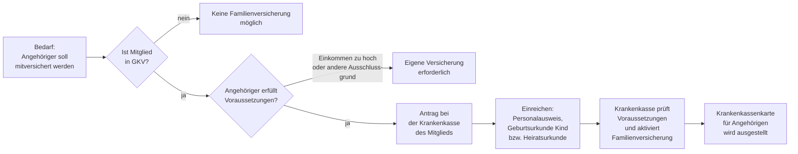

## Hintergrund

Die **beitragsfreie Familienversicherung** nach § 10 SGB V ermöglicht es, Familienangehörige ohne zusätzlichen Beitrag in der gesetzlichen Krankenversicherung (GKV) mitzuversichern. Sie ist eine der ältesten und sozialpolitisch bedeutsamsten Besonderheiten des deutschen Gesundheitssystems: Familienangehörige ohne oder mit geringem eigenen Einkommen sind automatisch abgesichert, ohne dass dafür ein Zusatzbeitrag anfällt.

Das Prinzip des **Familienlastenausgleichs** ist seit den Anfängen der GKV im 19. Jahrhundert verankert. Im Gegensatz zu privaten Krankenversicherungen (PKV), in denen jede Person einen eigenen Beitrag zahlen muss, finanziert in der GKV die Solidargemeinschaft der Beitragszahler die Mitversicherung von Familienangehörigen.

Nach Angaben des Bundesgesundheitsministeriums (Stand 2024) sind ca. **20 % aller GKV-Versicherten** — rund 11–12 Millionen Personen — über die Familienversicherung abgesichert.

## Voraussetzungen

### Voraussetzungen auf Seite des Mitglieds

Die Person, über die mitversichert werden soll (das „Mitglied"), muss:

- **GKV-Mitglied** sein (pflichtversichert, freiwillig versichert oder als Rentner versichert)
- **Ihren Wohnsitz oder gewöhnlichen Aufenthalt** im Inland haben

Nicht möglich ist die Familienversicherung, wenn das Mitglied ausschließlich **privat krankenversichert (PKV)** ist.

### Voraussetzungen auf Seite des mitversicherten Angehörigen

Mitversichert werden können (§ 10 Abs. 1, 2 SGB V):

- **Ehegatte oder eingetragener Lebenspartner** des Mitglieds
- **Kinder** des Mitglieds sowie Kinder des Ehegatten/Lebenspartners, Enkel-, Stief-, Pflege- und Adoptivkinder — sofern das Mitglied deren Unterhalt überwiegend bestreitet

Für alle Angehörigen gilt gemeinsam:

1. **Kein Vorrang-Versicherungsverhältnis**: Der Angehörige darf weder pflichtversichert, freiwillig GKV-versichert noch beihilfeberechtigt oder anderweitig anspruchsberechtigt sein
2. **Wohnsitz im Inland** (Ausnahmen für EU/EWR bei Arbeitnehmern)
3. **Einkommensgrenze**: Das monatliche Gesamteinkommen darf **1/7 der monatlichen Bezugsgröße** (§ 18 Abs. 1 SGB IV) nicht überschreiten

### Einkommensgrenze

| Jahr | Monatliche Bezugsgröße (West) | Einkommensgrenze (1/7) |
| --- | ---: | ---: |
| 2022 | 3.290 € | 470 € |
| 2023 | 3.395 € | 485 € |
| 2024 | 3.535 € | **505 €** |
| 2025 | 3.745 € | **535 €** |

**Sonderfall geringfügige Beschäftigung (Minijob):** Für Angehörige, die ausschließlich geringfügig beschäftigt sind, gilt nicht die allgemeine Einkommensgrenze, sondern die **Geringfügigkeitsgrenze** (§ 8 Abs. 1 Nr. 1 SGB IV). Diese betrug 2024 **538 €/Monat** und wurde 2025 auf **556 €/Monat** angehoben. Ein Angehöriger mit einem Minijob von 520 € im Jahr 2024 ist trotz Überschreitung der Grenze von 505 € familienversichert, weil die Geringfügigkeitsgrenze als Sonderregelung gilt.

**Was zählt zum Einkommen?** Als Einkommen im Sinne der Familienversicherung gelten nach § 16 SGB IV alle Einnahmen: Arbeitslohn, Kapitalerträge, Mieteinnahmen, Rentenzahlungen, Krankengeld u. a. Steuerliche Freibeträge (z. B. Sparerpauschbetrag) werden dabei **nicht** abgezogen — es gilt das Bruttoeinkommen.

## Kinder in der Familienversicherung

### Altersgrenze

Kinder können mitversichert werden bis zum Ablauf des Monats, in dem sie das **18. Lebensjahr** vollenden. Darüber hinaus unter bestimmten Voraussetzungen:

- Bis zum 23. Lebensjahr: wenn das Kind **nicht erwerbstätig** ist (also kein eigenes Einkommen hat, das zur Versicherungspflicht führt)
- Bis zum **25. Lebensjahr**: wenn das Kind sich in Schul- oder Berufsausbildung oder in einem Freiwilligendienst (FSJ, BFD) befindet
- **Ohne Altersgrenze**: wenn das Kind seit vor dem 23. Lebensjahr **dauerhaft erwerbsgemindert** ist

Wird die Ausbildung durch Wehr- oder Zivildienst unterbrochen, verlängert sich die Altersgrenze entsprechend.

### Vorrang des besser verdienenden Elternteils (§ 10 Abs. 3 SGB V)

Kinder werden grundsätzlich über den **gesetzlich versicherten Elternteil** familienversichert. Sind beide Elternteile GKV-Mitglieder, richtet sich die Familienversicherung nach dem Elternteil mit dem höheren Einkommen.

Ist ein Elternteil **privat krankenversichert** und verdient mehr als der GKV-versicherte Elternteil, besteht für das Kind **keine** Familienversicherung in der GKV. Das Kind muss dann entweder selbst GKV-versichert werden (sofern versicherungspflichtig) oder ist über die PKV des besserverdienenden Elternteils zu versichern.

### Ausnahme: Alleinerziehende

Ist der Elternteil, über den familienversichert werden soll, alleinerziehend und GKV-Mitglied, greift die Einschränkung des § 10 Abs. 3 SGB V nicht.

## Ausschlussgründe (§ 10 Abs. 1 Satz 1 Nr. 1–5 SGB V)

Keine Familienversicherung besteht, wenn der Angehörige:

1. **Eigene Versicherungspflicht** hat (z. B. als Arbeitnehmer über der Geringfügigkeitsgrenze)
2. **Beihilfeberechtigt** ist (z. B. verbeamteter Ehegatte) — hier übernimmt der Dienstherr einen Teil der Krankheitskosten
3. **Bereits freiwillig GKV-versichert** ist
4. **Rentner** ist, für den die Krankenversicherung der Rentner (KVdR) greift
5. Das **Einkommen die Grenze überschreitet**

### Sonderregel für Ehegatten mit PKV-Mitgliedschaft (§ 10 Abs. 3 SGB V)

Hat der Ehegatte oder Lebenspartner eine **private Krankenversicherung**, schließt dies die Familienversicherung aus — sofern das Einkommen des PKV-versicherten Ehegatten das Einkommen des GKV-Mitglieds übersteigt. In diesem Fall gilt das Prinzip: Wer mehr verdient, gibt den Versicherungstyp vor. Das soll Umgehungsgestaltungen verhindern, bei denen Gutverdienende sich durch Heirat in die günstigere GKV-Familienversicherung „einschmuggeln" würden.

## Antragsweg

**Wo ist der Antrag zu stellen?** Der Antrag wird bei der **Krankenkasse des Mitglieds** gestellt — nicht bei einer eigenen Krankenkasse des Angehörigen. Der Angehörige ist dann Mitglied derselben Krankenkasse wie das Mitglied, hat aber keine Wahlfreiheit.

**Nachweise:** Die Krankenkasse fordert in der Regel:
- Bei Ehegatten: Heiratsurkunde oder Lebenspartnerschaftsurkunde
- Bei Kindern: Geburtsurkunde
- Nachweis über das Einkommen des Angehörigen (z. B. Steuerbescheid, Verdienstbescheinigung)

**Rückwirkung:** Die Familienversicherung kann rückwirkend beantragt werden, wenn die Voraussetzungen nachgewiesen werden. Es gilt jedoch: Eine Rückerstattung bereits gezahlter eigener Beiträge des Angehörigen ist nicht möglich, wenn die eigene Versicherung freiwillig war.

**Kein Beitrag:** Für die Familienversicherung fällt **kein zusätzlicher Beitrag** an — weder für das Mitglied noch für den Angehörigen.

## Leistungsumfang der Familienversicherung

Familienversicherte Angehörige haben grundsätzlich **denselben Leistungsanspruch** wie das Mitglied selbst. Das bedeutet:

- Ärztliche und zahnärztliche Behandlung
- Krankenhausbehandlung
- Arzneimittel, Heil- und Hilfsmittel
- Krankengeld (nur bei Mitgliedern, nicht bei Familienversicherten — Ausnahme: § 45 SGB V Kinderpflege-Krankengeld)
- Mutterschaftsleistungen
- Vorsorgeleistungen (z. B. Krebsfrüherkennungsuntersuchungen, Kindervorsorge U1–U9)

**Kein Krankengeld für Familienversicherte:** Erkrankt ein familienversicherter Angehöriger, besteht kein Anspruch auf Krankengeld. Wer im Krankheitsfall Einkommensersatz benötigt, muss eigens versichert sein.

## Abgrenzung zu verwandten Leistungen

| Leistung | Verhältnis |
| --- | --- |
| **§ 45 SGB V – Kinderpflege-Krankengeld** | Eltern erhalten Krankengeld, wenn ein krankes Kind betreut werden muss — unabhängig davon, ob das Kind familienversichert ist |
| **§ 5 SGB V – Pflichtversicherung** | Hat Vorrang vor der Familienversicherung; wer pflichtversicherungspflichtig ist, kann nicht über die Familie mitversichert werden |
| **§ 9 SGB V – Freiwillige Versicherung** | Angehörige, die die Einkommensgrenze überschreiten, können sich freiwillig in der GKV versichern; der Beitrag richtet sich nach dem Einkommen |
| **§ 10 SGB V (Beihilfe)** | Beamte und ihre Angehörigen sind beihilfeberechtigt; die Familienversicherung scheidet aus, wenn der Ehegatte selbst beihilfeberechtigt ist |
| **PKV – Private Krankenvollversicherung** | Verdient der Ehegatte mehr als das GKV-Mitglied und ist privat versichert, muss das Kind privat oder eigenständig gesetzlich versichert werden |

## Praktische Hinweise

**Familienversicherung prüfen bei Einkommensänderungen:** Überschreitet ein Angehöriger die Einkommensgrenze (z. B. durch Jobaufnahme, Gehaltserhöhung oder Kapitalerträge), endet die Familienversicherung mit dem Folgetag. Die Krankenkasse muss sofort informiert werden — andernfalls drohen Nachzahlungen für zu Unrecht gewährte Leistungen.

**Jahresende-Check bei Kapitalerträgen:** Kapitalerträge zählen als Einkommen für die Familienversicherung. Wer Kapitalerträge nahe der Grenze erzielt, sollte prüfen, ob er im Folgejahr die Grenze überschreitet. Die Krankenkasse stellt auf das laufende monatliche Einkommen ab — Einmalerträge werden i. d. R. auf den Monat umgerechnet, in dem sie anfallen.

**Kinder studieren lassen:** Studenten bis 25 sind oft über die Eltern familienversichert. Ab dem 26. Lebensjahr endet das automatisch — Studenten müssen sich dann über die studentische Pflichtversicherung (§ 5 Abs. 1 Nr. 9 SGB V) bei einer GKV versichern; der günstige Studierendenbeitrag beträgt derzeit rund 130 €/Monat.

**Scheidung und Familienversicherung:** Mit Rechtskraft der Scheidung endet die Familienversicherung des früheren Ehegatten. Er muss sich danach selbst versichern — entweder pflichtversichert (wenn erwerbstätig) oder freiwillig.

**Internationale Mobilität:** Für Familienversicherte, die vorübergehend in einem anderen EU/EWR-Land leben, gelten die europäischen Sozialrechtskoordinierungsregelungen (EG-VO 883/2004). Mit der Europäischen Krankenversicherungskarte (EHIC) sind sie auch im EU-Ausland bei medizinischen Notfällen abgesichert.
