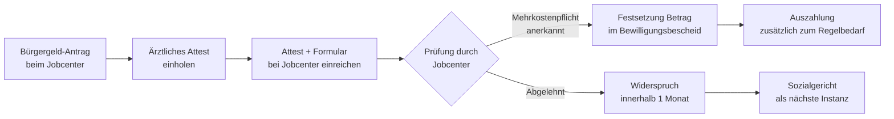

## Hintergrund

Der **Mehrbedarf für kostenaufwendige Ernährung** nach § 21 Abs. 5 SGB II erkennt an, dass bestimmte Erkrankungen eine spezielle Diät erfordern, die teurer ist als die Regelkost. Da der Regelbedarf (§ 20 SGB II) auf einem durchschnittlichen Warenkorb basiert, würden Betroffene ohne diesen Ausgleich systematisch benachteiligt.

Die Vorläuferregelung findet sich im *Bundessozialhilfegesetz (BSHG)*, das bis 2004 galt. Beim Übergang zu SGB II im Jahr 2005 wurde der Anspruch inhaltlich übernommen. Eine inhaltsgleiche Parallelnorm gilt in § 30 Abs. 5 SGB XII (Sozialhilfe) sowie § 42b SGB XII (Grundsicherung im Alter und bei Erwerbsminderung).

### Einschränkung durch die BSG-Rechtsprechung (2008)

Ein **Grundsatzurteil des Bundessozialgerichts** (BSG, B 14/11b AS 4/07 R, 27.02.2008) hat den Anspruch erheblich eingeschränkt: Der bloße Umstand, dass eine bestimmte Erkrankung eine Diät erfordert, reicht nicht aus. Es muss im konkreten Fall nachgewiesen werden, dass die medizinisch notwendige Ernährung **tatsächlich höhere Kosten** verursacht als die Regelkost. Erkrankungen, bei denen eine ausgewogene, normale Ernährung medizinisch ausreichend ist (z. B. unkomplizierter Typ-2-Diabetes), lösen damit keinen Mehrbedarf aus. Das BSG hat dies in weiteren Urteilen bestätigt.

Diese Rechtsprechungswende hat die Verwaltungspraxis deutlich verändert: Vor 2008 gewährten Jobcenter den Mehrbedarf für eine breitere Palette von Erkrankungen, seitdem ist die Prüfung strenger.

## Anerkannte Erkrankungen

Das Gesetz nennt keine abschließende Erkrankungsliste. Als Orientierungshilfe nutzen viele Jobcenter die **Empfehlungen des Deutschen Vereins für öffentliche und private Fürsorge** zur Gewährung von Krankenkostzulagen. Die Anerkennung und Höhe variieren je nach Behörde erheblich.

| Erkrankung | Typische Anerkennung | Begründung |
| --- | --- | --- |
| **Zöliakie** (Glutenunverträglichkeit) | Ja | Glutenfreie Produkte kosten deutlich mehr als Standardprodukte |
| **Niereninsuffizienz** (ab Stadium 3–4) | Ja | Proteinarme Spezialprodukte, phosphatarme Kost |
| **HIV/AIDS** | Ja (heute geringer als früher) | Erhöhter Kalorienbedarf, teils spezielle Nahrungsmittel |
| **Mukoviszidose** | Ja | Massiv erhöhter Kalorienbedarf (bis zu 150 % der Norm) |
| **Phenylketonurie (PKU)** | Ja, aber meist via GKV | Aminosäureformula teuer, aber oft GKV-Leistung nach § 31 SGB V |
| **Typ-2-Diabetes** | In der Regel **nein** | BSG: Normalkost ohne Mehrkosten ausreichend; Ausnahme bei Komplikationen |
| **Nahrungsmittelallergien** | Einzelfallprüfung | Nur wenn nachweislich teurere Alternativen nötig sind |

## Berechnung und Höhe

Anders als die anderen Mehrbedarfe (z. B. für Alleinerziehende: fester Prozentsatz auf den Regelbedarf) ist die Höhe des Ernährungs-Mehrbedarfs **gesetzlich nicht festgelegt**. § 21 Abs. 5 SGB II spricht von einem „angemessenen Mehrbedarf". Das Jobcenter hat Ermessen bei der Bestimmung des konkreten Betrags und muss diesen anhand der **tatsächlichen Mehrkosten** ermitteln.

In der Praxis orientieren sich die Behörden an Richtwerten:

| Orientierungswert | Quelle |
| --- | --- |
| Empfehlungen des Deutschen Vereins für öff. und private Fürsorge | Nicht verbindlich, aber weit verbreitet |
| Eigene Ermittlungen des Jobcenters (z. B. Preisvergleiche) | Selten |
| Pauschalbeträge aus Dienstanweisungen der Träger | Häufig |

Typische monatliche Beträge liegen je nach Erkrankung und Region zwischen **25 € und 150 €**. Für schwere Erkrankungen wie PKU (Säuglingsstadium) oder Niereninsuffizienz können die Beträge höher sein.

**Gesamtdeckel:** § 21 Abs. 8 SGB II begrenzt alle Mehrbedarfe kombiniert auf 100 % des maßgeblichen Regelbedarfs (563 € im Jahr 2025). Wer bereits andere Mehrbedarfe bezieht, kann deshalb bei der Ernährung unter Umständen weniger erhalten.

## Voraussetzungen im Überblick

1. **Bürgergeld-Bezug** (oder Anspruch auf Bürgergeld): Der Mehrbedarf ist keine eigenständige Leistung, sondern erhöht den Bedarf innerhalb des SGB-II-Systems.
2. **Ärztliches Attest**: Eine ärztliche Bescheinigung muss die Erkrankung und die Notwendigkeit einer Sonderdiät bestätigen. Ein Attest, das nur die Erkrankung benennt, reicht nach BSG-Rechtsprechung nicht aus — es sollte auch auf den erhöhten Aufwand hinweisen.
3. **Nachweis der Mehrkosten**: Das Jobcenter kann verlangen, dass die tatsächlichen Mehrkosten plausibel dargelegt werden.

## Antragsweg

Der Mehrbedarf muss **aktiv beantragt** werden — er wird nicht automatisch geprüft. Im Rahmen des Bürgergeld-Antrags sind Mehrbedarfe in der Anlage anzugeben; ohne Hinweis fehlt dem Jobcenter die Grundlage für eine Prüfung. Das Attest sollte sowohl die Diagnose als auch die Notwendigkeit kostenaufwendiger Diätkost belegen.

Bei Ablehnung empfiehlt sich ein Widerspruch unter Vorlage ärztlicher Unterlagen, die explizit auf die Mehrkosten eingehen. Die Sozialgerichtsbarkeit hat in zahlreichen Fällen Jobcenter-Entscheidungen korrigiert.

## Verhältnis zu anderen Leistungen

- **Bürgergeld-Regelbedarf (§ 20 SGB II)**: Der Ernährungs-Mehrbedarf wird zum Regelbedarf addiert und gemeinsam ausgezahlt. Er ist kein eigenständiger Antrag auf eine separate Leistung.
- **Andere Mehrbedarfe (§ 21 SGB II)**: Mehrbedarf für Alleinerziehende, Schwangerschaft, dezentrale Warmwasserbereitung und Schwerbehinderung können gleichzeitig bestehen, solange der Gesamtbetrag 100 % des Regelbedarfs nicht übersteigt (§ 21 Abs. 8 SGB II).
- **GKV-Leistungen (SGB V)**: Bei PKU und einigen anderen Stoffwechselerkrankungen übernimmt die Krankenkasse die teuren Spezialnahrungsmittel nach § 31 SGB V als Hilfsmittel. In diesen Fällen entfällt der Ernährungs-Mehrbedarf insoweit, als die Kosten anderweitig gedeckt sind.
- **Hilfe zur Ernährung bei Sozialhilfe (§ 30 Abs. 5 SGB XII)**: Für Personen, die nicht im SGB-II-Leistungsbezug stehen (z. B. wegen dauerhafter Erwerbsminderung), gilt die inhaltsgleiche Parallelregel im SGB XII.
- **Grundsicherung im Alter (§ 42b SGB XII)**: Rentenempfänger mit geringer Rente, die ergänzend Grundsicherung beziehen, haben denselben Anspruch nach SGB XII.
- **Kinderzuschlag (§ 6a BKGG)**: Familien, die durch KIZ aus dem Bürgergeld-Bezug herausgehalten werden, haben keinen Anspruch auf diesen Mehrbedarf — ein strukturelles Systemgap ähnlich wie beim Alleinerziehenden-Mehrbedarf.

## Nichtinanspruchnahme

Die Nichtinanspruchnahme dürfte bei diesem Mehrbedarf **überdurchschnittlich hoch** sein, weil er:

- **Nicht automatisch geprüft wird** — Jobcenter fragen nicht aktiv nach Erkrankungen, die eine Sonderdiät erfordern.
- **Ein ärztliches Attest erfordert**, was einen aktiven Schritt und Arzttermin voraussetzt. Für einkommensschwache, gesundheitlich belastete Personen ist diese Hürde real.
- **Inhaltlich komplex ist**: Viele Betroffene wissen nicht, dass ihre Erkrankung einen Mehrbedarf auslösen kann, und Ärzte sind oft nicht mit SGB-II-Regelungen vertraut genug, um proaktiv darauf hinzuweisen.
- **Von Jobcenter zu Jobcenter unterschiedlich gehandhabt wird**: Fehlende Einheitlichkeit führt dazu, dass Betroffene bei Ablehnung häufig nicht wissen, ob die Entscheidung korrekt ist, und daher auf einen Widerspruch verzichten.

Schuldner- und Sozialberatungen berichten, dass der Ernährungs-Mehrbedarf zu den am häufigsten übersehenen Ansprüchen im Bürgergeld-System gehört.
