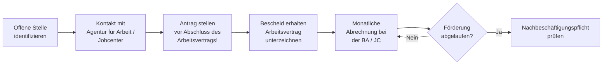

## Hintergrund

Der **Eingliederungszuschuss (EGZ)** ist ein Lohnkostenzuschuss an Arbeitgeber, die Personen mit erschwerter Vermittlung einstellen. Er soll die anfängliche Minderleistung ausgleichen, die etwa durch lange Arbeitslosigkeit, fehlende Qualifikationen oder fortgeschrittenes Alter entsteht — und damit die Einstellungsbereitschaft von Betrieben erhöhen.

Der EGZ ist kein Rechtsanspruch, sondern eine **Ermessensleistung**: Die Agentur für Arbeit oder das Jobcenter entscheidet im Einzelfall über Bewilligung, Höhe und Dauer. Grundvoraussetzung ist stets, dass ohne den Zuschuss eine dauerhafte Eingliederung erheblich erschwert oder nicht möglich wäre.

## Förderhöhe und -dauer

| Personengruppe | Max. Förderhöhe | Max. Förderdauer |
| --- | ---: | ---: |
| Regelförderung | 50 % des Bruttoarbeitsentgelts | 12 Monate |
| Behinderte / Schwerbehinderte | bis 70 % | bis 24 Monate |
| Ältere ab 55 Jahren | bis 50 % | bis 36 Monate |

Nach jeweils **12 Fördermonaten** sinkt der Zuschusssatz automatisch um **10 Prozentpunkte**. Bemessungsgrundlage ist das regelmäßig gezahlte sozialversicherungspflichtige Arbeitsentgelt — Einmalzahlungen wie Weihnachtsgeld bleiben unberücksichtigt.

## Antragsweg

**Wichtig:** Der Antrag muss **vor Beginn des Beschäftigungsverhältnisses** gestellt werden. Ein nachträglicher Antrag wird grundsätzlich abgelehnt — auch wenn alle sonstigen Voraussetzungen erfüllt wären.

## Nachbeschäftigungspflicht

Nach Ablauf der Förderung besteht eine **Nachbeschäftigungspflicht** in Höhe der Förderdauer (mindestens 12 Monate). Kündigt der Arbeitgeber in diesem Zeitraum, kann die Agentur für Arbeit eine anteilige Rückforderung des Zuschusses verlangen. Die Pflicht entfällt bei verhaltens- oder personenbedingten Kündigungen.

## Wirksamkeit und Zahlen

IAB-Studien zeichnen ein positives Bild: Geförderte weisen **bessere Beschäftigungsaussichten** auf als vergleichbare nicht geförderte Arbeitslose — der Effekt hält auch nach Auslaufen des Zuschusses an. 2022 traten rund **80.000 Personen** eine EGZ-geförderte Beschäftigung an (knapp 2 % aller Neueinstellungen in sozialversicherungspflichtige Beschäftigung). Die Gesamtausgaben lagen bei rund **466 Millionen Euro**, der durchschnittliche monatliche Zuschuss bei rund **1.100 Euro** bei einer Förderdauer von etwa 5,5 Monaten.

Eine bekannte Schwäche ist der **Mitnahmeeffekt**: Das IAB schätzt, dass 30–50 % der Arbeitgeber die geförderten Personen auch ohne Zuschuss eingestellt hätten. Die Agenturen sind daher angehalten, die tatsächliche Vermittlungsschwierigkeit sorgfältig zu prüfen.

## Abgrenzung zu ähnlichen Instrumenten

| Instrument | Zielgruppe | Besonderheit |
| --- | --- | --- |
| **EGZ (§ 88 SGB III)** | Arbeitslose mit erschwerter Vermittlung | Ermessensleistung, max. 12 Monate |
| **EGZ für Behinderte (§ 90 SGB III)** | Behinderte / Schwerbehinderte | Höherer Satz, längere Dauer |
| **§ 16e SGB II** | Langzeitarbeitslose im Bürgergeld (> 2 Jahre) | Bis 75 %, bis 24 Monate, mit Coaching |
| **§ 16i SGB II** | Sehr arbeitsmarktferne Personen (> 5 Jahre) | Bis 100 % Lohnkostenübernahme, bis 5 Jahre |
