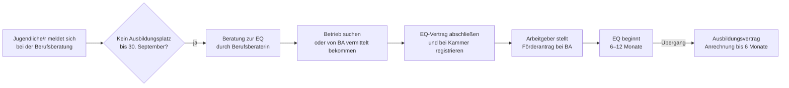

## Hintergrund

Die **Einstiegsqualifizierung (EQ)** nach § 54a SGB III ist ein betriebliches Langzeitpraktikum von sechs bis zwölf Monaten, das Jugendlichen den Weg in eine vollwertige Berufsausbildung ebnen soll. Das Programm wurde zum **1. Oktober 2004** mit dem Fachkräftesicherungsgesetz eingeführt und ist seitdem fester Bestandteil des dualen Ausbildungssystems. Jährlich werden rund **20.000–25.000 neue EQ-Verhältnisse** begonnen; das Instrument gewinnt zunehmend auch für Jugendliche mit Fluchthintergrund an Bedeutung.

Zuständig sind die **Agenturen für Arbeit** — für Bürgergeld-Beziehende übernehmen die **Jobcenter** diese Rolle.

## Zielgruppe

Die EQ richtet sich an junge Menschen, die

- als **Ausbildungsstellenbewerber** bei der Berufsberatung gemeldet sind und
- bis zum **30. September** des Ausbildungsjahres keinen Ausbildungsplatz gefunden haben — oder deren direkte Vermittlung in Ausbildung aus persönlichen Gründen (schulische Defizite, soziale Hemmnisse) nicht möglich ist.

Eine starre Altersgrenze gibt es gesetzlich nicht; in der Praxis zielt die BA auf **junge Menschen unter 25 Jahren**. Für Geflüchtete und Geduldete bestehen erweiterte Zugangsmöglichkeiten nach § 132 SGB III.

Der aufnehmende Betrieb muss als **Ausbildungsbetrieb anerkannt** sein (Ausbildungsberechtigung nach § 27 BBiG) und die EQ auf einen anerkannten Ausbildungsberuf ausrichten.

## Förderbeträge

Den Zuschuss erhält der **Arbeitgeber**, nicht der Jugendliche selbst:

| Förderelement | Betrag (2024) |
| --- | ---: |
| Zuschuss zur monatlichen Vergütung | bis zu **262 €** |
| Pauschale für Sozialversicherungsbeiträge | bis zu **20 %** des Vergütungszuschusses |

Jugendliche erhalten ihre Vergütung direkt vom Betrieb — typischerweise zwischen **350 € und 650 € monatlich**. Die EQ ist arbeitsrechtlich ein eigenständiges Beschäftigungsverhältnis mit Sozialversicherungsschutz, Unfallversicherung und Urlaubsanspruch — kein einfaches Praktikum.

## Anrechnung auf die Ausbildungszeit

Ein entscheidender Vorteil: Eine erfolgreich abgeschlossene EQ kann bei anschließender Berufsausbildung im gleichen Beruf **um bis zu sechs Monate auf die Ausbildungszeit angerechnet** werden (§ 54a Abs. 5 SGB III). Die zuständige Kammer entscheidet im Einzelfall. Rund **60–70 % der EQ-Verhältnisse** münden laut BIBB-Datenreport in einen Ausbildungsvertrag.

## Antragsweg

Der Förderantrag wird vom **Arbeitgeber** gestellt. Jugendliche sollten bereits im **August** aktiv bei der Berufsberatung nach einer EQ fragen — die BA kann passende Betriebe aus ihrer eigenen Datenbank vermitteln.

## Verhältnis zu anderen Leistungen

| Leistung | Abgrenzung |
| --- | --- |
| **Berufsausbildungsbeihilfe (BAB)** | Kann während einer EQ beantragt werden, wenn auswärtige Unterbringung nötig |
| **Bürgergeld (SGB II)** | Kann unter Umständen fortlaufen; EQ-Vergütung wird mit Freibeträgen angerechnet (§ 11b SGB II) |
| **Assistierte Ausbildung** | Sozialpädagogische Begleitung kann ergänzend auch während der EQ gewährt werden |
