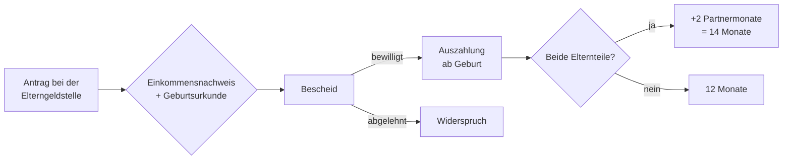

## Geschichte

Das **Elterngeld** wurde zum 1. Januar 2007 eingeführt und löste das frühere *Erziehungsgeld* ab. Mit dem Wechsel von einer Pauschale zu einer **Lohnersatzleistung** wollte der Gesetzgeber besonders Väter und gut verdienende Elternteile zur Elternzeit motivieren.

- **2007** – Einführung des Basiselterngelds (BEEG)
- **2015** – **ElterngeldPlus** und **Partnerschaftsbonus** (§§ 4a, 4b)
- **April 2024 / April 2025** – schrittweise Absenkung der Einkommensgrenze auf zuletzt **175.000 €** zu versteuerndes Jahreseinkommen (Paare)

## Höhe der Leistung

Das Basiselterngeld beträgt **65 % des wegfallenden Nettoeinkommens** (67 % bei Einkommen bis 1.200 €), Bemessungsgrundlage sind die zwölf Monate vor der Geburt (§ 2):

| Nettoeinkommen (monatl.) | Ersatzrate | Betrag |
| --- | ---: | ---: |
| bis 1.200 € | 67 % | 300 – 804 € |
| 1.200 – 2.770 € | 65 % | 804 – 1.800 € |
| über 2.770 € | Deckelung | max. 1.800 € |
| ohne eigenes Einkommen | Mindestbetrag | 300 € |

Zwei Aufschläge berücksichtigen besondere Familienkonstellationen (§ 2a):

- **Geschwisterbonus**: +10 %, mindestens 75 €/Monat, wenn ein Geschwisterkind unter 3 (oder zwei unter 6) im Haushalt lebt.
- **Mehrlingszuschlag**: +300 €/Monat für jedes weitere Mehrlingskind.

## Bezugsvarianten

| Variante | Monate | Bedingung |
| --- | ---: | --- |
| Basiselterngeld (ein Elternteil) | 12 | — |
| Basiselterngeld (beide) | 14 | mind. 2 Monate je Elternteil |
| ElterngeldPlus | bis 28 | Teilzeit, halber Monatsbetrag, doppelte Dauer |
| Partnerschaftsbonus | +4 je Elternteil | beide gleichzeitig 24–32 h/Woche |

**ElterngeldPlus** (§ 4a) erleichtert den Teilzeit-Wiedereinstieg: niedrigerer Monatsbetrag, dafür doppelt so lange. Der **Partnerschaftsbonus** (§ 4b) belohnt eine Phase, in der beide Elternteile gleichzeitig in Teilzeit arbeiten — gilt aber als bürokratisch anspruchsvoll, weil der Stundenkorridor exakt eingehalten werden muss.

## Anrechnung anderer Einnahmen

§ 3 BEEG vermeidet Doppelförderung. Praktisch am wichtigsten:

- **Mutterschaftsgeld** (inkl. Arbeitgeberzuschuss) wird in den ersten 8 Wochen nach der Geburt voll auf das Elterngeld angerechnet — faktisch beginnt der Elterngeldbezug der Mutter erst danach.
- **Erwerbseinkommen** aus erlaubter Teilzeit (bis 32 h/Woche) wird über die **Differenzmethode** berücksichtigt: Elterngeld bemisst sich nach der Lücke zwischen vor- und nachgeburtlichem Einkommen. Der Mindestbetrag von 300 € bleibt stets erhalten.

## Steuer: Progressionsvorbehalt

Elterngeld ist steuerfrei, unterliegt aber dem **Progressionsvorbehalt** (§ 32b EStG): Es erhöht den Steuersatz auf das übrige Einkommen desselben Jahres. Wer im selben Jahr Lohn und Elterngeld bezieht oder mit dem Partner zusammenveranlagt wird, erhält oft eine **Steuernachzahlung**. Eine Beratung vor Bezugsbeginn (Steuerberater, Lohnsteuerhilfeverein) kann sich lohnen.

## Antragsweg

Der Antrag sollte spätestens drei Monate nach der Geburt gestellt werden, da rückwirkend nur drei Monate ausgezahlt werden (§ 7). Zuständig sind die Elterngeldstellen der Länder.

## Väterbeteiligung

Während nahezu alle berechtigten Mütter Elterngeld beziehen, beantragten 2022 nur rund **25 % der berechtigten Väter** die Leistung — meist nur die zwei Partnermonate. Gründe sind das Einkommensgefälle in Paaren, die betriebliche Kultur und Informationsdefizite. Der Partnerschaftsbonus soll partnerschaftliche Aufteilung fördern, wird wegen der Koordinationsanforderungen aber wenig genutzt.
