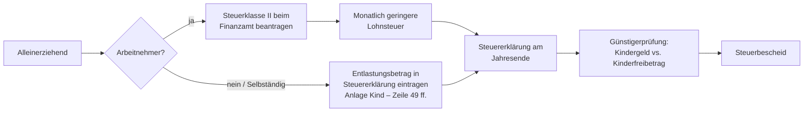

## Hintergrund

Der **Entlastungsbetrag für Alleinerziehende** (§ 24b EStG) korrigiert eine strukturelle Ungleichbehandlung im Steuerrecht: Verheiratete Paare profitieren vom Ehegattensplitting, das die gemeinsame Steuerlast senkt. Alleinerziehende hingegen werden wie Ledige besteuert — obwohl sie Haushalt und Kinderbetreuung alleine stemmen, ohne den Einkommensausgleich, den ein zweites Erwachseneneinkommen bietet.

2022 wurde der Freibetrag von 1.908 € auf **4.260 €** mehr als verdoppelt, nachdem er jahrzehntelang faktisch eingefroren war.

## Voraussetzungen

Drei Bedingungen müssen **gleichzeitig** erfüllt sein:

| Voraussetzung | Erläuterung |
| --- | --- |
| **Alleinstehend** | Nicht verheiratet, verwitwet oder dauerhaft getrennt lebend |
| **Kind im Haushalt** | Mindestens ein Kind, für das Kindergeld oder der Kinderfreibetrag zusteht, ist in der gemeinsamen Wohnung gemeldet |
| **Keine Haushaltsgemeinschaft** | Im Haushalt lebt keine andere volljährige Person außer dem Kind |

Die dritte Bedingung ist die häufigste Fehlerquelle. Eine Haushaltsgemeinschaft liegt vor, wenn eine weitere erwachsene Person gemeinsam wirtschaftet — also Kosten teilt oder eine gemeinsame Haushaltskasse führt. Das Finanzamt geht bei einer weiteren volljährigen Person zunächst von einer Haushaltsgemeinschaft aus; die Widerlegung liegt beim Steuerpflichtigen (§ 24b Abs. 2 Satz 2 EStG).

**Ausnahme:** Volljährige Kinder, für die noch Kindergeldanspruch besteht, gelten nicht als "andere volljährige Person" im Sinne dieser Regel.

## Höhe

| Situation | Betrag pro Jahr |
| --- | --- |
| Ein Kind im Haushalt | 4.260 € |
| Zwei Kinder | 4.500 € (+240 €) |
| Drei Kinder | 4.740 € (+480 €) |
| *Jedes weitere Kind* | *+240 €* |

Der Betrag wird **monatsgenau** gewährt. Beginnen oder enden die Voraussetzungen während des Jahres (z. B. Trennung im Mai), zählen nur die Monate, in denen alle Bedingungen erfüllt sind.

**Steuerliche Wirkung:** Bei einem zu versteuernden Einkommen von 35.000 € spart der Entlastungsbetrag rund **1.100–1.300 €** Einkommensteuer. Bei höheren Einkommen ist die Ersparnis entsprechend größer.

## Steuerklasse II

Wer monatlich weniger Lohnsteuer abführen will, anstatt die Entlastung erst mit der Jahressteuererklärung zu erhalten, kann beim Finanzamt **Steuerklasse II** beantragen. Die Änderung gilt ab dem Folgemonat der Antragstellung; vergangene Monate werden über die Steuererklärung korrigiert.

**Wichtig:** Ändert sich die Situation (neuer Partner zieht ein, Kind verlässt den Haushalt), muss die Steuerklasse aktiv zurückgeändert werden. Wer Steuerklasse II behält, obwohl die Voraussetzungen weggefallen sind, zahlt zu wenig Lohnsteuer und schuldet nach der Steuererklärung eine Nachzahlung.

## Antragsweg

In ELSTER wird der Entlastungsbetrag in der Anlage Kind eingetragen; die Günstigerprüfung zwischen Kindergeld und Kinderfreibetrag erfolgt automatisch.

## Verhältnis zu anderen Leistungen

| Leistung | Verhältnis |
| --- | --- |
| **Kindergeld** | Unabhängig — wird separat ausgezahlt; der Entlastungsbetrag ist ein zusätzlicher Steuervorteil |
| **Kinderfreibetrag** | Finanzamt prüft automatisch, ob Kinderfreibetrag + Entlastungsbetrag günstiger als Kindergeld sind |
| **Bürgergeld-Mehrbedarf (§ 21 Abs. 3 SGB II)** | Gilt für Bürgergeld-Empfänger; der steuerliche Entlastungsbetrag greift dort nicht, da keine Einkommensteuer anfällt |
| **Unterhaltsvorschuss** | Kann gleichzeitig in Anspruch genommen werden |

## Trennung und Trennungsjahr

Nach einer Trennung kann der Entlastungsbetrag **ab dem Monat** geltend gemacht werden, in dem das dauerhafte Getrenntleben beginnt — ein zivilrechtliches Trennungsjahr ist steuerlich nicht erforderlich. Im Trennungsjahr können mehrere Steuerregeln ineinandergreifen (Zusammenveranlagung für den Zeitraum des Zusammenlebens, Entlastungsbetrag ab Trennungsmonat). Es lohnt sich, beide Varianten in ELSTER durchzurechnen oder steuerliche Beratung in Anspruch zu nehmen.
