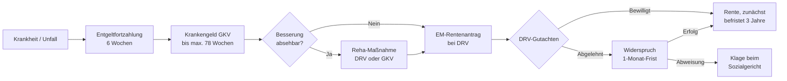

## Geschichte

Das deutsche Rentenrecht kannte bis Ende 2000 zwei getrennte Absicherungsstufen bei eingeschränkter Arbeitsfähigkeit: die **Rente wegen Berufsunfähigkeit** (halbe Rente, mit Berufsschutz) und die **Rente wegen Erwerbsunfähigkeit** (volle Rente bei unter 2 Stunden Arbeitsfähigkeit täglich). Mit dem **Gesetz zur Reform der Renten wegen verminderter Erwerbsfähigkeit** wurde dieses System zum 1. Januar 2001 grundlegend umgebaut.

Seitdem gilt das heutige Zwei-Stufen-Modell (§ 43 SGB VI): **teilweise** (3 bis unter 6 Stunden) und **volle Erwerbsminderung** (unter 3 Stunden täglich). Der Berufsschutz entfiel für alle ab 1961 Geborenen — seitdem kann jede versicherte Person auf *jede beliebige* Tätigkeit des allgemeinen Arbeitsmarkts verwiesen werden, unabhängig von Ausbildung oder Berufsbiografie.

Wichtige Meilensteine:

| Jahr | Änderung |
| --- | --- |
| **2001** | Ablösung der BU/EU-Rente durch das neue EM-System |
| **2014** | Zurechnungszeit verlängert auf das 62. Lebensjahr |
| **2019** | *Rentenpaket I*: Zurechnungszeit auf 65 Jahre und 8 Monate angehoben |
| **2024** | *Rentenpaket II*: Schrittweise weitere Anhebung in Richtung 67 Jahre |

## Voraussetzungen

Neben der ärztlich festgestellten Erwerbsminderung müssen zwei versicherungsrechtliche Bedingungen erfüllt sein:

1. **Allgemeine Wartezeit**: mindestens **60 Beitragsmonate** (Pflicht- und freiwillige Beiträge, Kindererziehungszeiten u. a.)
2. **3 Jahre Pflichtbeiträge in den letzten 5 Jahren**: In den 60 Monaten vor Eintritt der Erwerbsminderung müssen mindestens **36 Monate Pflichtbeiträge** vorliegen

Ausnahme: Bei Erwerbsminderung infolge eines Arbeitsunfalls oder einer Berufskrankheit entfällt die Drei-Jahres-Bedingung.

## Leistungsstufen

| Stufe | Tägliche Arbeitsfähigkeit | Rentenanteil |
| --- | --- | ---: |
| Volle Erwerbsminderung | unter 3 Stunden | 100 % |
| Teilweise Erwerbsminderung | 3 bis unter 6 Stunden | 50 % |
| Kein Anspruch | 6 Stunden und mehr | — |

**Arbeitsmarktklausel (§ 43 Abs. 3 SGB VI):** Wer nur teilweise erwerbsgemindert ist, aber als arbeitslos gemeldet keinen Teilzeitjob findet, erhält die Rente trotzdem in **voller Höhe**. Diese Regelung ist vielen Betroffenen unbekannt.

## Berechnung

```
Monatsrente = Entgeltpunkte × Zugangsfaktor × Rentenartfaktor × aktueller Rentenwert
```

Das wichtigste Schutzinstrument ist die **Zurechnungszeit** (§ 59 SGB VI): Beim Rentenbeginn wird so gerechnet, als hätte die versicherte Person bis zum **67. Lebensjahr** weiter mit durchschnittlichem Einkommen gearbeitet. Ohne diese Regelung wären insbesondere jüngere Betroffene auf minimale Renten angewiesen.

Ein dauerhafter **Zugangsfaktorabzug** von 0,3 % pro Monat Rentenbeginn vor dem 67. Lebensjahr — maximal **10,8 %** — bleibt auch nach dem Übergang in die Regelaltersrente erhalten. Da EM-Renten typischerweise weit vor dem 67. Lebensjahr beginnen, nehmen fast alle Betroffenen den Maximalabzug in Kauf.

Der Median der neu bewilligten EM-Renten liegt bei ca. **900–1.000 €/Monat** — in teuren Regionen oft unterhalb des faktischen Existenzminimums. Viele Betroffene sind ergänzend auf **Grundsicherung bei Erwerbsminderung** (§§ 41 ff. SGB XII) angewiesen, die beim Sozialamt — nicht bei der DRV — beantragt werden muss.

## Antragsweg



**Reha vor Rente (§ 9 SGB VI):** Die DRV ist verpflichtet, vor einer Rentenbewilligung alle Rehabilitationsmöglichkeiten auszuschöpfen. Ein Rentenantrag wird in der Praxis häufig zunächst als Reha-Antrag umgedeutet.

Die Rente wird **frühestens ab dem Antragsmonat** gezahlt — rückwirkende Leistungen sind ausgeschlossen. Der Antrag sollte daher gestellt werden, sobald absehbar ist, dass die Arbeitsfähigkeit nicht wiederkehrt.

EM-Renten werden zunächst **befristet auf maximal 3 Jahre** bewilligt. Betroffene müssen rechtzeitig vor Fristablauf einen Verlängerungsantrag stellen, da die Zahlung sonst automatisch endet. Nach neun Jahren Bezug wird die Rente in der Regel unbefristet festgesetzt.

## Typische Hürden

- **Hohe Ablehnungsquote**: Erstanträge werden zu 35–45 % abgelehnt; ein erheblicher Teil wird erst im Widerspruchs- oder Klageverfahren durchgesetzt. Gut dokumentierte Befundberichte sind entscheidend.
- **Übergangslücken**: Zwischen Krankengeldentzug und Rentenbewilligung entstehen einkommenslose Phasen. Die **Nahtlosigkeitsregelung** (§ 145 SGB III) soll ALG-I-Bezug in dieser Zeit sichern, ist aber vielen Betroffenen unbekannt.
- **Grundsicherung nicht beantragt**: Viele EM-Rentner mit niedrigen Renten kennen ihren Anspruch auf ergänzende Grundsicherung beim Sozialamt nicht — hier liegt eine systematische Dunkelziffer.
- **Befristungskontrollen**: Befristete Renten enden still ohne Verlängerungsantrag — vermeidbare Zahlungslücken entstehen.

## Übergangsregelungen für ältere Jahrgänge

Für Versicherte, die **vor dem 2. Januar 1961** geboren wurden, gilt noch der alte **Berufsschutz** nach § 240 SGB VI: Berufsunfähigkeit liegt vor, wenn weder der bisherige Beruf noch eine qualitativ zumutbare Verweisungstätigkeit mehr mindestens 6 Stunden täglich ausgeübt werden kann. Die Leistung entspricht der halben Erwerbsminderungsrente. Da diese Jahrgänge das Rentenalter zunehmend erreichen, ist § 240 eine auslaufende Übergangsregelung.

Bestandsrentner, die vor 2001 eine Berufsunfähigkeits- oder Erwerbsunfähigkeitsrente bezogen, sind durch §§ 302a und 302b SGB VI geschützt: Ihre Renten laufen nach altem Recht weiter und werden nicht auf das neue System umgestellt.
