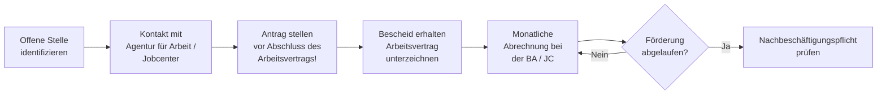

## Hintergrund

Der **Eingliederungszuschuss (EGZ)** ist ein Lohnkostenzuschuss an Arbeitgeber, die Arbeitnehmerinnen oder Arbeitnehmer mit erschwerter Vermittlung einstellen. Er soll die anfängliche Minderleistung kompensieren, die z. B. durch lange Arbeitslosigkeit, fehlende Qualifikationen oder Alter entstehen kann — und damit die Einstellungsbereitschaft von Betrieben erhöhen.

Das Instrument ist kein Rechtsanspruch, sondern eine **Ermessensleistung**: Die Agentur für Arbeit oder das Jobcenter entscheidet im Einzelfall über Bewilligung, Höhe und Dauer. Bewilligungsvoraussetzung ist immer, dass ohne den Zuschuss eine dauerhafte Eingliederung schwerer oder gar nicht möglich wäre.

## Wie hoch ist die Förderung?

| Merkmal | Regelförderung | Behinderte / Schwerbehinderte |
| --- | --- | --- |
| Maximale Förderhöhe | 50 % des sozialversicherungspflichtigen Bruttoarbeitsentgelts | bis 70 % |
| Maximale Förderdauer | 12 Monate | bis 24 Monate |
| Sonderfall: Ältere ab 55 | bis zu 36 Monate | — |

Nach Ablauf von jeweils **12 Fördermonaten** wird der Zuschuss automatisch um **10 Prozentpunkte** reduziert.

Die **Bemessungsgrundlage** ist das regelmäßig gezahlte sozialversicherungspflichtige Arbeitsentgelt; Einmalzahlungen (Weihnachtsgeld etc.) bleiben außen vor. Zusätzlich kann ein pauschaler Anteil des Arbeitgeberbeitrags zur Sozialversicherung einbezogen werden.

## Zahlen und Wirksamkeit

Forschungsergebnisse des **IAB (Institut für Arbeitsmarkt- und Berufsforschung)** zeichnen ein positives Bild:

- 2022 traten rund **80.000 Personen** eine durch EGZ geförderte Beschäftigung an — das entspricht knapp **2 % aller Neueinstellungen** in sozialversicherungspflichtige Beschäftigung.
- Die Gesamtausgaben für EGZ lagen 2022 bei rund **466 Millionen Euro**.
- Im Durchschnitt betrug der monatliche Zuschuss rund **1.100 Euro** bei einer durchschnittlichen Förderdauer von rund **5,5 Monaten**.
- IAB-Studien zeigen wiederholt: Geförderte haben **bessere Beschäftigungsaussichten** als vergleichbare nicht geförderte Arbeitslose — der Effekt hält auch nach Auslaufen des Zuschusses an.

## Antragsweg

**Kritischer Hinweis:** Der Antrag muss **vor Beginn des Beschäftigungsverhältnisses** gestellt werden. Ein nachträglicher Antrag wird abgelehnt, auch wenn alle anderen Voraussetzungen erfüllt wären.

## Nachbeschäftigungspflicht

Nach Ende der Förderung besteht eine **Nachbeschäftigungspflicht** in Höhe der Förderdauer (mindestens 12 Monate). Kündigt der Arbeitgeber während dieser Zeit, kann die BA eine anteilige Rückforderung des Zuschusses verlangen. Die Pflicht entfällt bei einer verhaltens- oder personenbedingten Kündigung.

## Abgrenzung zu ähnlichen Instrumenten

| Instrument | Zielgruppe | Besonderheit |
| --- | --- | --- |
| **EGZ (§ 88 SGB III)** | Arbeitslose mit erschwerter Vermittlung (SGB III) | Ermessensleistung, max. 12 Monate |
| **EGZ für Behinderte (§ 90 SGB III)** | Behinderte und Schwerbehinderte | Höherer Satz, längere Dauer |
| **Eingliederung von Langzeitarbeitslosen (§ 16e SGB II)** | Langzeitarbeitslose im Bürgergeld-Bezug (> 2 Jahre) | Bis 75 %, bis 24 Monate, beschäftigungsbegleitendes Coaching |
| **Teilhabe am Arbeitsmarkt (§ 16i SGB II)** | Sehr arbeitsmarktferne Personen (> 5 Jahre ALG II) | Bis 100 % Lohnkostenübernahme, bis 5 Jahre |

## Mitnahmeeffekte

Eine bekannte Schwäche des EGZ ist der **Mitnahmeeffekt**: Arbeitgeber stellen manchmal Personen ein, die sie ohne Förderung ebenfalls eingestellt hätten — und erhalten dennoch den Zuschuss. Das IAB schätzt den Mitnahmeeffekt beim EGZ auf 30–50 %. Die Agenturen sind daher angehalten, die tatsächliche Eingliederungsschwierigkeit sorgfältig zu prüfen, bevor sie eine Förderung bewilligen.
