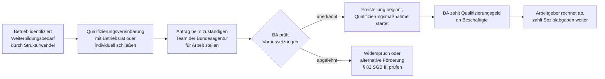

## Hintergrund

Das **Qualifizierungsgeld** nach § 82a SGB III ist eine Lohnersatzleistung für Beschäftigte, die ihr Unternehmen für eine längere betriebliche Qualifizierungsmaßnahme vollständig freistellt. Es wurde mit dem *Gesetz zur Stärkung der Aus- und Weiterbildungsförderung (BQFG)* eingeführt und ist am **1. April 2024** in Kraft getreten.

Der Hintergrund ist der tiefgreifende **Strukturwandel** in der deutschen Wirtschaft: Dekarbonisierung, Digitalisierung und Automatisierung verändern ganze Berufsfelder und erfordern in vielen Unternehmen eine umfassende Neuqualifizierung von Teilen der Belegschaft. Bestehende Instrumente deckten diesen Bedarf nur unvollständig ab:

- **§ 82 SGB III** (Förderung beruflicher Weiterbildung im Betrieb) subventioniert die Kosten einer Qualifizierung, lässt den Lohn aber beim Arbeitgeber. Bei langer Freistellung ist die finanzielle Belastung für den Betrieb entsprechend hoch.
- **Kurzarbeitergeld (§§ 95 ff. SGB III)** federt vorübergehende konjunkturelle Einbrüche ab, ist aber nicht für strukturelle Transformation konzipiert und an strengere Voraussetzungen geknüpft.

Das Qualifizierungsgeld schließt diese Lücke: Die Bundesagentur für Arbeit übernimmt den Lohnersatz während der Qualifizierung; der Arbeitgeber trägt die Weiterbildungskosten und die Sozialversicherungsbeiträge weiter.

## Voraussetzungen

Das Qualifizierungsgeld ist ein **betriebsgebundenes Instrument** — der Arbeitgeber, nicht der Arbeitnehmer, muss es initiieren und beantragen. Die Voraussetzungen (§ 82a Abs. 1 SGB III) sind kumulativ:

### 1. Strukturwandel betrifft den Betrieb

Die Qualifizierung muss durch den Strukturwandel im Sinne des § 82a Abs. 1 Nr. 1 SGB III veranlasst sein. Das Unternehmen muss plausibel machen, dass sich Tätigkeiten substanziell verändern oder wegfallen und die Belegschaft deshalb neue Kompetenzen braucht. Typische Szenarien: Ablösung von Verbrennungsmotoren durch Elektromobilität, Einführung von KI-gestützten Prozessen, Übergang von analoger zu digitaler Infrastruktur.

### 2. Qualifizierungsvereinbarung

Es muss eine tarifvertragliche oder betriebliche Vereinbarung (z. B. Betriebsvereinbarung) bestehen, die den Umfang und Inhalt der Qualifizierung festlegt. Betriebe ohne Betriebsrat können eine individuelle Vereinbarung zwischen Arbeitgeber und Arbeitnehmer schließen.

### 3. Mindestbeteiligungsquote

Nicht jeder einzelne Beschäftigte kann unabhängig vom Rest der Belegschaft Qualifizierungsgeld erhalten. Das Gesetz schreibt eine **gestaffelte Mindestbeteiligungsquote** vor: Ein bestimmter Mindestanteil der Beschäftigten des Betriebs muss an der Qualifizierung teilnehmen. Die Schwellen sinken mit zunehmender Betriebsgröße, um auch für große Unternehmen erreichbar zu sein. Kleinstbetriebe sind von der Mindestquote ausgenommen.

### 4. Qualifizierungsumfang: mehr als 120 Stunden

Die Qualifizierungsmaßnahme muss mehr als 120 Stunden umfassen (§ 82a Abs. 1 Nr. 4 SGB III). Dies grenzt das Instrument von kurzen Schulungen oder Einführungskursen ab — gemeint sind echte Umschulungsmaßnahmen oder längere Umqualifizierungen.

### 5. Beschäftigter ist für die Qualifizierung freigestellt

Der Arbeitnehmer muss während der Qualifizierung **vollständig freigestellt** sein, d. h. keine reguläre Arbeitsleistung erbringen.

## Höhe und Berechnung

Die Berechnung des Qualifizierungsgeldes orientiert sich eng an der Formel für das **Kurzarbeitergeld** und das **Arbeitslosengeld I**:

| Leistungssatz | Personengruppe | Prozentwert |
| --- | --- | ---: |
| Erhöhter Satz | Beschäftigte mit mindestens einem Kind im Haushalt | **67 %** |
| Allgemeiner Satz | alle anderen | **60 %** |

Bezugsgröße ist das **pauschalierte Nettoentgelt** — das Bruttoentgelt abzüglich pauschalierter Lohnsteuer und Sozialversicherungsbeiträge. Die BA berechnet es nach denselben Tabellen wie beim Kurzarbeitergeld.

**Beispiel (allgemeiner Satz, Bruttoentgelt 3.200 €/Monat, 2025):**

| Position | Betrag |
| --- | ---: |
| Bruttoentgelt | 3.200 € |
| Pauschaler SV-Abzug (~21 %) | − 672 € |
| Pauschaler Steuerabzug (Steuerkl. I, ~14 %) | − 448 € |
| Pauschaliertes Nettoentgelt | ≈ 2.080 € |
| Qualifizierungsgeld (60 %) | **≈ 1.248 €/Monat** |

Der **Arbeitgeber** zahlt während der Freistellung die Sozialversicherungsbeiträge weiter — auf Basis eines fiktiven beitragspflichtigen Entgelts von 80 % des Bruttoentgelts (analog zur Regelung beim Kurzarbeitergeld). Diese Regelung stellt sicher, dass keine Lücken bei Renten-, Kranken- und Pflegeversicherung entstehen.

## Antragsweg

Das Qualifizierungsgeld ist ein **Arbeitgeberantrag** — der Beschäftigte selbst stellt keinen Antrag, sondern der Betrieb beantragt die Leistung im Namen seiner Beschäftigten.

Die zuständige Stelle ist die **Bundesagentur für Arbeit**, konkret das Team Arbeitgeber-Service der regionalen Agentur. Es empfiehlt sich frühzeitiger Kontakt, da die Prüfung der strukturwandelbedingten Notwendigkeit Zeit in Anspruch nimmt. Die BA bietet Beratungsgespräche an.

## Verhältnis zu anderen Leistungen

- **§ 82 SGB III (Weiterbildungsförderung im Betrieb)**: Der Arbeitgeber zahlt beim § 82-Weg den Lohn weiter und erhält ggf. Zuschüsse zu den Lehrgangskosten. Das Qualifizierungsgeld ersetzt dagegen den Lohn — für längere Qualifizierungen ist § 82a deshalb wirtschaftlich attraktiver. Beide Instrumente lassen sich nicht kombinieren, aber nacheinander einsetzen.
- **Kurzarbeitergeld (§§ 95 ff. SGB III)**: Kurzarbeit reagiert auf einen konjunkturellen Auftragsrückgang (temporäre Arbeitszeitreduzierung). Das Qualifizierungsgeld adressiert strukturellen Wandel (langfristige Neuausrichtung). In der Praxis treten beide Situationen teils gleichzeitig auf — in Kurzarbeitsphasen darf der Arbeitgeber ergänzend Qualifizierungsmaßnahmen fördern, jedoch ist eine gleichzeitige Inanspruchnahme von Kurzarbeitergeld und Qualifizierungsgeld für dieselbe Person ausgeschlossen.
- **Transferkurzarbeitergeld (§ 111 SGB III)**: Beim Transferkurzarbeitergeld wird eine eigene Transfergesellschaft eingesetzt, weil der ursprüngliche Arbeitsplatz wegfällt. Das Qualifizierungsgeld setzt dagegen eine fortbestehende Beschäftigung voraus — die Person bleibt im Unternehmen. Transferkurzarbeitergeld ist also die Lösung für Personalabbau mit Weiterbildungselement; Qualifizierungsgeld ist die Lösung für Belegschaftserhalt trotz Strukturwandel.
- **Aufstockung durch Arbeitgeber**: Es ist zulässig, dass der Arbeitgeber das Qualifizierungsgeld freiwillig aufstockt, um dem Beschäftigten eine höhere Nettoabsicherung zu bieten. Viele Tarifverträge regeln solche Aufstockungen.
- **Bürgergeld (SGB II)**: Qualifizierungsgeld wird als Einkommen angerechnet und schließt in der Praxis eine gleichzeitige Hilfebedürftigkeit nach SGB II aus — sofern das Qualifizierungsgeld zuzüglich ggf. vorhandener sonstiger Einkünfte den SGB-II-Bedarf übersteigt.

## Einordnung und Bedeutung

Das Qualifizierungsgeld ist noch ein **junges Instrument** — es existiert seit April 2024. In der ersten Zeit nach Einführung war die Inanspruchnahme zunächst gering, da sowohl bei Arbeitgebern als auch bei der BA Beratungskapazitäten und Verwaltungsroutinen erst aufgebaut werden mussten.

Inhaltlich schließt das Qualifizierungsgeld eine wichtige Lücke in der deutschen Beschäftigungspolitik: Wo bisher die Wahl zwischen „Entlassung und Neueinstellung qualifizierter Arbeitskräfte" und „Kurzarbeit ohne strukturelle Lösung" bestand, bietet § 82a SGB III nun einen dritten Weg — den **Erhalt von Beschäftigung durch aktive Transformation**. Besonders in der Automobilindustrie, im Maschinenbau und in der Energiewirtschaft wird dem Instrument eine wachsende Bedeutung zugeschrieben.

Kritisch anzumerken ist, dass der **bürokratische Aufwand** — insbesondere der Nachweis des Strukturwandelbezugs — für kleinere Unternehmen eine Hürde darstellt. Kleinbetriebe sind zwar von der Mindestbeteiligungsquote ausgenommen, aber der administrative Aufwand der Antragstellung überfordert viele kleine Betriebe ohne eigene HR-Abteilung.
