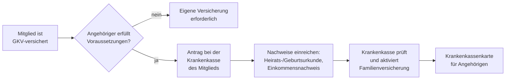

## Hintergrund

Die **beitragsfreie Familienversicherung** (§ 10 SGB V) ist eine der sozialpolitisch bedeutsamsten Besonderheiten des deutschen Gesundheitssystems: Familienangehörige ohne oder mit geringem eigenen Einkommen sind in der gesetzlichen Krankenversicherung (GKV) automatisch mitversichert, ohne dass ein zusätzlicher Beitrag anfällt. Das Prinzip des **Familienlastenausgleichs** reicht bis in die Anfänge der GKV im 19. Jahrhundert zurück. Heute sind rund **11–12 Millionen Personen** — etwa 20 % aller GKV-Versicherten — über die Familienversicherung abgesichert.

## Wer kann mitversichert werden?

Mitversichert werden können **Ehegatten, eingetragene Lebenspartner** sowie **Kinder** (einschließlich Stief-, Adoptiv-, Pflege- und Enkelkinder, sofern das Mitglied überwiegend für ihren Unterhalt aufkommt). Voraussetzung ist, dass der Angehörige:

- keiner eigenen Versicherungspflicht unterliegt und nicht beihilfeberechtigt ist
- seinen Wohnsitz im Inland hat
- die **Einkommensgrenze** nicht überschreitet

## Einkommensgrenze

| Jahr | Einkommensgrenze (1/7 der Bezugsgröße) |
| --- | ---: |
| 2022 | 470 €/Monat |
| 2023 | 485 €/Monat |
| 2024 | 505 €/Monat |
| 2025 | 535 €/Monat |

Als Einkommen gelten alle Einnahmen nach § 16 SGB IV — Arbeitslohn, Kapitalerträge, Mieteinnahmen, Rentenzahlungen — jeweils brutto, ohne steuerliche Freibeträge. **Ausnahme Minijob:** Wer ausschließlich geringfügig beschäftigt ist, darf bis zur Geringfügigkeitsgrenze (2025: 556 €/Monat) verdienen und bleibt trotzdem familienversichert.

## Kinder: Altersgrenzen

Kinder sind in der Familienversicherung bis zum 18. Lebensjahr abgesichert. Darüber hinaus gelten verlängerte Grenzen:

- bis **23 Jahre**: wenn das Kind nicht erwerbstätig ist
- bis **25 Jahre**: bei Schul- oder Berufsausbildung, Studium oder Freiwilligendienst (FSJ, BFD)
- **unbegrenzt**: bei dauerhafter Erwerbsminderung, die vor dem 23. Lebensjahr eingetreten ist

Sind **beide Elternteile GKV-Mitglieder**, richtet sich die Familienversicherung des Kindes nach dem Elternteil mit dem höheren Einkommen. Ist ein Elternteil privat versichert und verdient mehr als das GKV-Mitglied, besteht **keine** Familienversicherung für das Kind in der GKV.

## Leistungsumfang

Familienversicherte haben grundsätzlich **denselben Leistungsanspruch** wie das versicherte Mitglied: ärztliche und zahnärztliche Behandlung, Krankenhausbehandlung, Arzneimittel sowie Vorsorgeuntersuchungen (Krebsfrüherkennung, Kindervorsorge U1–U9). Kein Anspruch besteht auf **Krankengeld** — wer im Krankheitsfall Einkommensersatz benötigt, muss eine eigene Versicherung abschließen.

## Antragsweg

Der Antrag wird bei der **Krankenkasse des Mitglieds** gestellt. Der Angehörige wird Mitglied derselben Kasse, hat aber keine freie Kassenwahl. Für die Familienversicherung fällt **kein Beitrag** an.

## Wichtige Hinweise

**Einkommensänderungen sofort melden:** Überschreitet ein Angehöriger die Einkommensgrenze — etwa durch Jobaufnahme, Gehaltserhöhung oder Kapitalerträge — endet die Familienversicherung mit dem Folgetag. Die Krankenkasse muss unverzüglich informiert werden, um Nachzahlungen zu vermeiden.

**Scheidung:** Mit Rechtskraft der Scheidung endet die Familienversicherung des früheren Ehegatten. Er muss sich dann eigenständig pflicht- oder freiwillig versichern.

**Studium:** Kinder, die über 25 werden oder die Ausbildung abschließen, verlieren den Schutz der Familienversicherung. Studierende können sich anschließend über die studentische Pflichtversicherung absichern (derzeit rund 130 €/Monat).

**EU-Ausland:** Mit der Europäischen Krankenversicherungskarte (EHIC) sind Familienversicherte auch bei medizinischen Notfällen im EU- und EWR-Ausland abgesichert.
