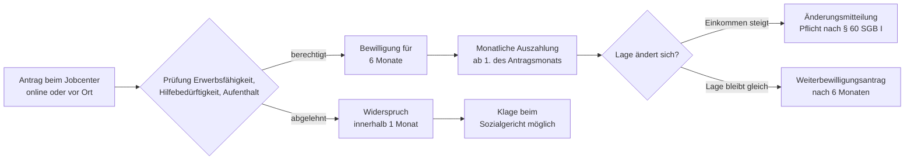

## Geschichte

Der **Regelbedarf nach § 20 SGB II** ist der Kern des deutschen Grundsicherungssystems für Erwerbsfähige. Seine heutige Form ist das Ergebnis einer langen Reformgeschichte:

- **1961** – *Bundessozialhilfegesetz (BSHG)*: Erste bundeseinheitliche Sozialhilfe. Erwerbslose Bedürftige erhielten Sozialhilfe, Langzeitarbeitslose eine nachrangige Arbeitslosenhilfe.
- **2005** – *Hartz-IV-Reform*: Das Vierte Gesetz für moderne Dienstleistungen am Arbeitsmarkt führt das **Arbeitslosengeld II (ALG II)** ein. Bisherige Arbeitslosenhilfe und Sozialhilfe für Erwerbsfähige werden zum einheitlichen ALG II zusammengelegt; die Jobcenter als gemeinsame Einrichtungen von BA und Kommunen entstehen.
- **2010** – *BVerfG-Urteil vom 9. Februar 2010* (BVerfGE 125, 175): Das Bundesverfassungsgericht erklärt die bisherigen Regelsätze für verfassungswidrig, weil sie nicht transparent und sachgerecht hergeleitet worden seien. Das Recht auf ein menschenwürdiges Existenzminimum (Art. 1 i. V. m. Art. 20 GG) verlange eine nachvollziehbare Bemessung. Der Gesetzgeber nimmt daraufhin eine Neuermittlung auf Basis der Einkommens- und Verbrauchsstichprobe (EVS) 2008 vor.
- **2023** – *Bürgergeld-Gesetz*: Das ALG II wird zum **Bürgergeld** umbenannt. Inhaltliche Änderungen: höhere Schonvermögen während einer zweijährigen „Karenzzeit", weniger strenge Wohnkostenanforderungen in dieser Zeit, stärkere Förderung beruflicher Weiterbildung und abgemilderte Sanktionsregeln.

## Anspruchsvoraussetzungen

Anspruch auf Bürgergeld nach § 7 SGB II hat, wer kumulativ alle folgenden Bedingungen erfüllt:

1. **Erwerbsfähigkeit** (§ 8 SGB II): Nicht dauerhaft (mehr als 6 Monate) außerstande, mindestens 3 Stunden täglich zu arbeiten — unabhängig vom regionalen Arbeitsmarkt.
2. **Hilfebedürftigkeit** (§ 9 SGB II): Eigenes Einkommen und Vermögen reichen nicht aus, um den Bedarf zu decken.
3. **Gewöhnlicher Aufenthalt** in Deutschland (§ 7 Abs. 1 Nr. 4 SGB II).
4. **Alter**: 15 bis 64 Jahre. Für Kinder unter 15 im Haushalt gilt Sozialgeld (§ 23 SGB II); Personen ab 65 fallen unter die Grundsicherung im Alter (SGB XII).

**Ausgeschlossen** sind Personen mit erheblichem Vermögen. Während der zweijährigen Karenzzeit gilt ein erhöhter Schonbetrag von **40.000 €** für die erste Person (15.000 € je weiterer Person); nach der Karenzzeit greift die reguläre Vermögensprüfung.

## Berechnung

Der Regelbedarf ist nur einer von mehreren Bausteinen des Bürgergeld-Anspruchs. Die Gesamtleistung berechnet sich vereinfacht als:

```
Bürgergeld = Regelbedarf + Mehrbedarfe + Kosten der Unterkunft und Heizung
             − anrechenbares Einkommen − anrechenbares Vermögen
```

Die Regelsätze werden jährlich angepasst. Stand **2025**:

| Stufe | Personengruppe | Monatlich |
| --- | --- | ---: |
| 1 | Alleinstehende, Alleinerziehende | 563 € |
| 2 | Paare (je Person) | 506 € |
| 3 | Erwachsene unter 25 im Elternhaus | 451 € |
| 4 | Jugendliche 14–17 Jahre | 471 € |
| 5 | Kinder 6–13 Jahre | 390 € |
| 6 | Kinder 0–5 Jahre | 357 € |

### Jährliche Fortschreibung

Die Regelbedarfe werden nach § 28a SGB XII i. V. m. § 20 SGB II jährlich durch einen **Mischindex** fortgeschrieben:

- **70 %** Preisentwicklung der regelbedarfsrelevanten Güter (Verbraucherpreisindex, Teilindex)
- **30 %** Entwicklung der Nettolöhne und -gehälter je Arbeitnehmer (Volkswirtschaftliche Gesamtrechnung)

Die konkreten Beträge werden durch die [Regelbedarfsstufen-Fortschreibungsverordnung (RBSFV)](https://www.gesetze-im-internet.de/rbsfv_2025/) per Rechtsverordnung festgesetzt und im Bundesgesetzblatt bekannt gemacht.

### Einkommensanrechnung

Erwerbseinkommen wird nicht vollständig angerechnet. Nach § 11b SGB II gelten Freibeträge: Vom Bruttolohn werden Steuern und Sozialversicherungsbeiträge abgezogen; vom verbleibenden Nettoeinkommen bleiben weitere 20 % (maximal 330 €/Monat bei Einkommen über 520 €) anrechnungsfrei. Das soll Anreize zur Erwerbsarbeit setzen.

## Antragsweg



Der Antrag wirkt auf den Ersten des Antragsmonats zurück (§ 37 Abs. 2 SGB II) — wer im März beantragt, erhält Leistungen ab 1. März. Es gibt keine weitergehende Rückwirkung, weshalb frühzeitiges Handeln bei finanzieller Not entscheidend ist. Der Bewilligungszeitraum beträgt in der Regel sechs Monate; danach ist ein Weiterbewilligungsantrag erforderlich.

## Sanktionen

Bei Pflichtverletzungen (z. B. Ablehnung zumutbarer Arbeit, unentschuldigtes Fernbleiben von Terminen) kann das Bürgergeld nach § 31–31b SGB II gemindert werden:

| Pflichtverletzung | Minderung | Dauer |
| --- | ---: | --- |
| Erste Pflichtverletzung | 10 % des Regelbedarfs | 1 Monat |
| Wiederholte Pflichtverletzung (innerhalb eines Jahres) | 20 % des Regelbedarfs | 2 Monate |

Das Bürgergeld-Gesetz 2023 hat die früheren ALG-II-Sanktionen, die bei wiederholter Verletzung bis zu 100 % der Leistung entziehen konnten, erheblich abgemildert. Das Bundesverfassungsgericht hatte bereits 2019 (BVerfG, 1 BvL 7/16) entschieden, dass 60-%-Sanktionen in ihrer früheren Ausgestaltung verfassungswidrig seien.

Unterhalb einer bestimmten Grenze (§ 31a Abs. 3 SGB II) darf das Bürgergeld durch Sanktionen nicht auf unter null reduziert werden; ein Existenzminimum bleibt stets gesichert.

## Nichtinanspruchnahme

Studien des DIW und des IAB schätzen, dass ein erheblicher Teil der Anspruchsberechtigten das Bürgergeld bzw. seine Vorgängerleistungen *nicht* in Anspruch nimmt — geschätzt **40–60 %**, je nach Methodik und Jahr. Besonders betroffen ist die Gruppe der „verdeckten Armut": Erwerbstätige mit niedrigem Einkommen und ältere Menschen kurz vor dem Rentenalter, die nicht wissen, dass aufstockendes Bürgergeld möglich ist. Quelle: [DIW Wochenbericht 49/2019](https://www.diw.de/de/diw_01.c.699957.de/publikationen/wochenberichte/2019_49_1/starke_nichtinanspruchnahme_von_grundsicherung_deutet_auf_hohe_verdeckte_altersarmut.html).

Häufige Gründe für Nichtinanspruchnahme:

- Unkenntnis des Anspruchs, insbesondere bei Personen mit Erwerbseinkommen (aufstockendes Bürgergeld)
- Scham und Stigma, das trotz der Umbenennung von ALG II zu Bürgergeld fortbesteht
- Komplexität des Antrags und Unsicherheit über Erfolgsaussichten
- Angst vor aufenthaltsrechtlichen Folgen bei Ausländerinnen und Ausländern

## Verhältnis zu anderen Leistungen

- **Kosten der Unterkunft (§ 22 SGB II)**: Der Regelbedarf deckt *keine* Miet- und Heizkosten ab; diese werden gesondert in „angemessener Höhe" erstattet (Richtwerte je nach Wohnort und Haushaltsgröße).
- **Mehrbedarfe (§ 21 SGB II)**: Aufschläge auf den Regelbedarf für Alleinerziehende (12–60 %), Schwangere (17 %), Menschen mit Behinderung und Personen mit kostenaufwändiger Ernährung.
- **Kinderzuschlag (§ 6a BKGG)**: Für erwerbstätige Familien kann das Paket aus Kinderzuschlag + Wohngeld günstiger sein als Bürgergeld; das Jobcenter prüft dies von Amts wegen. Wer KIZ + Wohngeld erhält, bekommt kein Bürgergeld.
- **Arbeitslosengeld I (SGB III)**: Vorrangig gegenüber dem Bürgergeld. Reicht das ALG I nicht zum Lebensunterhalt aus, kann aufstockendes Bürgergeld beantragt werden. Nach Erschöpfung des ALG I übernimmt das Bürgergeld vollständig.
- **Wohngeld (WoGG)**: Bürgergeld-Beziehende erhalten kein Wohngeld; ihre Unterkunftskosten werden über § 22 SGB II getrennt abgedeckt.
- **Grundsicherung im Alter (SGB XII)**: Paralleles System für Menschen ab 65 Jahren und dauerhaft voll Erwerbsgeminderte. Die Regelbedarfsstufen sind identisch; der Unterschied liegt im fehlenden Vermittlungsauftrag und in der Kostenträgerschaft (Kommunen statt Jobcenter).
- **Sozialgeld (§ 23 SGB II)**: Für nicht erwerbsfähige Personen (z. B. Kinder unter 15) im Haushalt, die zusammen mit einem Bürgergeld-Berechtigten leben. Die Regelbedarfsstufen 5 und 6 gelten für diese Gruppe.
