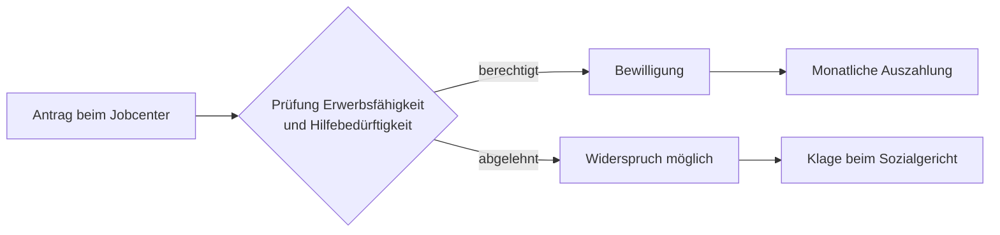

## Geschichte

Das **Bürgergeld** ersetzt seit dem 1. Januar 2023 das frühere *Arbeitslosengeld II* (umgangssprachlich „Hartz IV"). Der Regelbedarf nach § 20 SGB II deckt den notwendigen Lebensunterhalt für Erwachsene, die ihren Bedarf nicht aus eigenem Einkommen oder Vermögen sichern können.

Die Reform brachte unter anderem:

- höhere Schonvermögen in den ersten zwei Jahren („Karenzzeit")
- mehr Spielraum bei Wohnkosten in der Karenzzeit
- stärkere Förderung beruflicher Weiterbildung
- abgemilderte Sanktionsregeln

## Regelbedarfsstufen

Die Regelsätze werden jährlich angepasst. Stand 2025:

| Stufe | Personengruppe | Monatlich |
| --- | --- | ---: |
| 1 | Alleinstehende, Alleinerziehende | 563 € |
| 2 | Paare (je Person) | 506 € |
| 3 | Erwachsene unter 25 im Elternhaus | 451 € |
| 4 | Jugendliche 14–17 Jahre | 471 € |
| 5 | Kinder 6–13 Jahre | 390 € |
| 6 | Kinder 0–5 Jahre | 357 € |

Genaue Beträge und Anpassungen siehe [Regelbedarfsstufen-Fortschreibungsverordnung](https://www.gesetze-im-internet.de/rbsfv_2025/).

## Antragsweg

Der Antrag wirkt grundsätzlich auf den Ersten des Antragsmonats zurück (§ 37 Abs. 2 SGB II).

## Nichtinanspruchnahme

Studien des DIW und des IAB schätzen, dass ein erheblicher Teil der Anspruchsberechtigten das Bürgergeld bzw. seine Vorgängerleistungen *nicht* in Anspruch nimmt — geschätzt 40–60 %, je nach Methodik. Häufige Gründe: Unkenntnis des Anspruchs, Scham, Komplexität des Antrags. Quelle: [DIW Wochenbericht 49/2019](https://www.diw.de/de/diw_01.c.699957.de/publikationen/wochenberichte/2019_49_1/starke_nichtinanspruchnahme_von_grundsicherung_deutet_auf_hohe_verdeckte_altersarmut.html).
