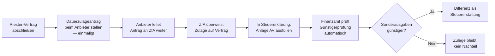

## Hintergrund

Die staatlich geförderte Altersvorsorge nach **§ 10a EStG** wurde 2002 durch das Altersvermögensgesetz (AVmG) eingeführt — als Reaktion auf das schrittweise Absinken des gesetzlichen Rentenniveaus. Die Idee: Wer eigenverantwortlich privat vorsorgt, bekommt vom Staat eine direkte Zulage und/oder eine steuerliche Entlastung über den Sonderausgabenabzug. Das Modell ist nach seinem damaligen Initiator Walter Riester als „Riester-Rente" bekannt.

Knapp 17 Millionen Riester-Verträge existierten zum Spitzenwert; seitdem gehen Bestände durch Kündigungen und Ruhendstellungen zurück. Die Förderung ist strukturell breit angelegt, trifft aber in der Praxis vor allem **mittlere Einkommensschichten** mit Kindern, bei denen die Kinderzulagen einen erheblichen Teil der nötigen Eigenleistung übernehmen.

## Das Zwei-Förder-Wege-System

§ 10a EStG enthält **zwei Förderkomponenten**, die das Finanzamt im Rahmen der Einkommensteuerveranlagung automatisch miteinander vergleicht:

| Förderweg | Mechanismus | Vorteil |
| --- | --- | --- |
| **Zulage** (§§ 83–87 EStG) | Staatliche Zulage wird direkt dem Vertrag gutgeschrieben | Unabhängig vom Steuersatz; für Geringverdiener oft günstiger |
| **Sonderausgabenabzug** (§ 10a EStG) | Beiträge + Zulage bis 2.100 € als Sonderausgaben abziehbar | Für höhere Steuersätze oft günstiger |

Die sogenannte **Günstigerprüfung** (§ 10a Abs. 2 EStG) läuft automatisch: Das Finanzamt prüft, ob der Steuervorteil aus dem Sonderausgabenabzug die Zulagen übersteigt. Ist das der Fall, wird die Differenz als Steuererstattung ausgezahlt. Ist die Zulage günstiger, bleibt es dabei — es entsteht kein Nachteil.

## Wer hat Anspruch?

Anspruchsberechtigt sind ausschließlich Personen im Sinne von **§ 79 EStG** — im Wesentlichen:

| Personengruppe | Bedingung |
| --- | --- |
| Pflichtversicherte in der gesetzlichen Rentenversicherung | Abhängig Beschäftigte, Azubis, Selbstständige mit GRV-Pflicht |
| Beamte, Richter, Soldaten | Anstelle der GRV-Versicherung |
| Bezieher von Arbeitslosengeld I oder II (Bürgergeld) | Während des Leistungsbezugs |
| Elternzeitnehmende | Sofern kurz vor Elternzeit GRV-versichert |
| Ehepartner „abgeleitet" | Können einen eigenen Riester-Vertrag abschließen, wenn der andere Ehepartner anspruchsberechtigt ist |

**Nicht** anspruchsberechtigt: freiwillig GRV-Versicherte, rein privat krankenversicherte Selbstständige ohne GRV-Pflicht.

## Staatliche Zulagen

| Zulage | Betrag pro Jahr |
| --- | --- |
| **Grundzulage** | 175 € |
| **Kinderzulage** (geboren bis 31.12.2007) | 185 € pro Kind |
| **Kinderzulage** (geboren ab 01.01.2008) | 300 € pro Kind |
| **Berufseinsteiger-Bonus** | 200 € (einmalig im ersten Beitragsjahr, nur unter 25 Jahren) |

Die Kinderzulagen werden derjenigen Person gutgeschrieben, die das Kindergeld bezieht.

## Der Mindesteigenbeitrag

Um die **volle Zulage** zu erhalten, muss ein Mindesteigenbeitrag eingezahlt werden:

> **Mindestbeitrag = 4 % des sozialversicherungspflichtigen Vorjahres-Bruttoeinkommens − Zulage**, mindestens aber **60 € (Sockelbeitrag)**.

Der **maximal steuerlich absetzbare Gesamtbetrag** (Eigenbeitrag + Zulage) beträgt **2.100 € pro Jahr**. Beiträge darüber hinaus sind nicht mehr förderungsfähig.

**Beispiel** (grob): Alleinstehende/r, Bruttoeinkommen 30.000 €, keine Kinder.
- Mindestbeitrag: 4 % × 30.000 = 1.200 € − 175 € (Grundzulage) = **1.025 € Eigenbeitrag** nötig
- Gesamtbeitrag Vertrag: 1.200 € (wird steuerlich als Sonderausgabe geprüft)

## Antragsweg

**Zentrale Zulagenstelle für Altersvermögen (ZfA):** Die ZfA (beim Bundeszentralamt für Steuern) verwaltet die Zulagen. Den Dauerzulageantrag stellt man einmalig beim Riester-Anbieter — dieser leitet ihn jedes Jahr automatisch weiter.

## Nachgelagerte Besteuerung

Ein zentrales Merkmal: Die gesamte Riester-Rente — Beiträge und Zulagen — wird in der **Auszahlungsphase versteuert**. Wer also heute Steuern spart und Zulagen erhält, zahlt im Alter auf die volle Rente Einkommensteuer. Das ist fair für alle, die im Alter in einer niedrigeren Steuerklasse sind — kann aber ein Nachteil sein, wenn das Renteneinkommen hoch ist.

## Schädliche Verwendung

Wer Riester-Kapital **vorzeitig entnimmt** oder in nicht geförderte Verwendungen umleitet, muss alle erhaltenen Zulagen und Steuervorteile zurückzahlen (§ 93 EStG). Ausnahmen gibt es für:
- Eigenheimkauf (Wohnriester, § 92a EStG)
- Verlegung des Wohnsitzes in EU-/EWR-Staat (mit Rückzahlungspflicht)
- Tod des Zulageberechtigten (Erbe kann Förderung behalten, wenn in eigenen Riester-Vertrag überführt)

## Abgrenzung zu ähnlichen Leistungen

| Leistung | ID | Unterschied |
| --- | --- | --- |
| Kinderzulage zur Riester-Rente | [[d0f5923b46]] | Reine Kinderzulage nach § 85 EStG — hier separat ausgewiesen |
| Altersvorsorgezulage (§ 79 EStG) | [[fe2acc4351]] | Wer ist zulageberechtig; Grundnorm für die Zulage |
| Betriebliche Altersvorsorge (§ 3 Nr. 63 EStG) | — | Steuerfreie AG-Beiträge zur bAV; andere Förderlogik |
