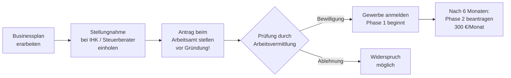

## Hintergrund

Der **Gründungszuschuss** (§ 93 SGB III) ist die zentrale Förderleistung der Bundesagentur für Arbeit für Arbeitslose, die sich selbstständig machen wollen. Er sichert den Lebensunterhalt in der kritischen Anfangsphase und ermöglicht eine Mindestabsicherung im Sozialversicherungssystem.

Das Instrument entstand 2006 durch Zusammenführung von **Überbrückungsgeld** und **Ich-AG**. Die folgenreichste Reform kam 2012: Seither ist der Gründungszuschuss eine **Ermessensleistung** — ein Rechtsanspruch besteht nicht mehr. Die Förderzahlen brachen daraufhin ein:

| Zeitraum | Bewilligungen p. a. (ca.) |
| --- | ---: |
| 2011 (vor Reform) | ~150.000 |
| 2013 (nach Reform) | ~35.000 |
| 2015–2023 | 25.000–50.000 |

IAB-Forschung zeigt, dass Geförderte langfristig bessere Erwerbsverläufe aufweisen als andere ALG-I-Empfänger — trotz vorhandener Mitnahmeeffekte.

## Voraussetzungen

1. **Bezug von Arbeitslosengeld I** zum Gründungszeitpunkt (Bürgergeld reicht nicht)
2. **Mindestens 150 Tage Restanspruch** auf ALG I bei Aufnahme der Selbstständigkeit
3. **Tragfähige Geschäftsidee**, belegt durch Stellungnahme einer fachkundigen Stelle (IHK, Handwerkskammer, Steuerberater, Kreditinstitut)
4. **Persönliche Eignung** — Ermessensentscheidung der Arbeitsvermittlung

Der **Businessplan** ist das Herzstück der Prüfung: Marktanalyse, Finanzplan und realistische Umsatzprognosen erhöhen die Bewilligungswahrscheinlichkeit erheblich. Viele IHKs bieten kostenlose Businessplan-Beratung an.

## Höhe und Dauer

| Phase | Dauer | Betrag |
| --- | ---: | --- |
| Phase 1 | 6 Monate | ALG-I-Betrag + 300 €/Monat Pauschale |
| Phase 2 (optional) | 9 Monate | nur 300 €/Monat |

Phase 1 entspricht dem individuellen ALG-I-Anspruch — bei einem früheren Bruttolohn von 3.000 €/Monat etwa 1.200–1.400 € zuzüglich 300 €, also rund **1.500–1.700 €/Monat**. Phase 2 setzt einen erneuten Antrag und Nachweis der laufenden Selbstständigkeit voraus.

Die **300 €-Pauschale** ist als Beitrag zur Sozialversicherung gedacht, deckt diese aber kaum vollständig. Selbstständige müssen sich eigenständig krankenversichern (GKV-Mindestbeitrag 2024: ca. 233 €/Monat) und optional rentenversichern.

## Antragsweg

**Kritisch:** Der Antrag muss **vor** Aufnahme der Selbstständigkeit gestellt werden — eine rückwirkende Bewilligung ist ausgeschlossen. Da außerdem mindestens 150 Tage Restanspruch benötigt werden, muss die Gründung frühzeitig in der Arbeitslosigkeit geplant werden.

## Steuer und Sozialversicherung

Die Zahlungen sind **steuerfrei** (§ 3 Nr. 2 EStG), unterliegen aber dem **Progressionsvorbehalt** (§ 32b EStG): Eigene Gewinne aus der Selbstständigkeit werden mit dem höheren Steuersatz belastet, der sich ergibt, wenn der Gründungszuschuss rechnerisch zum Einkommen addiert wird.

## Abgrenzung

| Leistung | Verhältnis |
| --- | --- |
| **Einstiegsgeld (§ 16b SGB II)** | Pendant für Bürgergeld-Empfänger; geringerer Umfang |
| **KfW-Gründerkredite** | Fremdkapital; parallel nutzbar |
| **EXIST-Gründerstipendium** | BMWi-Programm für Hochschulgründungen; nicht kombinierbar |
| **BAFA-Beratungsförderung** | Ergänzend nutzbar |

## Praktische Hinweise

- **Widerspruch lohnt sich** bei Ablehnung auf Basis falscher Tatsachen oder erkennbar nicht ausgeübtem Ermessen — Sozialgerichte prüfen die ordnungsgemäße Ermessensausübung.
- **Krankenversicherung frühzeitig planen:** Aus ALG I heraus kann man freiwillig in der GKV bleiben. In Phase 2 (nur 300 €) bleibt nach Krankenversicherungsbeitrag kaum Spielraum.
- **Kombination möglich:** KfW-Kredite, Landesförderprogramme und BAFA-Beratungsförderung können parallel zum Gründungszuschuss genutzt werden.
