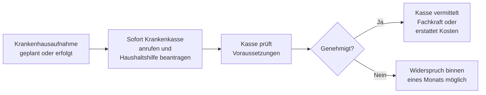

## Hintergrund

Die **Haushaltshilfe bei Krankenhausaufenthalt** ist seit dem Gesundheitsreformgesetz 1989 als Pflichtleistung der gesetzlichen Krankenversicherung in **§ 38 SGB V** verankert. Sie greift, wenn ein Versicherter wegen Krankheit stationär aufgenommen wird oder eine ambulante Behandlung erhält, die die Haushaltsführung unmöglich macht — und dadurch die Betreuung kleiner Kinder zu Hause nicht mehr gewährleistet ist.

Obwohl es sich um einen klaren gesetzlichen Anspruch handelt, gehört die Haushaltshilfe zu den **am seltensten genutzten GKV-Leistungen**. Krankenhäuser und Arztpraxen weisen kaum aktiv darauf hin, und viele Versicherte wissen schlicht nicht, dass ihnen diese Hilfe zusteht.

## Wer hat Anspruch?

| Voraussetzung | Details |
| --- | --- |
| **GKV-Mitgliedschaft** | Pflicht- oder freiwillig gesetzlich Versicherte |
| **Medizinischer Anlass** | Stationärer Aufenthalt oder ambulante Behandlung, die Haushaltsführung unmöglich macht |
| **Kind im Haushalt** | Kind unter **12 Jahren** (oder behindertes Kind ohne Altersgrenze) |
| **Keine Ersatzperson** | Keine andere im Haushalt lebende Person, die die Versorgung übernehmen kann |

Die letzte Bedingung ist entscheidend: Lebt ein Partner oder ein erwachsenes Kind im Haushalt, entfällt der Anspruch grundsätzlich — auch wenn diese Person berufstätig ist. Privat Versicherte haben keinen Anspruch nach SGB V; einzelne PKV-Tarife können eigene Regelungen enthalten.

## Was wird geleistet?

Die Krankenkasse stellt eine Haushaltshilfe als **Sachleistung** bereit (die Fachkraft wird direkt von der Kasse organisiert und bezahlt) oder erstattet die Kosten bei selbst organisierter Hilfe. Die Tätigkeiten umfassen typischerweise Einkaufen, Kochen, Reinigung, Wäsche sowie Betreuung und Beaufsichtigung der Kinder.

## Eigenbeteiligung

Versicherte zahlen eine Zuzahlung von **10 % der Kosten pro Kalendertag**, mindestens **5 €** und höchstens **10 €** (§ 38 Abs. 5 SGB V). Wer die jährliche Belastungsgrenze bereits ausgeschöpft hat (2 % des Bruttoeinkommens, bei chronisch Kranken 1 %), ist von der Zuzahlung befreit.

## Antragsweg

Der Antrag sollte möglichst **vor oder bei der Aufnahme** gestellt werden. Bei Notfallaufnahmen ist auch ein nachträglicher Antrag möglich; die Leistung wird ab dem Aufnahmetag gewährt. In vielen Fällen genügt ein einfacher **Telefonanruf** bei der Krankenkasse — viele Kassen können innerhalb weniger Stunden eine Haushaltshilfe vermitteln.

## Abgrenzung zu ähnlichen Leistungen

| Leistung | Rechtsgrundlage | Anlass |
| --- | --- | --- |
| Haushaltshilfe bei Krankheit | § 38 SGB V | Stationärer oder ambulanter Behandlungsaufenthalt |
| Haushaltshilfe bei Schwangerschaft | § 24h SGB V | Schwangerschaft, Entbindung oder Fehlgeburt |
| Haushaltshilfe bei Vorsorge-/Reha-Kur | §§ 23 Abs. 4, 40 SGB V | Medizinische Vorsorge oder Rehabilitation |

## Hinweis zur Nutzung

Wer mit kleinen Kindern zu Hause stationär aufgenommen wird oder eine längere ambulante Behandlung beginnt (z. B. Chemotherapie), sollte **sofort die eigene Krankenkasse kontaktieren**. Die häufigsten Hindernisse — Unkenntnis, vermeintliche Bürokratie, die Annahme, Nachbarn oder Verwandte müssten einspringen — lassen sich durch einen einzigen Anruf aus dem Weg räumen.
