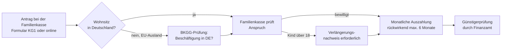

## Geschichte

Das **Kindergeld** gehört zu den ältesten Familienleistungen des deutschen Sozialstaats. Erste bundeseinheitliche Regelungen entstanden mit dem **Bundeskindergeldgesetz (BKGG) von 1954** — damals noch auf Familien ab dem dritten Kind beschränkt.

- **1954** – Einführung des BKGG: 26 DM/Monat ab dem dritten Kind
- **1961** – Erweiterung ab dem zweiten Kind
- **1975** – Kindergeld für alle Kinder ab dem ersten Kind
- **1996** – Systemwechsel ins Einkommensteuergesetz (EStG); Einführung des **Familienleistungsausgleichs**
- **2023** – Einheitlicher Betrag für jedes Kind (250 €), Abschaffung der Staffelung nach Kinderzahl
- **2024/2025** – Schrittweise Anhebung auf zuletzt **259 €/Monat**

## Anspruchsvoraussetzungen

Anspruchsberechtigt nach § 62 EStG ist, wer in Deutschland **unbeschränkt einkommensteuerpflichtig** ist (Wohnsitz oder gewöhnlicher Aufenthalt im Inland). Die Staatsangehörigkeit spielt keine Rolle.

Als **Kinder** zählen (§ 63 EStG): leibliche Kinder, Adoptiv- und Pflegekinder sowie Stiefkinder und Kinder des Lebenspartners im gemeinsamen Haushalt.

**Altersgrenzen:**

| Situation | Altersgrenze |
| --- | --- |
| Grundfall | bis 18 Jahre |
| Berufsausbildung, Studium | bis 25 Jahre |
| FSJ, BFD, Freiwilligendienst | bis 25 Jahre |
| Übergangszeit zwischen Ausbildungsabschnitten | bis 25 Jahre (max. 4 Monate) |
| Behinderung (vor dem 25. Geburtstag eingetreten) | keine Altersgrenze |

Eigenes Einkommen des Kindes ist seit **2012 nicht mehr** anspruchsschädlich.

## Betrag und Zahlung

Seit 2023 gilt für jedes Kind derselbe monatliche Betrag — die frühere Staffelung wurde abgeschafft:

| Jahr | Betrag je Kind/Monat |
| --- | ---: |
| 2022 | 219–250 € (gestaffelt) |
| 2023 | 250 € |
| 2024 | 255 € |
| **2025** | **259 €** |

Die Zahlung erfolgt monatlich im Voraus (§ 66 Abs. 2 EStG). Bei getrenntlebenden Eltern erhält derjenige das Kindergeld, bei dem das Kind lebt (§ 64 EStG).

## Familienleistungsausgleich

Das Kindergeld ist keine reine Sozialleistung, sondern Teil des **Familienleistungsausgleichs** (§§ 31, 32 EStG). Das Finanzamt prüft im Rahmen der Einkommensteuererklärung automatisch, ob der **Kinderfreibetrag** (2025: 6.672 €/Kind) günstiger ist als das ausgezahlte Kindergeld. Fällt die Prüfung zugunsten des Freibetrags aus, wird das bereits ausgezahlte Kindergeld angerechnet. In der Praxis profitieren vom Freibetrag fast ausschließlich Gutverdiener im Spitzensteuersatz — für die große Mehrheit der Familien ist das Kindergeld die bessere Lösung.

## Auszahlung in Sonderfällen

§ 74 EStG ermöglicht Abweichungen von der Standardauszahlung an den betreuenden Elternteil:

- **Direkt an das Kind**, wenn es volljährig ist, im eigenen Haushalt lebt oder der Elternteil seiner Unterhaltspflicht nicht nachkommt
- **An Dritte oder Behörden** (sog. Abzweigung), wenn das Kind vollstationär in einem Heim oder einer Pflegefamilie lebt — das Kindergeld geht dann an den Jugendhilfeträger oder die Pflegeperson, nicht an die Eltern

## Antragsweg

**Wichtige Frist:** Eine rückwirkende Zahlung ist nur für die **letzten 6 Monate** vor Antragstellung möglich (§ 66 Abs. 3 EStG). Wer zu spät beantragt, verliert Ansprüche unwiederbringlich. Für Kinder über 18 ist jährlich ein Nachweis (Immatrikulationsbescheinigung, Ausbildungsvertrag o. Ä.) einzureichen.

## Verhältnis zu anderen Leistungen

- **Kinderzuschlag**: Setzt das Kindergeld voraus und ergänzt es für Familien knapp oberhalb der Bürgergeld-Schwelle
- **Bürgergeld**: Kindergeld wird als Einkommen des Kindes angerechnet, mindert also den Kinderbedarf
- **Elterngeld**: Wird zusätzlich zum Kindergeld gezahlt; Kindergeld bleibt bei der Elterngeldberechnung außer Ansatz
- **BAföG**: Kindergeld zählt nicht zum Einkommen des Auszubildenden, sondern wird den Eltern zugerechnet

## Inanspruchnahme

Das Kindergeld erreicht mit rund **17,6 Millionen Kindern** die größte Reichweite aller deutschen Familienleistungen. Da der Antrag einmalig gestellt wird und für Kinder unter 18 automatisch weiterläuft, ist die Inanspruchnahme hoch. Bekannte Lücken entstehen durch verspätete Antragstellung (6-Monats-Grenze), fehlende Verlängerungsnachweise für Kinder über 18 sowie komplexe Koordinationsregeln für Grenzpendler und Zugewanderte (EU-Verordnung 883/2004).
