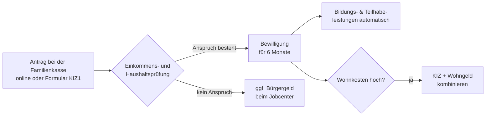

## Geschichte

Der **Kinderzuschlag** (KIZ) wurde zum 1. Januar 2005 eingeführt, um Familien mit kleinem Erwerbseinkommen davor zu bewahren, allein wegen der Unterhaltskosten für ihre Kinder auf staatliche Grundsicherung angewiesen zu sein. Die Leistung ist in § 6a BKGG (Bundeskindergeldgesetz) geregelt.

- **2005** – Einführung mit max. 140 € pro Kind
- **2019** – Grundlegende Reform durch das **Starke-Familien-Gesetz**: gleitende statt abrupter Einkommensanrechnung, Erhöhung auf 185 €, ausdrückliche Kombinierbarkeit mit Wohngeld
- **2023** – Erhöhung auf 250 €
- **2025** – aktuell **297 € pro Kind und Monat**

## Anspruchsvoraussetzungen

Alle vier Bedingungen müssen gleichzeitig erfüllt sein (§ 6a Abs. 1 BKGG):

1. Die antragstellende Person bezieht **Kindergeld** für das Kind.
2. Das Kind lebt im Haushalt und ist **unter 25 Jahre** alt.
3. Es besteht ein **Mindesteinkommen** aus Erwerbstätigkeit:
   - **900 € brutto/Monat** für Paare
   - **600 € brutto/Monat** für Alleinerziehende
4. Mit dem KIZ — ggf. ergänzt durch Wohngeld — wäre **keine Hilfebedürftigkeit** nach SGB II mehr anzunehmen.

Die Mindesteinkommensgrenze stellt sicher, dass der KIZ erwerbstätigen Eltern zugute kommt; wer deutlich darunter liegt, wird auf Bürgergeld verwiesen.

## Berechnung

Der monatliche Betrag wird für jedes Kind gesondert berechnet. Vereinfacht gilt:

> KIZ je Kind = Max. KIZ − 0,45 × (elterliches Nettoeinkommen − elterlicher Bedarf nach SGB II)

Für jeden Euro, den das bereinigte Elterneinkommen den SGB-II-Bedarf übersteigt, sinkt der KIZ um **45 Cent** — bis er bei null angekommen ist.

| Einkommenssituation | KIZ-Betrag (2025) |
| --- | ---: |
| Einkommen = elterlicher Bedarf | 297 €/Kind |
| Einkommen 100 € über Bedarf | 252 €/Kind |
| Einkommen 660 € über Bedarf | 0 € |

Eigenes Einkommen des Kindes (z. B. Unterhalt, Ausbildungsvergütung) wird ebenfalls angerechnet.

## Kombination mit Wohngeld

Seit 2019 ist der KIZ ausdrücklich mit Wohngeld kombinierbar. Das **KIZ-Wohngeld-Paket** ist für erwerbstätige Familien oft vorteilhafter als Bürgergeld. Die Familienkasse bietet auf ihrer Website einen Vergleichsrechner an. Jobcenter prüfen bei Bürgergeld-Anträgen automatisch, ob dieses Paket zumutbar wäre — und können den Antrag ablehnen, wenn das der Fall ist.

## Bildungs- und Teilhabeleistungen

KIZ-Berechtigte erhalten **automatisch Anspruch auf Bildungs- und Teilhabeleistungen** (§ 6b BKGG), ohne einen eigenen SGB-II-Antrag stellen zu müssen:

- Schulbedarfspaket (195 € pro Schuljahr)
- Schul- und Kitaausflüge
- Schülerbeförderung
- Lernförderung (Nachhilfe)
- Mittagsverpflegung in Schule, Kita und Hort
- Teilhabe am sozialen und kulturellen Leben (15 €/Monat)

## Antragsweg

Der Bewilligungszeitraum beträgt stets **sechs Monate**; danach ist eine erneute Antragstellung nötig. Eine rückwirkende Zahlung ist — anders als beim Elterngeld — nicht möglich; der KIZ wird frühestens ab dem Antragsmonat gewährt.

## Nichtinanspruchnahme

Studien schätzen, dass nur 30–60 % der berechtigten Familien den KIZ tatsächlich beantragen. Häufige Gründe:

- **Unkenntnis**: Viele Familien wissen nicht, dass Erwerbseinkommen und KIZ gleichzeitig möglich sind.
- **Stigma**: Die Nähe zu Bürgergeld schreckt ab.
- **Komplexität**: Das bereinigte Nettoeinkommen nach SGB-II-Logik ist schwer einzuschätzen — Freibeträge werden oft nicht berücksichtigt, weshalb viele ihr Einkommen fälschlicherweise für zu hoch halten.

Die Familienkasse empfiehlt den **Online-Schnellcheck** auf ihrer Website als ersten Orientierungspunkt.
