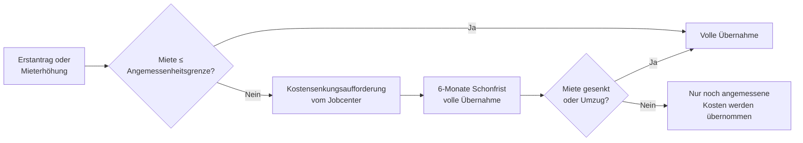

## Hintergrund

Die **Kosten der Unterkunft und Heizung (KdU)** nach § 22 SGB II sind die zweite große Säule des Bürgergeldes neben dem Regelbedarf. Anders als der bundesweit einheitliche Regelbedarf orientieren sich die KdU an den tatsächlichen, ortsüblichen Mietkosten — was in München angemessen ist, kann in Sachsen-Anhalt weit überhöht wirken. Finanziell sind die KdU erheblich: Je nach Region machen sie 40–60 % der gesamten Bürgergeld-Ausgaben aus; bundesweit wurden 2023 rund 15 Milliarden Euro dafür aufgewendet.

## Was wird übernommen?

§ 22 Abs. 1 SGB II unterscheidet zwei Kostenblöcke:

**Unterkunftskosten** (Bruttokaltmiete):
- Nettokaltmiete
- Betriebskosten nach BetrKV (Wasser, Abwasser, Müll, Hausmeister, Aufzug etc.)
- Nicht enthalten: Heizkosten und in der Regel die Kabel-TV-Pauschale

**Heizkosten** werden separat nach tatsächlichem Verbrauch übernommen, soweit sie nicht unangemessen hoch sind. Maßstab ist der **Bundesweite Heizkostenspiegel** (co2online), der nach Heizungsart und beheizter Fläche differenziert. Betriebskostennachzahlungen werden übernommen, sofern die Wohnung noch bewohnt wird; Guthaben aus der Abrechnung sind als Einnahme anzurechnen.

**Eigentümer** können statt Miete folgende Kosten geltend machen: Schuldzinsen (nicht Tilgungsanteile!), Grundsteuer, Wohngebäudeversicherung und unaufschiebbare Instandhaltungsmaßnahmen.

## Angemessenheit: das Schlüsselkonzept

Herzstück und häufigste Konfliktquelle ist die **Angemessenheitsgrenze**. Das Bundessozialgericht (BSG) hat entwickelt, dass Jobcenter auf Basis lokaler Mietdaten ein **schlüssiges Konzept** vorlegen müssen — typischerweise das 33. Perzentil des lokalen Wohnungsangebots. Flächengrenzen richten sich nach Landesverwaltungsvorschriften (üblich: 50 m² für eine Person, +15 m² je weiterer Person).

Die resultierenden Richtwerte variieren stark:

| Region (2024/2025, Orientierung) | 1-Personen-HH | 2-Personen-HH |
| --- | ---: | ---: |
| München | ~800 € Bruttokaltmiete | ~960 € |
| Hamburg | ~650 € | ~800 € |
| Berlin (je nach Bezirk) | ~560–620 € | ~680–760 € |
| Köln | ~620 € | ~750 € |
| Ländlicher Raum (z. B. Sachsen-Anhalt) | ~350–400 € | ~430–490 € |

Kann ein Jobcenter kein schlüssiges Konzept vorweisen, gilt ersatzweise der **Wohngeldtabellenwert zuzüglich 10 %** als Angemessenheitsgrenze.

## Kostensenkungsaufforderung und Umzug

Überschreitet die Miete die Angemessenheitsgrenze, läuft ein geregeltes Verfahren ab:

Die **6-Monate-Schonfrist** gilt nur bei erstmaligem Leistungsbezug. Wer bereits Bürgergeld bezieht und in eine teurere Wohnung umzieht, ohne vorherige Zustimmung des Jobcenters (§ 22 Abs. 4 SGB II), erhält nur die bisherige angemessene Miethöhe erstattet — ein häufiger und teurer Fehler.

Ein Umzug kann ausnahmsweise **unzumutbar** sein (z. B. Schulwechsel mitten im Schuljahr, Pflegebeziehungen in der Nachbarschaft, gesundheitliche Gründe) — in diesen Fällen sind die tatsächlichen Kosten weiter zu übernehmen.

## Verhältnis zu anderen Leistungen

- **Wohngeld:** Bürgergeld-Beziehende sind vom Wohngeld ausgeschlossen. Ein Wechsel ins Wohngeld-System kann sich lohnen, sobald das Einkommen steigt und der Bürgergeld-Anspruch entfällt.
- **Schuldenübernahme (§ 22 Abs. 8 SGB II):** Bei drohender Obdachlosigkeit durch Mietschulden kann das Jobcenter die Schulden als **Darlehen** übernehmen — rückzahlungspflichtig, aber wohnungssichernd.
- **Kinderzuschlag:** Wer durch den Kinderzuschlag aus dem Bürgergeld-Bezug herauskommt, erhält stattdessen Wohngeld; das Zusammenspiel ist komplex.

## Typische Streitpunkte

KdU ist das am häufigsten vor Sozialgerichten beklagte Thema im SGB-II-Bereich:

- **Veraltetes oder fehlendes schlüssiges Konzept** des Jobcenters — Gerichte ersetzen es dann durch den Wohngeldtabellenwert + 10 %
- **Abgelehnte Betriebskostennachzahlungen**, obwohl diese grundsätzlich zu übernehmen wären
- **Hohe Heizkosten in schlecht gedämmten Altbauten** — Mieter können die Energieeffizienz des Gebäudes nicht selbst steuern; die Rechtsprechung differenziert, ob dies dem Mieter anzulasten ist
- **Wohngemeinschaften:** KdU werden nur anteilig anerkannt

## Antragsweg

Die KdU werden nicht separat beantragt, sondern sind Teil des allgemeinen **Bürgergeld-Antrags** (Anlage KdU). Beizufügen sind aktueller Mietvertrag, aktuelle Betriebskostenabrechnung sowie bei Wohneigentum Kreditvertrag, Grundsteuerbescheid und Versicherungsnachweis. Mieterhöhungen sind dem Jobcenter unverzüglich zu melden.
