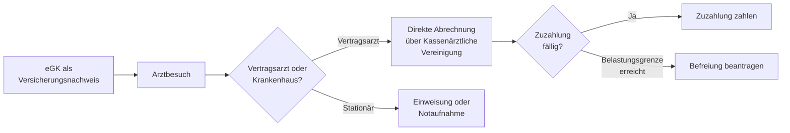

## Geschichte

Die **gesetzliche Krankenversicherung (GKV)** ist der älteste Zweig des deutschen Sozialversicherungssystems. Seit dem *Krankenversicherungsgesetz* von 1883 unter Bismarck hat sie sich von einem Basisschutz für Industriearbeiter zu einem universellen Versorgungssystem entwickelt.

- **1883** – Erste obligatorische Krankenversicherung; Beiträge je 2/3 Arbeitnehmer, 1/3 Arbeitgeber
- **1996** – Freie Kassenwahl für Versicherte
- **2004** – Einführung der Praxisgebühr (10 €/Quartal), 2013 wieder abgeschafft
- **2007** – Allgemeine Versicherungspflicht; Einführung des Gesundheitsfonds
- **2019** – Wiederherstellung der paritätischen Finanzierung des Zusatzbeitrags

## Versicherter Personenkreis

Die GKV unterscheidet drei Mitgliedschaftsformen:

| Form | Wer | Beitrag |
| --- | --- | --- |
| **Pflichtversicherung** (§§ 5, 6 SGB V) | Arbeitnehmer unter der JAEG (2025: 73.800 €/Jahr), ALG-Beziehende, Studierende bis 30 J. | einkommensabhängig |
| **Freiwillige Versicherung** (§ 9 SGB V) | Wer aus der Pflicht ausscheidet oder nie pflichtversichert war | nach Gesamteinkommen |
| **Familienversicherung** (§ 10 SGB V) | Ehegatten, Kinder bis 18 J. (bis 25 J. in Ausbildung) | beitragsfrei |

Wer die Jahresarbeitsentgeltgrenze überschreitet, kann in die **private Krankenversicherung (PKV)** wechseln.

## Leistungsumfang nach § 27 SGB V

Versicherte haben Anspruch auf Krankenbehandlung, wenn diese notwendig ist, um eine Krankheit zu erkennen, zu heilen, ihre Verschlimmerung zu verhüten oder Beschwerden zu lindern. Der Leistungskatalog umfasst unter anderem:

- Ärztliche und zahnärztliche Behandlung
- Arznei-, Verband-, Heil- und Hilfsmittel
- Häusliche Krankenpflege und Haushaltshilfe
- Krankenhausbehandlung und medizinische Rehabilitation
- **Krankengeld** ab der 7. Woche (70 % des Bruttolohns, max. 90 % des Nettolohns; 2025: max. 120,75 €/Tag)

Das **Wirtschaftlichkeitsgebot** (§ 12 SGB V) begrenzt den Leistungsumfang: Nur ausreichende, zweckmäßige und wirtschaftliche Leistungen werden übernommen. Der **Gemeinsame Bundesausschuss (G-BA)** konkretisiert dies in Richtlinien. Nicht übernommen werden typischerweise ästhetische Eingriffe, Reiseimpfungen ohne berufliche Notwendigkeit, nicht verschreibungspflichtige Medikamente für Erwachsene sowie Sehhilfen (außer in Ausnahmefällen).

## Zuzahlungen und Belastungsgrenze

| Leistungsbereich | Zuzahlung |
| --- | --- |
| Arzneimittel | 10 % des Preises, mind. 5 €, max. 10 € |
| Krankenhausaufenthalt | 10 €/Tag, max. 28 Tage/Jahr |
| Heilmittel (z. B. Physiotherapie) | 10 % je Anwendung + 10 € je Verordnung |
| Zahnersatz | i. d. R. 50–65 % der Regelversorgungskosten |

Die jährliche Gesamtbelastung ist auf **2 % des Haushaltsbruttoeinkommens** begrenzt (1 % bei chronisch Kranken, § 62 SGB V). Wer die Grenze erreicht, beantragt eine Befreiungsbescheinigung bei seiner Krankenkasse. Kinder unter 18 Jahren sind von den meisten Zuzahlungen befreit.

## Finanzierung

Der allgemeine Beitragssatz beträgt 2025 **14,6 %** des beitragspflichtigen Einkommens — paritätisch geteilt zwischen Arbeitnehmer und Arbeitgeber. Hinzu kommt ein kassenindividueller **Zusatzbeitrag** (Ø ca. 1,7 %), ebenfalls paritätisch. Die **Beitragsbemessungsgrenze** liegt bei 66.150 € Jahreseinkommen.

Alle Beiträge fließen in den zentralen **Gesundheitsfonds** (§ 271 SGB V) und werden über den morbiditätsorientierten Risikostrukturausgleich (**Morbi-RSA**) risikoadjustiert an die Kassen verteilt.

## Inanspruchnahme

Die GKV funktioniert als **Sachleistungssystem**: Versicherte legen keine Rechnungen vor — die Abrechnung läuft direkt zwischen Arzt, Apotheke oder Krankenhaus und der Krankenkasse. Der Versicherungsnachweis ist die **elektronische Gesundheitskarte (eGK)**, die die Kasse automatisch ausgibt.

## Besondere Risikogruppen

Trotz allgemeiner Versicherungspflicht bleiben Versorgungslücken bestehen:

- **Einkommensschwache** nehmen präventive Leistungen und Zahnersatz seltener in Anspruch (Robert-Koch-Institut-Daten zeigen systematische Schichtunterschiede).
- **Unversicherte**: Schätzungsweise 60.000–100.000 Personen sind trotz Versicherungspflicht ohne Schutz — häufig wegen aufgelaufener Beitragsschulden.
- **Asylsuchende** haben in den ersten 18 Monaten nur Anspruch auf akute Behandlung (§ 4 AsylbLG), danach auf GKV-gleichwertige Leistungen.

## Verhältnis zu anderen Leistungen

- **Pflegeversicherung (SGB XI)**: GKV-Mitglieder sind automatisch auch in der sozialen Pflegeversicherung versichert; die Krankenkasse fungiert als Pflegekasse.
- **Entgeltfortzahlung**: Die ersten 6 Wochen der Arbeitsunfähigkeit trägt der Arbeitgeber nach dem EFZG; ab der 7. Woche zahlt die GKV Krankengeld.
- **Bürgergeld (SGB II)**: Leistungsbeziehende sind über das Jobcenter pflichtversichert; Beiträge trägt der Bund.
- **Beamte**: Erhalten Beihilfe des Dienstherrn (50–80 % der Kosten) und ergänzen dies in der Regel über eine private Restkostenversicherung.
