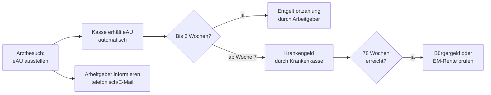

## Geschichte

Das **Krankengeld** gehört zu den ältesten Leistungen des deutschen Sozialversicherungssystems. Bismarck begründete es bereits 1883 mit dem *Krankenversicherungsgesetz* — einem der ersten staatlich organisierten Krankenversicherungssysteme weltweit. Seither hat sich die Leistung grundlegend weiterentwickelt:

- **1883** – Erstmals staatlich organisierte Geldleistung bei Arbeitsunfähigkeit
- **1969** – *Lohnfortzahlungsgesetz*: Arbeitgeber zahlen ab dem ersten Krankheitstag sechs Wochen Entgelt; das Krankengeld der Kasse greift erst danach
- **1989** – SGB V vereinheitlicht das Leistungsrecht der gesetzlichen Krankenversicherung
- **2023** – Volldigitale Krankmeldung (eAU): Arbeitgeber rufen die Arbeitsunfähigkeitsbescheinigung elektronisch bei der Krankenkasse ab — der Papier-„gelbe Schein" entfällt

## Anspruchsvoraussetzungen

Krankengeld erhalten GKV-Versicherte, die alle Voraussetzungen des § 44 SGB V erfüllen:

1. **GKV-Mitgliedschaft mit Krankengeldanspruch** — keine beitragsfreie Familienversicherung, kein Tarif ohne Krankengeld
2. **Ärztlich festgestellte Arbeitsunfähigkeit** (eAU)
3. **Einkommensausfall** durch die Arbeitsunfähigkeit

Der Anspruch entsteht erst **nach der sechswöchigen Entgeltfortzahlungsfrist** des Arbeitgebers. Bei derselben Erkrankung beginnt die Sechs-Wochen-Frist nur dann neu, wenn zuvor mindestens sechs Monate ununterbrochene Arbeitsfähigkeit bestand.

| Personengruppe | Situation |
| --- | --- |
| Familienversicherte | Beitragsfreie Mitversicherung schließt Krankengeld aus |
| Selbstständige ohne KG-Tarif | Haben Krankengeldschutz abgewählt (§ 44 Abs. 2 SGB V) |
| Minijobber (≤ 538 €/Monat) | Keine GKV-Pflichtmitgliedschaft |
| Beamte / Privatversicherte | Kein Anspruch aus SGB V |

## Höhe der Leistung

Das Krankengeld berechnet sich aus dem **Regelentgelt** nach § 47 SGB V:

> **70 % des beitragspflichtigen Bruttoarbeitsentgelts**, höchstens **90 % des Nettoarbeitsentgelts**

Basis ist das Arbeitsentgelt der letzten vier abgerechneten Wochen oder des letzten voll abgerechneten Kalendermonats. Die Tagesleistung ergibt sich durch Division durch 30 Kalendertage.

| Position | Betrag (2025) |
| --- | ---: |
| Beitragsbemessungsgrenze GKV | 5.512,50 €/Monat |
| Max. Regelentgelt pro Kalendertag | 183,75 € |
| Max. Krankengeld pro Kalendertag (brutto) | **128,63 €** |
| Max. Krankengeld pro Monat (brutto) | **3.858,75 €** |

Vom ausgezahlten Krankengeld werden Arbeitnehmeranteile zur Renten-, Arbeitslosen- und Pflegeversicherung einbehalten (ca. 12–13 %). Krankenversicherungsbeiträge fallen für Pflichtversicherte während des Bezugs nicht an (§ 224 Abs. 1 SGB V).

Das Krankengeld ist **steuerfrei**, unterliegt aber dem **Progressionsvorbehalt** (§ 32b EStG). Wer im gleichen Jahr Arbeitslohn und Krankengeld bezogen hat, muss eine Steuererklärung abgeben und erhält häufig eine Steuernachzahlung.

## Bezugsdauer

| Phase | Regelung |
| --- | --- |
| 1.–42. Tag | Entgeltfortzahlung durch Arbeitgeber — kein Krankengeld |
| Ab dem 43. Tag | Krankengeld durch die Krankenkasse |
| Höchstdauer | **78 Wochen** innerhalb von 3 Jahren für dieselbe Erkrankung (§ 48 SGB V) |

Die Blockfrist läuft auf Basis des ICD-Diagnosecodes. Nach Erschöpfung des Anspruchs kommen je nach Situation Bürgergeld (SGB II), Erwerbsminderungsrente (§ 43 SGB VI) oder Sozialhilfe (SGB XII) in Betracht.

## Antragsweg

Seit dem 1. Januar 2023 erstellt die Arztpraxis die eAU und übermittelt sie direkt an die Kasse. Arbeitgeber rufen die Daten elektronisch ab. Die Krankmeldung beim Arbeitgeber (telefonisch o. ä.) bleibt aber weiterhin Pflicht.

## Wichtige Fallstricke

- **Nahtlosigkeit der Krankmeldung**: Der häufigste Grund für den Verlust des Krankengeldanspruchs ist das Versäumen der rechtzeitigen Folge-AU. Die nächste Krankmeldung muss spätestens am letzten Geltungstag der bestehenden AU ausgestellt sein (§ 49 Abs. 1 Nr. 5 SGB V) — auch an Freitagen und vor Feiertagen.
- **Nebentätigkeit melden**: Hinzuverdienste während der Arbeitsunfähigkeit sind der Kasse zu melden, andernfalls droht Rückforderung.
- **Auswirkung auf Elterngeld**: Krankengeld in den zwölf Monaten vor der Geburt mindert die Elterngeld-Bemessungsgrundlage, da es nur 70 % des Bruttoentgelts ersetzt.
- **Selbstständige**: Wer beim GKV-Beitritt den günstigeren Tarif ohne Krankengeld gewählt hat, erhält ab dem 43. Krankheitstag keine Leistung.
