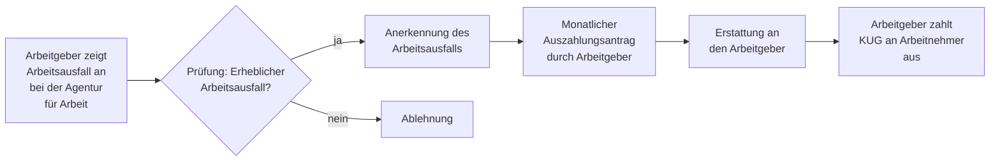

## Geschichte

Das **Kurzarbeitergeld** (KUG) gehört zu den ältesten Instrumenten der deutschen Arbeitslosenversicherung. Die Idee, Beschäftigte bei vorübergehender Arbeitszeitverkürzung staatlich zu stützen, reicht bis ins frühe 20. Jahrhundert zurück.

- **1924** – Einführung einer „Kurzarbeiterunterstützung" im Deutschen Reich
- **1969** – Systematische Verankerung im Arbeitsförderungsgesetz (AFG)
- **1998** – Überführung ins SGB III (§§ 95–109)
- **2008/09** – Massennutzung während der Weltfinanzkrise: bis zu **1,4 Millionen Kurzarbeiter** gleichzeitig; internationale Rezeption als „German Model"
- **2020/21** – COVID-19-Krise: historischer Spitzenwert von über **6 Millionen Kurzarbeitern** im April 2020; vereinfachter Zugang, Bezugsdauer auf 24 Monate verlängert

## Leistungshöhe

Das KUG ersetzt einen Anteil des **pauschalierten Nettolohnausfalls** — der Differenz zwischen dem normalen Monatslohn (Soll-Entgelt) und dem tatsächlich verdienten Lohn während der Kurzarbeit (Ist-Entgelt):

| Leistungssatz | Personengruppe | Ersatzrate |
| --- | --- | ---: |
| Allgemeiner Satz | Kein Kind im Haushalt | 60 % |
| Erhöhter Satz | Mind. 1 Kind im Haushalt (§ 105 Nr. 2 SGB III) | 67 % |

Viele Tarifverträge — insbesondere in der Metall- und Chemieindustrie — verpflichten den Arbeitgeber zur **Aufstockung auf 80–90 %** des Nettoentgelts. Diese Aufstockungsbeträge sind steuerpflichtig.

## Voraussetzungen

Das KUG setzt Voraussetzungen auf drei Ebenen voraus:

**Erheblicher Arbeitsausfall (§ 96 SGB III):** Mindestens 10 % der Belegschaft müssen von einem Entgeltausfall von mehr als 10 % betroffen sein. Der Ausfall muss auf wirtschaftlichen Gründen oder einem unabwendbaren Ereignis beruhen — dauerhafter Stellenabbau begründet keinen Anspruch.

**Betriebliche Voraussetzungen (§ 97 SGB III):** Im Betrieb muss mindestens ein versicherungspflichtig Beschäftigter tätig sein. Der Arbeitgeber muss zumutbare Maßnahmen zur Vermeidung von Kurzarbeit ausgeschöpft haben (z. B. Überstundenabbau, Urlaubsgewährung).

**Persönliche Voraussetzungen (§ 98 SGB III):** Nur **versicherungspflichtige Beschäftigte** erhalten KUG. Minijobber, Selbstständige und Beamte sind ausgeschlossen. Auszubildende haben in der Regel keinen Anspruch.

## Bezugsdauer

| Regelung | Dauer |
| --- | ---: |
| Reguläre Bezugsdauer (§ 104 Abs. 1 SGB III) | 12 Monate |
| Verlängerung per Verordnung (§ 109 SGB III) | bis zu 24 Monate |

## Antragsweg

Das Verfahren ist **arbeitgebergetrieben**: Nicht der Arbeitnehmer, sondern der Betrieb beantragt das KUG. Der Arbeitgeber zeigt den Arbeitsausfall an (§ 99 SGB III), stellt monatlich Auszahlungsanträge (Frist: 3 Monate nach Monatsende) und reicht die Erstattung bei der Agentur für Arbeit ein. Für Arbeitnehmer ist das Verfahren damit weitgehend passiv — das KUG erscheint einfach auf der Gehaltsabrechnung.

## Steuerliche Behandlung

KUG ist **steuerfrei**, unterliegt aber dem **Progressionsvorbehalt** (§ 32b EStG): Es erhöht den Steuersatz auf das übrige Einkommen desselben Jahres. Für Arbeitnehmer mit nennenswerten Einkünften kann dies zu Steuernachzahlungen führen — ein häufig unterschätzter Effekt.

## Verhältnis zu anderen Leistungen

- **Saison-Kurzarbeitergeld (§ 101 SGB III):** Spezifisches Instrument für das Baugewerbe während der Schlechtwetterperiode (Dezember–März).
- **Transfer-Kurzarbeitergeld (§ 111 SGB III):** Bei betriebsbedingtem Stellenabbau wechseln Betroffene in eine Transfergesellschaft und erhalten Transfer-KUG für bis zu 12 Monate.
- **Bürgergeld (SGB II):** Wer trotz KUG die Bedarfsgrenze unterschreitet, kann ergänzend Bürgergeld beantragen; das KUG wird als Einkommen angerechnet.

## Kritische Einordnung

Das KUG erhält regelmäßig gute Noten als Rezessionsinstrument. Gleichzeitig gibt es strukturelle Einwände: Es kann notwendige Anpassungsprozesse verlangsamen, wenn Beschäftigung in schrumpfenden Branchen künstlich erhalten wird. Da die Leistung proportional zum Lohn bemessen ist, profitieren Besserverdienende absolut stärker — ein Verteilungseffekt, den die 67-%-Variante für Eltern nur begrenzt mildert.
