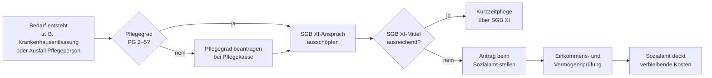

## Worum geht es?

**Kurzzeitpflege nach § 64h SGB XII** ist eine Leistung der Hilfe zur Pflege im Sozialhilferecht. Sie ermöglicht die vorübergehende vollstationäre Unterbringung pflegebedürftiger Menschen, wenn die häusliche Pflege zeitweise nicht möglich ist — etwa nach einem Krankenhausaufenthalt, bei Ausfall der pflegenden Angehörigen oder während der Einrichtungsphase vor einem dauerhaften Heimeinzug.

Die Leistung ergänzt die Kurzzeitpflege der Pflegeversicherung (§ 42 SGB XI) und greift dort, wo diese nicht vorhanden ist oder nicht ausreicht.

## Wer hat Anspruch?

Anspruchsberechtigt sind Pflegebedürftige der **Pflegegrade 2 bis 5**, die zwei Voraussetzungen erfüllen:

1. **Pflegebedarf:** Die häusliche Pflege ist vorübergehend nicht möglich, und teilstationäre Angebote (Tages- oder Nachtpflege) reichen nicht aus.
2. **Bedürftigkeit nach SGB XII:** Die anfallenden Kosten können aus eigenem Einkommen und Vermögen nicht gedeckt werden.

Das Sozialamt prüft Einkommen und Vermögen. Geschützt bleiben ein angemessenes Hausgrundstück, Bestattungsvorsorge und kleine Ersparnisse (ca. 5.000 €). Seit dem **Angehörigen-Entlastungsgesetz 2020** werden Kinder von Sozialhilfeempfängern erst ab einem Jahreseinkommen von **100.000 €** herangezogen — darunter bleibt ihr Einkommen unangetastet.

## Verhältnis zur Pflegeversicherung

§ 64h SGB XII ist **nachrangig**: Erst werden alle Ansprüche aus der Pflegeversicherung ausgeschöpft, dann füllt das Sozialamt die verbleibende Lücke.

| Merkmal | § 42 SGB XI (Pflegeversicherung) | § 64h SGB XII (Sozialhilfe) |
| --- | --- | --- |
| Träger | Pflegekasse | Sozialamt |
| Einkommensprüfung | Nein | Ja |
| Budgetobergrenze | 1.774 €/Jahr | Kein festes Budget |
| Max. Dauer | 8 Wochen/Jahr | Nach Bedarf |
| Nachrang | Nein | Ja |

Ein wichtiger Unterschied: Anders als § 42 SGB XI kennt § 64h SGB XII **keine starre Budgetobergrenze**. Wenn Bedarf und Bedürftigkeit nachgewiesen sind, kann auch eine längere Kurzzeitpflegephase übernommen werden.

## Kosten und Eigenanteile

Die Kosten eines Kurzzeitpflegeaufenthalts gliedern sich in drei Positionen:

- **Pflegebedingte Aufwendungen** — übernimmt primär die Pflegekasse (SGB XI); Rest trägt das Sozialamt
- **Unterkunft und Verpflegung** — grundsätzlich Eigenanteil; das Sozialamt übernimmt bei nachgewiesener Bedürftigkeit
- **Investitionskosten** — je nach Bundesland teilweise öffentlich gefördert (z. B. Pflegewohngeld in NRW), sonst Eigenanteil

## Antragsweg

Zuständig ist das **Sozialamt am gewöhnlichen Aufenthaltsort** der pflegebedürftigen Person. Bei akutem Bedarf kann die Kurzzeitpflege sofort begonnen werden — das Sozialamt entscheidet dann rückwirkend. In der Praxis übernimmt oft der **Sozialdienst des Krankenhauses** die Koordination.

## Praktische Hinweise

- **Pflegegrad 1** reicht nicht aus — es wird mindestens Pflegegrad 2 benötigt.
- Die Kostensätze, die das Sozialamt anerkennt, unterscheiden sich je nach **Bundesland und Einrichtungsvertrag**.
- In manchen Bundesländern gibt es **Pflegewohngeld**, das Investitionskostenanteile für Sozialhilfeempfänger subventioniert — auch bei Kurzzeitpflege.
- Wenn wiederholt oder dauerhaft stationärer Bedarf besteht, ist zu prüfen, ob ein Übergang zur vollstationären Dauerpflege (§ 64 SGB XII) sinnvoller ist.
