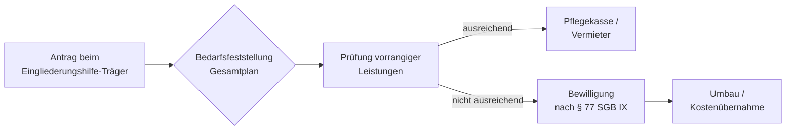

## Hintergrund

**Leistungen für Wohnraum** nach § 77 SGB IX sind Bestandteil der Eingliederungshilfe und gehören zu den Leistungen zur sozialen Teilhabe (§ 76 SGB IX). Ziel ist es, Menschen mit Behinderungen zu ermöglichen, selbstständig oder mit Unterstützung in einer eigenen Wohnung zu leben — statt auf stationäre Einrichtungen angewiesen zu sein.

## Was wird gefördert?

§ 77 SGB IX umfasst drei Leistungsbereiche:

| Bereich | Inhalt |
| --- | --- |
| **Wohnraumbeschaffung** | Unterstützung bei der Wohnungssuche sowie Übernahme von Erstkosten (Kaution, erste Miete) |
| **Wohnraumumbau** | Finanzierung baulicher Anpassungen — z. B. Rollstuhlrampen, verbreiterte Türen, barrierefreies Bad, Haltegriffe, Treppenlifts |
| **Wohnraumerhalt** | Sicherung bereits angepassten Wohnraums, etwa bei Mietstreitigkeiten oder notwendigen Instandhaltungen |

## Wer hat Anspruch?

Anspruchsberechtigt sind Menschen mit (drohender) Behinderung, die Eingliederungshilfe nach dem SGB IX erhalten. Voraussetzung ist, dass die Leistung erforderlich ist, um eine angemessene und behinderungsgerechte Wohnsituation herzustellen oder zu sichern.

## Nachrang gegenüber anderen Trägern

Die Eingliederungshilfe greift subsidiär — andere Leistungsquellen sind vorrangig zu nutzen:

- **Pflegekasse (§ 40 SGB XI):** wohnumfeldverbessernde Maßnahmen bis zu **4.000 Euro** je Maßnahme
- **Mietrecht (§ 559b BGB):** Anspruch gegenüber dem Vermieter auf Duldung behindertengerechter Umbauten

Erst wenn diese Ansprüche nicht ausreichen oder nicht greifen, tritt § 77 SGB IX ein und übernimmt den verbleibenden Bedarf.

## Antragsweg

Zuständig ist der **Träger der Eingliederungshilfe** — in der Regel das Sozialamt des Landkreises oder der kreisfreien Stadt. Der Antrag sollte frühzeitig gestellt werden, da Umbaumaßnahmen vorab genehmigt werden müssen; nachträgliche Kostenübernahmen sind nur in Ausnahmefällen möglich.

## Hinweise in der Praxis

Die Inanspruchnahme setzt eine **Gesamtplanung** nach § 117 SGB IX voraus, in der alle Teilhabeziele koordiniert werden. Menschen mit körperlichen Behinderungen sollten frühzeitig prüfen, ob der Vermieter einen behindertengerechten Umbau dulden muss — dies kann eine kostenaufwändige Eingliederungshilfe-Antragstellung ersparen. Werden mehrere Träger (Pflegekasse und Eingliederungshilfe) gleichzeitig benötigt, empfiehlt sich eine Beratung bei einem **VdK-Kreisverband**, dem **VCP** oder einer **Ergänzenden unabhängigen Teilhabeberatung (EUTB)**, die bundesweit kostenlos angeboten wird.
