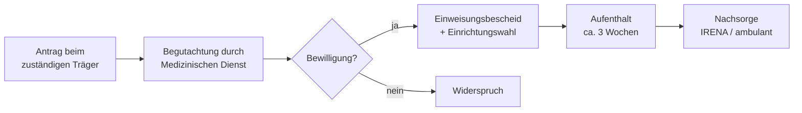

## Hintergrund

**Medizinische Rehabilitation** nach § 42 SGB IX bildet das Herzstück des deutschen Rehabilitationssystems. Ziel ist nicht primär die Heilung einer Erkrankung, sondern die **Wiederherstellung oder Erhaltung der Teilhabe** am gesellschaftlichen und beruflichen Leben — also die Vermeidung dauerhafter Erwerbsminderung oder Pflegebedürftigkeit.

§ 42 SGB IX schafft einen trägerübergreifenden Rahmen: Die Leistungsarten sind einheitlich geregelt, auch wenn je nach Ursache und Lebenssituation unterschiedliche Träger zuständig sind.

## Leistungsarten

Der gesetzliche Katalog umfasst drei Bereiche:

| Bereich | Beispiele |
|---|---|
| Behandlung | Ärztliche Behandlung, Arznei- und Hilfsmittel, Physio-/Ergo-/Logotherapie, Psychotherapie |
| Rehabilitation | Stationäre Reha (klassische „Reha-Kur"), ambulante Tagesklinik, mobile Reha in der Häuslichkeit |
| Ergänzende Leistungen | Patientenschulungen, Belastungserprobung, Arbeitstherapie, sozialmedizinische Nachsorge |

## Wer ist zuständig?

Die Trägerlandschaft ist komplex:

| Ursache / Lebensphase | Zuständiger Träger |
|---|---|
| Allgemeine Erkrankung | Gesetzliche Krankenversicherung (GKV) |
| Gefährdete Erwerbsfähigkeit | Deutsche Rentenversicherung (DRV) |
| Arbeitsunfall, Berufskrankheit | Gesetzliche Unfallversicherung (BG/UV) |
| Angeborene oder früh erworbene Behinderung | Eingliederungshilfe (SGB IX Teil 2) |

Zentral ist das **Reha-vor-Rente-Prinzip**: Bevor die DRV eine Erwerbsminderungsrente bewilligt, muss geprüft werden, ob Rehabilitation die Erwerbsfähigkeit wiederherstellen kann.

## Antragsweg

Bei Unklarheit über die Zuständigkeit gilt § 14 SGB IX: Der **erstangegangene Träger** muss innerhalb von zwei Wochen entscheiden und ggf. weiterleiten — zahlt im Zweifel aber vor und holt sich die Kosten vom eigentlich zuständigen Träger zurück. Für Betroffene bedeutet das: kein Zuständigkeitschaos.

Der typische Ablauf einer stationären Reha:

## Stationär vs. ambulant

Die stationäre Rehabilitation — typischerweise drei Wochen in einer Fachklinik — ist in Deutschland nach wie vor die häufigste Form. Die **ambulante Rehabilitation** (wohnortnahe Tagesklinik) bietet dieselben Therapien ohne Trennung von Familie und Alltag, ist jedoch noch unterentwickelt, obwohl sie für viele Indikationen ähnlich effektiv und kostengünstiger ist.

## Häufige Indikationen

Rund ein Drittel aller Reha-Maßnahmen entfällt auf Muskel-Skelett-Erkrankungen. Weitere häufige Diagnosegruppen:

- Herz-Kreislauf-Erkrankungen (z. B. nach Herzinfarkt)
- Onkologische Erkrankungen (nach Krebstherapie)
- Psychische Erkrankungen (Burnout, Depression, Sucht)
- Neurologische Erkrankungen (nach Schlaganfall, bei MS)

## Wichtige Hinweise

- Die **Eigenbeteiligung** bei stationärer Reha beträgt in der GKV grundsätzlich 10 € pro Tag (maximal 28 Tage pro Kalenderjahr); Ausnahmen gelten bei Bezug von Sozialhilfe oder geringem Einkommen.
- Reha-Leistungen der DRV setzen in der Regel bestimmte **Wartezeiten** in der Rentenversicherung voraus.
- Abgelehnte Anträge sollten **immer per Widerspruch angefochten** werden — Ablehnungen werden in der Praxis häufig nach Widerspruch revidiert.
