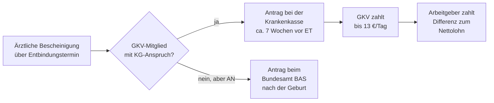

## Geschichte

Der Schutz erwerbstätiger Mütter gehört zu den ältesten Errungenschaften des deutschen Sozialrechts. Erste Ansätze reichen bis ins Kaiserreich zurück:

- **1878** – *Arbeiterschutzgesetz*: vierwöchiges Fabrikarbeitsverbot nach der Geburt, noch ohne Lohnersatz
- **1883** – Bismarcksche Krankenversicherung: Krankengeld auch für Wöchnerinnen — der Keim des späteren Mutterschaftsgeldes
- **1952** – Erstes **Mutterschutzgesetz (MuSchG)**: Beschäftigungsverbot und Lohnfortzahlung über die Krankenkassen
- **1979** – Verlängerung der Nachschutzfrist auf **8 Wochen**; bei Früh- und Mehrlingsgeburten 12 Wochen
- **2006** – Einführung des **Elterngeldes (BEEG)**: Mutterschaftsgeld und Elterngeld werden als aufeinanderfolgende Leistungen konzipiert; Anrechnung wird gesetzlich geregelt
- **2018** – Reform des MuSchG: Erweiterter Schutzbereich (Schülerinnen, Studentinnen, Heimarbeiterinnen) — Geldzahlungen gelten aber weiterhin nur für Arbeitnehmerinnen

## Zwei Leistungsformen

Das Mutterschaftsgeld existiert in zwei rechtlich eigenständigen Varianten:

| Leistung | Rechtsgrundlage | Zahlstelle | Betrag |
| --- | --- | --- | --- |
| GKV-Mutterschaftsgeld | § 24i SGB V | Gesetzliche Krankenkasse | bis 13 €/Tag |
| Bundesamt-Mutterschaftsgeld | § 19 Abs. 2 MuSchG | Bundesamt für Soziale Sicherung (BAS) | einmalig max. 210 € |

**GKV-Mutterschaftsgeld** erhalten Arbeitnehmerinnen, die in der GKV pflicht- oder freiwillig versichert sind und Anspruch auf Krankengeld haben. **Nicht** berechtigt sind familienversicherte Frauen ohne eigene Mitgliedschaft.

Das **Bundesamt-Mutterschaftsgeld** ist eine Auffanglösung für Arbeitnehmerinnen ohne GKV-Krankengeldanspruch — typischerweise privat Krankenversicherte oder Minijobberin ohne Krankengeld. Der Einmalbetrag von maximal 210 € deckt nur einen kleinen Teil des Verdienstausfalls.

**Kein Mutterschaftsgeld** erhalten Selbstständige, Beamtinnen und Frauen ohne laufendes Beschäftigungsverhältnis (z. B. Arbeitslose, Studentinnen).

## Berechnung und Arbeitgeberzuschuss

Das GKV-Mutterschaftsgeld beträgt 100 % des durchschnittlichen kalendertäglichen Nettolohns der letzten drei abgerechneten Monate, **höchstens 13 € pro Kalendertag**. Da diese Deckelung für die meisten Arbeitnehmerinnen unter dem tatsächlichen Nettolohn liegt, ist der **Arbeitgeberzuschuss (§ 20 MuSchG)** entscheidend:

```
Arbeitgeberzuschuss/Tag = Ø Nettolohn/Tag − GKV-Mutterschaftsgeld/Tag (max. 13 €)
```

Zusammen ergeben GKV-Leistung und Arbeitgeberzuschuss eine vollständige Einkommensersatzleistung in Höhe des bisherigen Nettolohns. Der Arbeitgeberzuschuss ist dabei **steuerpflichtiger Arbeitslohn**, während das Mutterschaftsgeld selbst steuerfrei ist.

## Bezugsdauer

| Phase | Dauer |
| --- | --- |
| Vor dem errechneten Entbindungstermin | 6 Wochen |
| Nach der Geburt (Regelfall) | 8 Wochen |
| Nach Frühgeburt (vor 37. SSW), Mehrlingsgeburt oder Behinderung des Kindes | 12 Wochen |

Bei Frühgeburt verlängert sich die Nachschutzfrist entsprechend: Nicht in Anspruch genommene Vorschutzzeit wird auf die Nachfrist übertragen.

## Antragsweg



Den GKV-Antrag sollte man stellen, sobald die ärztliche Bescheinigung vorliegt — idealerweise ab der 32. Schwangerschaftswoche. Den BAS-Antrag kann man erst nach der Geburt abschließen; Unterlagen sollten aber frühzeitig zusammengestellt werden.

## Verhältnis zu Elterngeld

Das Mutterschaftsgeld wird auf das Elterngeld **angerechnet** (§ 3 Abs. 1 BEEG). In der Praxis bedeutet das: Da Mutterschaftsgeld und Arbeitgeberzuschuss zusammen den vollen Nettolohn ersetzen und damit das Elterngeld übersteigen, entfällt das Elterngeld während der Mutterschutzfrist faktisch. Die entsprechenden Elterngeldbezugsmonate gelten dadurch als **nicht verbraucht** und stehen anschließend noch zur Verfügung.

Außerdem werden Monate mit Mutterschaftsgeldbezug aus dem **Elterngeld-Bemessungszeitraum herausgenommen** (§ 2b Abs. 1 BEEG) und durch frühere Monate ersetzt — das verhindert, dass der Mutterschutz die Elterngeldberechnung mindert.

## Steuer und häufige Fallstricke

Das Mutterschaftsgeld ist nach § 3 Nr. 1d EStG **steuerfrei**, unterliegt aber dem **Progressionsvorbehalt**: Es erhöht den Steuersatz auf das übrige Einkommen desselben Jahres. Wer das in der Steuererklärung (Anlage N) nicht angibt, riskiert eine Nachforderung mit Säumniszuschlägen.

Weitere Stolperfallen:
- **Familienversicherte** ohne eigene GKV-Mitgliedschaft haben keinen Krankengeldanspruch — und damit auch keinen Anspruch auf GKV-Mutterschaftsgeld. Ggf. BAS-Antrag prüfen.
- Der **Arbeitgeberzuschuss** ist lohnsteuerpflichtig und wird mit den übrigen Bezügen versteuert.
- Bei **Bürgergeld**: Das Mutterschaftsgeld gilt als anrechenbares Einkommen (§ 11 SGB II); eine zusätzliche Auszahlung entfällt im Regelfall.
