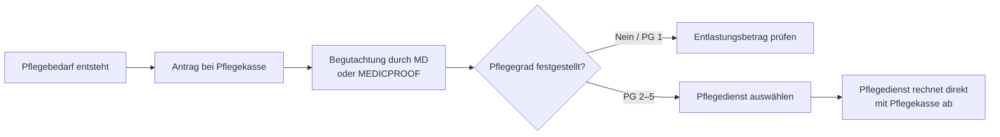

## Worum geht es?

Die **Pflegesachleistung** (§ 36 SGB XI) finanziert die professionelle häusliche Pflege durch einen zugelassenen ambulanten Pflegedienst. Anders als das **Pflegegeld** (§ 37 SGB XI), das als freie Geldleistung an den Pflegebedürftigen ausgezahlt wird, rechnet der Pflegedienst seine Leistungen direkt mit der Pflegekasse ab — der Pflegebedürftige muss in der Regel keinen Eigenanteil leisten, solange der monatliche Höchstbetrag nicht überschritten wird.

2023 wurden rund **900.000 Pflegebedürftige** ausschließlich durch ambulante Dienste versorgt; weitere 500.000 nutzten eine Kombination aus Sach- und Geldleistung. Die Gesamtausgaben der sozialen Pflegeversicherung für Pflegesachleistungen lagen 2025 bei rund **6,9 Mrd. €** jährlich.

## Historische Entwicklung

- **1995** – Inkrafttreten der häuslichen Pflegeleistungen mit Einführung des SGB XI; Anfangsbeträge: Pflegestufe 1: 750 DM, Stufe 2: 1.800 DM, Stufe 3: 2.800 DM.
- **2015** – Erstes Pflegestärkungsgesetz (PSG I): deutliche Erhöhung der Sachleistungsbeträge.
- **2017** – Zweites Pflegestärkungsgesetz (PSG II): Ablösung der drei Pflegestufen durch fünf **Pflegegrade**; kognitive und psychische Einschränkungen werden gleichwertig berücksichtigt.
- **2024/2025** – Pflegeunterstützungs- und -entlastungsgesetz (PUEG): stufenweise Erhöhung der Beträge um insgesamt ca. 10 %.

## Wer hat Anspruch?

Anspruch besteht für Versicherte der sozialen oder privaten Pflegeversicherung mit **Pflegegrad 2 bis 5**, die zu Hause gepflegt werden und einen **zugelassenen ambulanten Pflegedienst** beauftragen. Pflegegrad 1 berechtigt nicht zur Pflegesachleistung — dort steht nur der Entlastungsbetrag nach § 45b SGB XI zur Verfügung.

## Leistungsumfang

§ 36 SGB XI umfasst drei Kategorien:

1. **Körperbezogene Pflegemaßnahmen** – Körperpflege, Ernährungsunterstützung, Mobilität (Lagern, Umsetzen, An- und Auskleiden, Gehen).
2. **Pflegerische Betreuungsmaßnahmen** – Beschäftigung, Aktivierung und Beaufsichtigung zur Erhaltung der Alltagskompetenz.
3. **Hilfen bei der Haushaltsführung** – Einkaufen, Kochen, Reinigen und Wäschepflege, soweit diese im Zusammenhang mit dem Pflegebedarf stehen.

## Leistungsbeträge (ab 1. Januar 2025)

| Pflegegrad | Höchstbetrag/Monat |
| ---: | ---: |
| 1 | — |
| 2 | **761 €** |
| 3 | **1.432 €** |
| 4 | **1.778 €** |
| 5 | **2.200 €** |

Nicht verbrauchte Budgetanteile verfallen am Monatsende — eine Übertragung auf den Folgemonat ist nicht möglich. Übersteigen die tatsächlichen Leistungskosten den Höchstbetrag, trägt der Pflegebedürftige die Differenz selbst; wer auf Sozialhilfe angewiesen ist, kann ergänzende Hilfe zur Pflege beim Sozialamt beantragen (§§ 61 ff. SGB XII).

## Kombination mit Pflegegeld

Wer das Sachleistungsbudget nicht vollständig ausschöpft, kann den verbleibenden Anteil anteilig als **Pflegegeld** erhalten (**Kombinationsleistung**, § 38 SGB XI). Dies ermöglicht flexible Pflegearrangements, bei denen Angehörige und professionelle Dienste zusammenwirken.

*Beispiel (Pflegegrad 3):* Werden Sachleistungen im Wert von 716 € (= 50 % des Budgets) abgerufen, erhält man zusätzlich 50 % des Pflegegelds von 573 € = **286,50 €** — Gesamtleistung damit rund 1.002,50 €.

## Verhältnis zu anderen Leistungen

| Leistung | Verhältnis |
| --- | --- |
| Pflegegeld (§ 37) | alternativ oder anteilig kombinierbar |
| Entlastungsbetrag (§ 45b) | zusätzlich, 125 €/Monat für alle Pflegegrade |
| Verhinderungspflege (§ 39) | ergänzend, bis 1.612 €/Jahr |
| Kurzzeitpflege (§ 42) | ergänzend für vorübergehende stationäre Pflege |
| Vollstationäre Pflege (§ 43) | alternativ — § 36 gilt nur bei häuslicher Pflege |

## Antragstellung

Der Antrag wird bei der **Pflegekasse** gestellt (= Abteilung der eigenen Krankenkasse). Der **Medizinische Dienst (MD)** begutachtet den Pflegebedarf; bei Privatversicherten übernimmt MEDICPROOF diese Aufgabe. Pflegesachleistungen werden ab dem **Monat der Antragstellung** gewährt, wenn der Pflegegrad anerkannt wird.

Pflegebedürftige haben **freie Pflegedienstwahl** — die Pflegekasse kann die Auswahl nicht einschränken. Ein Vergleich lohnt sich: Die **Pflegenavigator**-Datenbank des MDS sowie regionale Pflegestützpunkte helfen bei der Orientierung. Das Budget kann auch auf **mehrere zugelassene Pflegedienste** aufgeteilt werden, solange die Gesamtkosten den Höchstbetrag nicht überschreiten.
