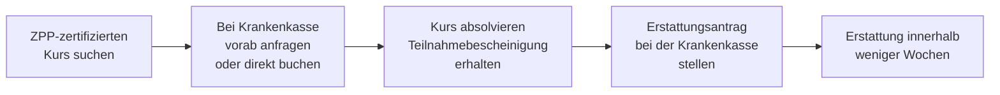

## Hintergrund

Die gesetzlichen Krankenkassen sind seit 1989 zur Prävention verpflichtet. Die heutige Form der **Primärprävention nach § 20 SGB V** geht auf das Präventionsgesetz von 2015 zurück, das erstmals verbindliche Mindestausgaben pro Versichertem festlegte. Das Ziel: Krankheiten verhindern, bevor sie entstehen — das sogenannte **primärpräventive Prinzip**.

2024 gaben die gesetzlichen Krankenkassen rund **686 Millionen Euro** für Prävention und Gesundheitsförderung aus. Der gesetzliche Mindestbetrag liegt seit 2023 bei **7,52 Euro pro Versichertem und Jahr** (§ 20 Abs. 6 SGB V).

## Die vier Handlungsfelder

Der GKV-Spitzenverband legt im **Leitfaden Prävention** fest, welche Kursangebote gefördert werden. Anerkannt sind vier Bereiche:

| Handlungsfeld | Typische Kursangebote |
| --- | --- |
| **Bewegungsgewohnheiten** | Rückenschule, Kräftigung, Yoga, Pilates, Tai-Chi, Walking |
| **Ernährungsgewohnheiten** | Vollwertkost, Gewichtsmanagement, gesundes Kochen |
| **Stressmanagement / psychische Gesundheit** | Progressive Muskelentspannung, autogenes Training, MBSR |
| **Suchtmittelkonsum** | Rauchentwöhnung, Alkoholprävention |

Nicht jeder Fitnesskurs ist automatisch förderfähig. Entscheidend ist die **Zertifizierung** durch die Zentrale Prüfstelle Prävention (ZPP) oder eine gleichwertige Prüfstelle im Auftrag des GKV-Spitzenverbands.

## Höhe der Förderung

Die konkreten Erstattungssätze legt jede Kasse selbst fest. In der Praxis gelten folgende Richtwerte:

- **Erwachsene**: 80 % der Kursgebühr, typischerweise **80–150 € pro Kurs**
- **Kinder und Jugendliche (unter 18)**: oft 100 %, kein Eigenanteil
- **Kurse pro Jahr**: meist ein bis zwei, einige Kassen bis zu drei

Die meisten Kassen zahlen den Zuschuss nach Vorlage der Teilnahmebescheinigung zurück (**Erstattungsprinzip**). Einige bieten auch eine Direktbuchung über ihre eigene Kursplattform an.

## Antragsweg

Ein **vorheriger Kontakt mit der Krankenkasse** ist empfehlenswert, um sicherzustellen, dass der konkrete Kurs anerkannt wird. Einige Kassen verlangen eine Voranfrage; andere erstatten pauschal alle ZPP-zertifizierten Kurse ohne Vorabgenehmigung.

Zertifizierte Kurse finden sich über:
1. Das **Portal oder die App der eigenen Krankenkasse**
2. Die **Zentrale Prüfstelle Prävention** unter [zpp.preventionoffice.de](https://zpp.preventionoffice.de/)
3. **Volkshochschulen und Sportvereine** — viele Angebote sind ZPP-zertifiziert

## Abgrenzung zu verwandten Leistungen

| Leistung | Rechtsgrundlage | Inhalt |
| --- | --- | --- |
| Primärprävention (Kursförderung) | § 20 Abs. 1 SGB V | Präventionskurse für Gesunde |
| Betriebliche Gesundheitsförderung | § 20b SGB V | Maßnahmen am Arbeitsplatz |
| Gesundheitsförderung in Lebenswelten | § 20a SGB V | Strukturelle Maßnahmen in Schulen, Kitas etc. |
| Schutzimpfungen | § 20i SGB V | Pflichtleistung, volle Kostenübernahme |
| Medizinische Vorsorgeleistungen | § 23 SGB V | Kur und Vorsorge bei gesundheitlicher Gefährdung |

## Inanspruchnahme in der Praxis

Trotz hoher Bekanntheit des Themas nutzen schätzungsweise nur **10–15 % der GKV-Versicherten** die Kursförderung aktiv. Häufige Gründe:

- Unwissenheit darüber, welche Kurse konkret erstattungsfähig sind
- Hemmschwelle beim Einreichen von Belegen
- Zeitliche Bindung durch Kurse mit fester Teilnehmerzahl
- Unterschätzung des eigenen Anspruchs ("Ich bin doch gesund")

Es lohnt sich, bei der eigenen Krankenkasse nachzufragen — viele Kassen listen erstattungsfähige Kurse aktiv in ihren Portalen oder Apps auf.
