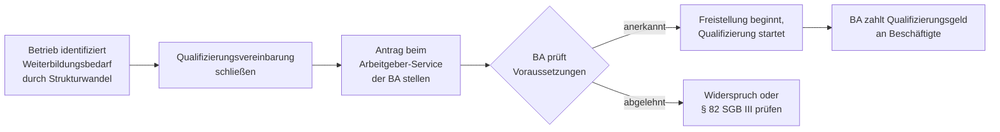

## Hintergrund

Das **Qualifizierungsgeld** (§ 82a SGB III) ist eine **Lohnersatzleistung** für Beschäftigte, die ihr Unternehmen vollständig für eine längere Weiterbildungsmaßnahme freistellt. Es trat am **1. April 2024** in Kraft und ist Teil des *Gesetzes zur Stärkung der Aus- und Weiterbildungsförderung (BQFG)*.

Das Instrument reagiert auf den tiefgreifenden Strukturwandel durch Digitalisierung, Dekarbonisierung und Automatisierung: Wo bisherige Instrumente entweder nur die Weiterbildungskosten (§ 82 SGB III) oder konjunkturelle Einbrüche (Kurzarbeitergeld) abdeckten, übernimmt § 82a SGB III den Lohnersatz bei strukturell bedingter Freistellung — und schließt damit eine wichtige Lücke in der Beschäftigungspolitik.

## Voraussetzungen

Das Qualifizierungsgeld ist ein **betriebsgebundenes Instrument** — der Arbeitgeber initiiert und beantragt die Leistung, nicht der Beschäftigte. Alle folgenden Bedingungen müssen kumulativ erfüllt sein:

| Voraussetzung | Details |
| --- | --- |
| Strukturwandelbezug | Tätigkeiten verändern sich substanziell oder fallen weg (z. B. E-Mobilität, KI-Einführung) |
| Qualifizierungsvereinbarung | Tarifvertragliche oder betriebliche Vereinbarung (auch individuelle Vereinbarung ohne Betriebsrat möglich) |
| Mindestbeteiligungsquote | Gestaffelt nach Betriebsgröße; Kleinstbetriebe ausgenommen |
| Mindestumfang | Mehr als **120 Stunden** |
| Vollständige Freistellung | Keine reguläre Arbeitsleistung während der Qualifizierung |

## Höhe der Leistung

Die Berechnung orientiert sich eng an der Formel für das Kurzarbeitergeld — Bemessungsgrundlage ist das **pauschalierte Nettoentgelt**:

| Leistungssatz | Personengruppe | Ersatzrate |
| --- | --- | ---: |
| Erhöhter Satz | mind. ein Kind im Haushalt | **67 %** |
| Allgemeiner Satz | alle anderen | **60 %** |

**Beispiel** (allgemeiner Satz, Bruttoentgelt 3.200 €/Monat):

| Position | Betrag |
| --- | ---: |
| Bruttoentgelt | 3.200 € |
| Pauschaliertes Nettoentgelt | ≈ 2.080 € |
| Qualifizierungsgeld (60 %) | **≈ 1.248 €/Monat** |

Der **Arbeitgeber** führt die Sozialversicherungsbeiträge auf Basis von 80 % des Bruttoentgelts weiter ab — Renten-, Kranken- und Pflegeversicherung entstehen dadurch keine Lücken. Eine freiwillige Aufstockung durch den Arbeitgeber ist zulässig und in manchen Tarifverträgen vorgesehen.

## Antragsweg

Zuständig ist der **Arbeitgeber-Service der Bundesagentur für Arbeit** der jeweiligen Regionaldirektion. Da die Prüfung des Strukturwandelbezugs Zeit in Anspruch nimmt, empfiehlt sich eine **frühzeitige Kontaktaufnahme** — die BA bietet Beratungsgespräche an.

## Abgrenzung zu ähnlichen Leistungen

- **§ 82 SGB III (Weiterbildungsförderung)**: Lohn bleibt beim Arbeitgeber; die BA bezuschusst nur die Lehrgangskosten. Für längere Freistellungen ist § 82a wirtschaftlich deutlich attraktiver. Beide Instrumente können nacheinander, aber nicht gleichzeitig genutzt werden.
- **Kurzarbeitergeld**: Reagiert auf konjunkturellen Auftragsrückgang. Eine gleichzeitige Inanspruchnahme beider Leistungen für dieselbe Person ist ausgeschlossen.
- **Transferkurzarbeitergeld (§ 111 SGB III)**: Greift, wenn Arbeitsplätze dauerhaft wegfallen und eine Transfergesellschaft eingesetzt wird. Das Qualifizierungsgeld setzt dagegen eine **fortbestehende Beschäftigung** voraus.

## Einordnung

Das Qualifizierungsgeld bietet einen dritten Weg zwischen Entlassung und Kurzarbeit: **Belegschaftserhalt durch aktive Transformation**. Besonders in der Automobilindustrie, im Maschinenbau und in der Energiewirtschaft wird dem Instrument Potenzial zugeschrieben.

Als junges Instrument (seit April 2024) war die Inanspruchnahme anfangs gering — Beratungskapazitäten und Verwaltungsroutinen mussten erst aufgebaut werden. Kritisch bleibt der **bürokratische Aufwand** beim Nachweis des Strukturwandelbezugs, der besonders kleine Betriebe ohne eigene HR-Abteilung vor Herausforderungen stellt.
