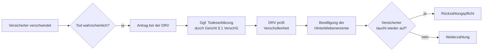

## Was ist die Rente bei Verschollenheit?

**§ 49 SGB VI** schließt eine Lücke im Hinterbliebenenrecht: Witwen- und Witwerrenten sowie Waisenrenten setzen normalerweise den **nachgewiesenen Tod** des Versicherten voraus — belegt durch eine Sterbeurkunde. Ist jemand jedoch spurlos verschwunden, existiert weder ein Totenschein noch die Gewissheit, dass er verstorben ist. Hinterbliebene stehen damit vor einem rechtlichen Dilemma: kein Anspruch auf Hinterbliebenenrente, aber auch keine Rückkehr zur Normalität.

Die Rente bei Verschollenheit überbrückt diesen Zustand: Sie ermöglicht es, Hinterbliebenenleistungen bereits vor einer formellen Todeserklärung zu beziehen, wenn der Tod aufgrund der Umstände wahrscheinlich ist.

## Voraussetzungen

Drei Bedingungen müssen kumulativ erfüllt sein:

1. **Verschollenheit** – Der Versicherte ist seit einer bestimmten Zeit unauffindbar; sein Tod wurde bisher nicht festgestellt.
2. **Wahrscheinlichkeit des Todes** – Die Umstände des Verschwindens lassen den Tod als wahrscheinlich erscheinen, etwa Schiffbruch, Flugzeugabsturz, Naturkatastrophe oder Kriegsgeschehen.
3. **Zeitablauf** – Seit dem Verschwinden ist eine Mindestzeit vergangen; die genaue Frist richtet sich nach den Umständen des Einzelfalls.

## Verfahren

Die Hinterbliebenen stellen einen Antrag auf Hinterbliebenenrente bei der **Deutschen Rentenversicherung (DRV)**. Die DRV prüft, ob die Voraussetzungen der Verschollenheit vorliegen. In vielen Fällen ist zusätzlich eine gerichtliche **Todeserklärung** nach dem Verschollenheitsgesetz (VerschG) erforderlich, bevor oder parallel dazu die Rente bewilligt wird.

## Besonderheit: Rückzahlungspflicht

Die Leistung ist **bedingt**: Stellt sich nachträglich heraus, dass der Verschollene noch lebt, müssen die bereits ausgezahlten Renten **zurückgezahlt** werden. Dies macht die Rente bei Verschollenheit zu einer Ausnahmeregelung mit erheblichem Rückforderungsrisiko.

## Höhe der Leistung

Die Rente bei Verschollenheit entspricht der jeweiligen Hinterbliebenenrente, auf die Anspruch bestünde, wenn der Tod nachgewiesen wäre — also Witwen-/Witwerrente oder Waisenrente nach den allgemeinen Regeln des SGB VI. Die Höhe hängt von den Rentenanwartschaften des Versicherten ab.

## Praktische Relevanz

§ 49 SGB VI ist ein **seltener Anwendungsfall**. Er greift vor allem bei:

- Naturkatastrophen mit Vermissten (Tsunami, Überschwemmungen)
- Kriegs- und Krisengebieten
- Schiff- oder Flugzeugkatastrophen ohne Bergung aller Opfer

Für die große Mehrzahl der Todesfälle ist die Norm ohne Bedeutung. Betroffene Hinterbliebene sollten sich frühzeitig an die DRV und ggf. einen Rechtsanwalt wenden, da das Verfahren komplex ist und die Rückzahlungspflicht bei unerwarteter Rückkehr des Verschollenen erhebliche finanzielle Konsequenzen haben kann.
