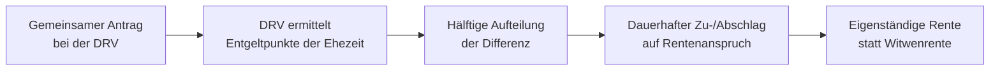

## Grundidee

Das **Rentensplitting unter Ehegatten** (§§ 120a–120e SGB VI, technisch umgesetzt über § 76c) erlaubt Ehepaaren und eingetragenen Lebenspartnern, die während der Ehe gemeinsam erworbenen Rentenanwartschaften **hälftig aufzuteilen**. Wer mehr eingezahlt hat — etwa weil der andere Partner Kinder erzogen oder in Teilzeit gearbeitet hat — gibt Entgeltpunkte ab; der andere erhält einen dauerhaften Zuschlag.

Das Rentensplitting ist eine **Alternative zur Hinterbliebenenversorgung**, keine Ergänzung: Wer sich für das Splitting entscheidet, verzichtet auf die Witwenrente und sichert sich stattdessen einen eigenständigen, gestärkten Rentenanspruch.

## Wie die Aufteilung funktioniert

Die Deutsche Rentenversicherung (DRV) ermittelt die in der Ehezeit von beiden Partnern erworbenen **Entgeltpunkte** und gleicht die Differenz aus. Nach § 76c erhält der abgebende Partner einen **Abschlag**, der empfangende einen **Zuschlag** — beide Anpassungen sind dauerhaft und wirken sich auf alle Rentenarten aus: Altersrente, Erwerbsminderungsrente und potenziell auch die Hinterbliebenenrente.

| Partner | Wirkung |
| --- | --- |
| Mehr Entgeltpunkte (höheres Einkommen) | Abschlag — gibt Punkte ab |
| Weniger Entgeltpunkte (z. B. Kindererziehung, Teilzeit) | Zuschlag — erhält Punkte dazu |

## Voraussetzungen

- Die Ehe (oder eingetragene Lebenspartnerschaft) muss **mindestens 25 Jahre** bestanden haben, **oder** ein Partner hat die Regelaltersgrenze bereits erreicht und der andere ist mindestens 60 Jahre alt.
- Beide Partner müssen in der gesetzlichen Rentenversicherung versichert sein.
- Das Splitting muss **gemeinsam beantragt** werden — es ist keine automatische Leistung.

## Wann ist Rentensplitting sinnvoll?

Das Splitting lohnt sich nicht in jedem Fall. Ein Vergleich mit der zu erwartenden Witwenrente ist unbedingt ratsam:

- **Vorteilhaft**, wenn beide Partner eigene Rentenansprüche aufgebaut haben, der Abstand groß ist und der weniger verdienende Partner voraussichtlich lange lebt.
- **Weniger vorteilhaft**, wenn Kinder vorhanden sind — für sie kann die Große Witwenrente (mit Kinderzuschlag) günstiger sein.
- **Neutral bis nachteilig**, wenn der besser verdienende Partner deutlich älter ist und früher stirbt, da die Witwenrente dann länger fließen würde.

## Antrag und Beratung

Der Antrag wird bei der zuständigen **Deutschen Rentenversicherung** gestellt. Die DRV bietet kostenlose individuelle Rentenberatungen an, bei denen ein konkreter Splitting-Vergleich mit dem Hinterbliebenenrenten-Szenario durchgerechnet werden kann — diese Beratung sollte vor der Entscheidung unbedingt genutzt werden, da sie unwiderruflich ist.

## Wichtiger Hinweis

Die Entscheidung für das Rentensplitting ist **endgültig** und kann nicht rückgängig gemacht werden. Da gleichzeitig der Anspruch auf Hinterbliebenenrente entfällt, empfiehlt sich eine sorgfältige Berechnung beider Szenarien — idealerweise mit Unterstützung der DRV oder eines unabhängigen Rentenberaters.
