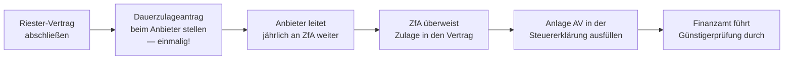

## Geschichte

Die **Riester-Förderung** wurde 2002 durch das Altersvermögensgesetz (AVmG) eingeführt — benannt nach dem damaligen Bundesarbeitsminister Walter Riester. Hintergrund war das schrittweise Absinken des gesetzlichen Rentenniveaus: Wer eigenverantwortlich privat vorsorgt, sollte vom Staat durch eine direkte Zulage und/oder eine steuerliche Entlastung unterstützt werden.

Zum Spitzenwert existierten knapp 17 Millionen Riester-Verträge. Seitdem gehen die Bestände durch Kündigungen und Ruhendstellungen zurück; 2023 hielten noch rund 15,4 Millionen Personen einen aktiven Vertrag. Eine grundlegende Reform wird politisch diskutiert, ist aber bisher nicht umgesetzt.

## Wer ist berechtigt?

Anspruchsberechtigt sind (§ 79 EStG) vor allem:

| Personengruppe | Hinweis |
| --- | --- |
| Pflichtversicherte Arbeitnehmer (GRV) | Kernfall |
| Beamte, Richter, Soldaten | Ersatz für fehlende GRV-Beiträge |
| Bezieher von ALG I, Elterngeld | Berechtigung bleibt während Bezug erhalten |
| Pflichtversicherte Selbstständige | z. B. Handwerker mit GRV-Pflicht |
| Ehepartner (mittelbar) | Eigener Vertrag möglich, wenn Partner unmittelbar berechtigt ist; Mindesteigenbeitrag nur 60 €/Jahr |

**Nicht** berechtigt: freiwillig GRV-Versicherte, Selbstständige ohne GRV-Pflicht.

## Staatliche Zulagen

| Zulage | Betrag/Jahr |
| --- | ---: |
| Grundzulage | 175 € |
| Kinderzulage (geboren vor 01.01.2008) | 185 € pro Kind |
| Kinderzulage (geboren ab 01.01.2008) | 300 € pro Kind |
| Berufseinsteiger-Bonus (einmalig, unter 25 Jahren) | 200 € |

Die Kinderzulagen werden demjenigen Elternteil gutgeschrieben, das das Kindergeld bezieht. Bei Ehepaaren, bei denen beide riestern, lässt sich die Kinderzulage auf einen der Verträge konzentrieren — das senkt dort den nötigen Mindesteigenbeitrag erheblich.

**Beispiel — Elternpaar, 2 Kinder ab 2008 geboren:**
Mutter (mit Kinderzulagen): 175 € + 2 × 300 € = **775 €/Jahr** staatliche Förderung. Vater: 175 €/Jahr.

## Mindesteigenbeitrag

Die volle Zulage gibt es nur bei ausreichendem Eigenbeitrag:

> **Mindesteigenbeitrag = 4 % des sozialversicherungspflichtigen Vorjahres-Bruttoeinkommens − alle Zulagen**, mindestens jedoch **60 €/Jahr**.

Der maximal förderungsfähige Gesamtbetrag (Eigenbeitrag + Zulage) beträgt **2.100 €/Jahr**. Wer weniger als den Mindestbeitrag einzahlt, erhält die Zulage nur anteilig.

**Beispiel — Single, 40.000 € Brutto, keine Kinder:**
4 % × 40.000 € = 1.600 € − 175 € Grundzulage = **1.425 € Eigenbeitrag** nötig (~119 €/Monat).

## Das Zwei-Förder-Wege-System

§ 10a EStG kombiniert zwei Förderkomponenten, die das Finanzamt automatisch vergleicht:

| Förderweg | Mechanismus |
| --- | --- |
| **Zulage** | Fließt direkt in den Vertrag; unabhängig vom Steuersatz — für Geringverdiener oft vorteilhafter |
| **Sonderausgabenabzug** | Bis zu 2.100 €/Jahr absetzbar; bei höherem Grenzsteuersatz oft günstiger |

Die **Günstigerprüfung** (§ 10a Abs. 2 EStG) läuft automatisch: Übersteigt der Steuervorteil die Zulage, wird die Differenz als Steuererstattung ausgezahlt. Ist die Zulage günstiger, bleibt es dabei — es entsteht kein Nachteil.

## Antragsweg

Der **Dauerzulageantrag** muss nur einmal beim Anbieter gestellt werden; danach läuft die Beantragung automatisch. Der Antrag kann noch bis zu zwei Jahre rückwirkend gestellt werden. Zuständig ist die **Zentrale Zulagenstelle für Altersvermögen (ZfA)** beim Bundeszentralamt für Steuern.

**Wichtig:** Bei Einkommensänderungen muss der Anbieter informiert werden, damit der Mindesteigenbeitrag korrekt berechnet und Rückforderungen vermieden werden.

## Nachgelagerte Besteuerung und schädliche Verwendung

Die gesamte Riester-Rente — Eigenbeiträge und Zulagen — wird in der **Auszahlungsphase versteuert**. Da Rentner typischerweise einen niedrigeren Steuersatz haben als im Erwerbsleben, bleibt die Förderung per Saldo meist vorteilhaft.

Bei **vorzeitiger Kündigung oder schädlicher Verwendung** (§ 93 EStG) müssen alle erhaltenen Zulagen und Steuervorteile zurückgezahlt werden. Ausnahme: **Wohnriester** (§ 92a EStG) — das Kapital kann steuerneutral für den Kauf oder Bau einer selbstgenutzten Immobilie verwendet werden.

## Für wen lohnt es sich?

Riester ist besonders attraktiv für Familien mit Kindern (hohe Kinderzulagen senken den nötigen Eigenbeitrag deutlich), für Geringverdiener (Zulage wirkt unabhängig vom Steuersatz) und für Beamte (keine betriebliche Altersvorsorge als Alternative). Kritisch ist das Modell bei hohen Verwaltungskosten einzelner Anbieter, die einen Teil der Förderung aufzehren können — ein Produktvergleich vor Vertragsabschluss lohnt sich.
