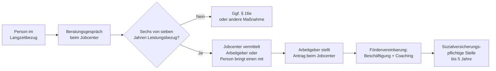

## Hintergrund

**§ 16i SGB II** schuf zum 1. Januar 2019 den sogenannten **sozialen Arbeitsmarkt** — ein Förderinstrument für Menschen, die trotz jahrelangen Kontakts mit Jobcentern und Arbeitsmarktmaßnahmen keinen nachhaltigen Einstieg in Beschäftigung gefunden haben. Grundlage ist das *Teilhabechancengesetz*, das der Bundestag im Dezember 2018 verabschiedete.

Das Besondere: Anders als klassische Lohnkostenzuschüsse erkennt § 16i **Teilhabe** als eigenständiges Förderziel an. Für Menschen, die seit Jahren aus dem Erwerbsleben ausgeschieden sind, hat die Rückkehr in Arbeit einen Eigenwert — Tagesstruktur, soziale Einbindung, Kompetenzerhalt — auch ohne unmittelbaren Übergang in ungeförderte Beschäftigung.

## Zielgruppe

Das Programm richtet sich an Personen, die in den **letzten sieben Kalenderjahren mindestens sechs Jahre lang** Bürgergeld (früher: ALG II) bezogen haben. Kurze Unterbrechungen durch geringfügige Beschäftigung sind unschädlich. Es gibt keine Alters- oder Staatsangehörigkeitsbeschränkung.

Im Unterschied zu § 16e SGB II (der auf zwei Jahre ununterbrochene Arbeitslosigkeit abstellt) zählt bei § 16i der **kumulierte Leistungsbezug** — erfasst sind also auch Personen, die mehrfach kurze Jobs hatten, ohne nachhaltig Fuß zu fassen.

## Lohnkostenzuschuss

§ 16i ist ein **Arbeitgeberprogramm**: Das Jobcenter schließt mit dem Arbeitgeber eine Fördervereinbarung; dieser stellt die geförderte Person regulär sozialversicherungspflichtig ein und erhält einen degressiv gestaffelten Zuschuss:

| Förderjahr | Lohnkostenzuschuss |
| ---: | ---: |
| Jahr 1 | 100 % |
| Jahr 2 | 90 % |
| Jahr 3 | 80 % |
| Jahr 4 | 70 % |
| Jahr 5 | 60 % |

Bezugsgröße ist der tatsächlich gezahlte Lohn bis zur Höhe des gesetzlichen Mindestlohns zuzüglich der Arbeitgeberbeiträge zur Sozialversicherung. Zahlt der Arbeitgeber mehr als den Mindestlohn, trägt er den übersteigenden Anteil selbst. Minijobs und Selbstständigkeit sind ausgeschlossen.

## Coaching

Ein zentrales Element ist die **verpflichtende ganzheitliche Begleitung** während des gesamten Beschäftigungsverhältnisses. Jobcenter oder beauftragte Träger unterstützen bei Schwierigkeiten im Arbeitsverhältnis, begleiten bei parallelen Problemlagen (Schulden, Wohnen, Gesundheit) und bereiten auf einen möglichen Übergang in ungeförderte Beschäftigung vor. In der Praxis variiert die Coachingintensität erheblich — gut ausgestattete Jobcenter erzielen deutlich höhere Stabilisierungsquoten.

## Antragsweg

Viele Teilnehmende gelangen über eine **proaktive Ansprache** durch das Jobcenter ins Programm. Die Jobcenter bauen teils eigene Netzwerke § 16i-affiner Arbeitgeber auf — vor allem in gemeinnützigen Einrichtungen, Wohlfahrtsverbänden und kommunalen Betrieben.

## Verhältnis zu anderen Leistungen

- **Bürgergeld:** Der Lohn wird auf Bürgergeld angerechnet; in den meisten Fällen übersteigt er die SGB-II-Leistungen, sodass Teilnehmende aus dem Leistungsbezug ausscheiden — ein explizites Programmziel.
- **Rentenversicherung:** Da ein echtes sozialversicherungspflichtiges Beschäftigungsverhältnis entsteht, sammeln Teilnehmende **Rentenanwartschaften** — ein bedeutender Nebeneffekt für Personen, die jahrelang kaum Anwartschaften erworben haben.
- **Wohngeld:** Wer durch die Beschäftigung aus dem Bürgergeld-Bezug ausscheidet, aber noch wenig verdient, kann Wohngeld beantragen. Der Antrag muss aktiv beim kommunalen Amt gestellt werden.
- **§ 16e SGB II:** Für weniger arbeitsmarktferne Langzeitarbeitslose — kürzere Förderdauer (max. 2 Jahre), kein verpflichtendes Coaching.
- **§ 16d SGB II (Ein-Euro-Jobs):** Arbeitsgelegenheiten ohne echtes Arbeitsverhältnis und ohne Rentenanwartschaften; § 16i ist für die Zielgruppe das deutlich stärkere Instrument.

## Wirkung und Grenzen

Bis Ende 2023 hatten rund **200.000 Personen** eine § 16i-geförderte Beschäftigung aufgenommen. Die Stabilisierungsquoten liegen deutlich über denen vergleichbarer Maßnahmen für sehr arbeitsmarktferne Personen.

Strukturelle Engpässe bleiben:

- **Arbeitgebernachfrage:** Der Engpassfaktor ist nicht die Zahl der Berechtigten, sondern die Bereitschaft von Arbeitgebern — insbesondere privaten — zur Teilnahme. Der Verwaltungsaufwand und die Unsicherheit über die Leistungsfähigkeit schrecken ab.
- **Geografische Ungleichheit:** In strukturschwachen Regionen fehlen geeignete Arbeitgeber; Jobcenter in Ostdeutschland und ländlichen Gebieten haben besondere Schwierigkeiten.
- **Coaching-Qualität:** Dort, wo das Coaching gut funktioniert, steigen die Stabilisierungsraten erheblich; sporadische Betreuung mindert die Wirkung deutlich.
- **Unkenntnis bei Betroffenen:** Viele Langzeitarbeitslose kennen das Programm nicht. Aktiver Outreach durch das Jobcenter ist essenziell.
