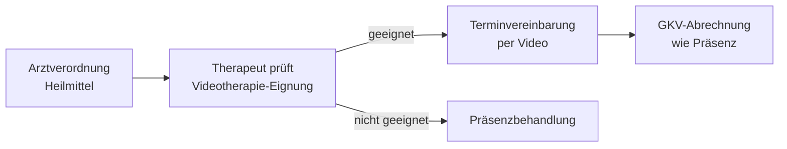

## Hintergrund

**Telemedizinische Heilmittel** sind digitale Versionen klassischer therapeutischer Leistungen, die per Videoanruf erbracht werden – ohne Praxisbesuch. Die gesetzliche Grundlage findet sich in § 32 Abs. 1 S. 2 SGB V, der seit der COVID-19-Pandemie strukturell im Heilmittelrecht verankert ist. Versicherte der gesetzlichen Krankenversicherung haben damit Anspruch auf Physiotherapie, Ergotherapie oder Logopädie in digitaler Form.

## Geeignete Therapieformen

Nicht alle Heilmittel lassen sich telemedizinisch erbringen. Gut geeignet sind:

| Therapiebereich | Beispiele |
| --- | --- |
| Physiotherapie | Gangschulung, Heimübungen, Gleichgewichtstraining |
| Logopädie | Artikulations- und Stimmübungen, Tinnitus-Therapie |
| Ergotherapie (teilweise) | Psychomotorische Förderprogramme für Kinder |
| Allgemein | Atemtherapie, Entspannungstraining, Übungskontrolle nach Erstbehandlung |

Nicht telemedizinisch erbringbar sind Leistungen, die physischen Kontakt erfordern:
- **Manuelle Therapie** (Massagen, Mobilisierungen)
- **Gerätegestützte Verfahren** (Elektrotherapie, Ultraschall, Thermotherapie)
- Ergotherapeutische Maßnahmen mit speziellen Materialien vor Ort

## GKV-Leistungsumfang

Die GKV erstattet telemedizinisch erbrachte Heilmittel auf Basis **derselben Verordnungen und Vergütungssätze** wie die Präsenzbehandlung. Eine eigene Verordnung für Videotherapie ist nicht erforderlich – die bestehende Heilmittelverordnung des Arztes genügt.

Voraussetzungen auf Anbieterseite:
- Nutzung einer **zertifizierten Videoplattform**
- Einhaltung der datenschutzrechtlichen Anforderungen (Datenschutz-Grundverordnung)

## Antrag und Ablauf

Versicherte müssen die Videotherapie nicht gesondert beantragen. Der Therapeut entscheidet gemeinsam mit dem Patienten, ob eine Leistung telemedizinisch erbracht werden kann.

## Praktische Einschränkungen

Trotz pandemiebedingtem Aufwind ist die Verbreitung telemedizinischer Heilmitteltherapien begrenzt geblieben. Viele Patienten bevorzugen den persönlichen Kontakt, und nicht jede Praxis bietet Videotherapie an. Für Folgetermine und Kontrolleinheiten nach einer abgeschlossenen Präsenzbehandlung eignet sich das Format hingegen besonders gut – es spart Wege und erleichtert die Therapietreue.
