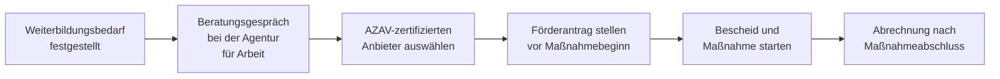

## Hintergrund

Mit dem **Qualifizierungschancengesetz** von 2019 hat der Gesetzgeber § 82 SGB III grundlegend neu ausgerichtet: Was früher eine Nischenregelung für Ältere und Geringqualifizierte war, ist heute ein breites Förderinstrument für nahezu alle Beschäftigten. Das Leitbild dahinter ist präventiv — wer sich qualifiziert, bevor Digitalisierung oder Dekarbonisierung seinen Job wegrationalisieren, soll finanziell unterstützt werden. Das **Weiterbildungsgesetz** von April 2023 hat die Förderung nochmals ausgebaut und ergänzend das **Qualifizierungsgeld** (§ 82a SGB III) eingeführt.

## Wer wird gefördert?

Die Förderung setzt voraus, dass mindestens einer der folgenden Eintrittstatbestände zutrifft:

1. Die bisherige Qualifikation droht durch **Strukturwandel** (Automatisierung, Digitalisierung, Ökologisierung) wegzufallen.
2. Der Berufsabschluss liegt **mehr als vier Jahre** zurück und entspricht nicht mehr dem Stand der Technik.
3. Der Beschäftigte arbeitet in einem anerkannten **Engpassberuf** (z. B. Pflege, IT, Handwerk).
4. Es liegt **kein Berufsabschluss** vor.
5. Der Betrieb hat **weniger als 10 Mitarbeiter** (Kleinbetrieb).

## Was wird gefördert?

Es gibt zwei eigenständige Förderkomponenten:

| Komponente | Wer erhält sie? | Inhalt |
| --- | --- | --- |
| **Lehrgangskosten** | Arbeitgeber/Arbeitnehmer | Übernahme der Kursgebühren, gestaffelt nach Betriebsgröße |
| **Arbeitsentgeltzuschuss** | Arbeitgeber | Zuschuss für den während der Weiterbildung weitergezahlten Lohn |

Die Weiterbildung muss **außerhalb des Betriebs** stattfinden und von einem nach **AZAV** zugelassenen Träger durchgeführt werden. Reine Inhouse-Schulungen oder Pflichtunterweisungen (z. B. Arbeitssicherheit) sind nicht förderfähig.

## Förderhöhen (Stand 2023)

**Lehrgangskosten:**

| Betriebsgröße | Regelfall | Ohne Abschluss / hohes Strukturwandel-Risiko |
| --- | ---: | ---: |
| Klein (< 10 MA) | 100 % | 100 % |
| Mittel (10–249 MA) | 50 % | 80 % |
| Groß (≥ 250 MA) | 25 % | 60 % |

**Arbeitsentgeltzuschuss:**

| Betriebsgröße | Zuschuss zum Bruttoentgelt |
| --- | ---: |
| Klein (< 10 MA) | 75 % |
| Mittel (10–249 MA) | 50 % |
| Groß (≥ 250 MA) | 25 % |

Beschäftigte ab dem **45. Lebensjahr** oder mit **Schwerbehinderung** erhalten jeweils **+10 Prozentpunkte** auf den Arbeitsentgeltzuschuss (maximal 75 %).

## Abgrenzung zum Qualifizierungsgeld

Das seit 2023 verfügbare **Qualifizierungsgeld** (§ 82a SGB III) greift, wenn nicht einzelne Beschäftigte, sondern **ganze Betriebe oder Abteilungen** im Strukturwandel stecken. Voraussetzungen sind eine Betriebsvereinbarung oder ein Tarifvertrag sowie die Beteiligung von mindestens 10 % der Beschäftigten. Ähnlich wie beim Kurzarbeitergeld übernimmt die Bundesagentur den Hauptteil des Lohnersatzes — der Arbeitgeber zahlt nur die Differenz zum bisherigen Nettolohn.

## Antragsweg

**Wichtig:** Der Antrag muss zwingend **vor Beginn** der Weiterbildung gestellt werden — rückwirkende Förderung ist ausgeschlossen. Beschäftigte können sich direkt an die zuständige Agentur für Arbeit wenden; oft übernimmt in größeren Betrieben die Personalabteilung die Antragstellung.

## Praktische Hinweise

- **Kein Bildungsgutschein:** Der Bildungsgutschein ist für Arbeitslose gedacht. Beschäftigte erhalten eine direkte Kostenübernahme über den Betrieb, keinen Gutschein.
- **Betriebsberatung nutzen:** Die Agentur für Arbeit bietet Betrieben kostenlose Beratungen an — gerade für Kleinbetriebe lohnt sich das, da bis zu 100 % der Lehrgangskosten übernommen werden können.
- Die Inanspruchnahme ist seit Einführung des Qualifizierungschancengesetzes deutlich gestiegen, liegt aber noch weit hinter dem vorhandenen Förderpotenzial.
