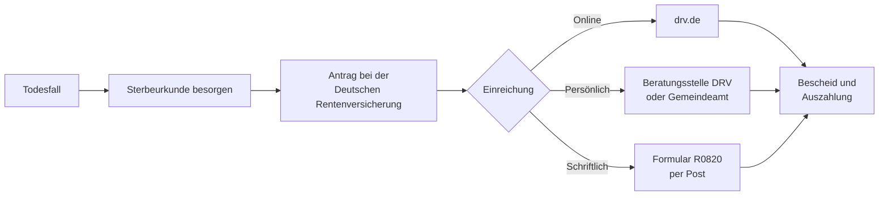

## Was ist die Witwen-/Witwerrente?

Die **Witwen- und Witwerrente** (§ 46 SGB VI) ist eine Hinterbliebenenrente der gesetzlichen Rentenversicherung. Sie sichert den überlebenden Ehegatten oder eingetragenen Lebenspartner finanziell ab, wenn durch den Tod des Versicherten Einkommen wegfällt. Insgesamt zahlt die Deutsche Rentenversicherung rund **5,2 Millionen Hinterbliebenenrenten** aus (Stand 2024).

## Zwei Rentenarten

Es gibt eine befristete kleine und eine dauerhafte große Variante:

| Rentenart | Höhe | Laufzeit | Voraussetzung |
| --- | ---: | --- | --- |
| Kleine Witwenrente | 25 % der Rente des Verstorbenen | 24 Monate | keine besonderen |
| Große Witwenrente | 55 % der Rente des Verstorbenen | dauerhaft | Alter, Kinder oder Erwerbsminderung |

Die **große Witwenrente** wird gewährt, wenn mindestens eine der folgenden Bedingungen erfüllt ist:

- Alter von mindestens **47 Jahren** (gilt für ab 2029 Leistungsbeziehende; Übergangsregelungen für ältere Jahrgänge beachten)
- Erziehung eines Kindes unter 18 Jahren (bei Behinderung auch darüber)
- Dauerhaft volle **Erwerbsminderung** des Hinterbliebenen

## Anspruchsvoraussetzungen

1. Der Verstorbene hat mindestens **5 Jahre Wartezeit** in der gesetzlichen Rentenversicherung erfüllt.
2. Zum Todeszeitpunkt bestand eine gültige **Ehe oder eingetragene Lebenspartnerschaft**.
3. Die Ehe dauerte mindestens 1 Jahr — andernfalls wird eine **Versorgungsehe** vermutet. Diese Vermutung kann widerlegt werden, etwa wenn der Tod durch Unfall oder plötzliche Krankheit eintrat.

## Berechnung der Rentenhöhe

```
Witwenrente = Entgeltpunkte × Rentenartfaktor × Zugangsfaktor × aktueller Rentenwert
```

War der Verstorbene zum Zeitpunkt des Todes noch kein Rentner, werden ihm fiktive Entgeltpunkte bis zum 67. Lebensjahr gutgeschrieben (**Zurechnungszeit**, § 59 SGB VI). Das erhöht die Witwenrente erheblich bei frühem Tod.

**Vereinfachtes Beispiel:**

| Position | Wert |
| --- | --- |
| Entgeltpunkte (inkl. Zurechnungszeit) | 35,0 |
| Aktueller Rentenwert (ab 1.7.2025) | 40,44 € |
| Rentenartfaktor (große Witwenrente) | 0,55 |
| **Brutto-Witwenrente** | **778,47 €/Monat** |

## Einkommensanrechnung

Eigenes Einkommen wird auf die Witwenrente angerechnet — jedoch erst oberhalb eines **Freibetrags**. Darüber liegendes Einkommen mindert die Rente zu **40 %**.

```
Anrechnungsbetrag = (Einkommen − Freibetrag) × 0,40
```

- **Freibetrag ab Juli 2025:** 1.076,86 €/Monat (erhöht sich je Kind um ca. 226 €)
- Als Einkommen zählen: Arbeitseinkommen, eigene Renten, Versorgungsbezüge, Arbeitslosengeld
- **Sterbevierteljahr:** In den ersten drei Monaten nach dem Sterbemonat erfolgt **keine Einkommensanrechnung** — als Puffer für die unmittelbare Notlage.

Wer bereits eine eigene Altersrente bezieht, erhält beide Renten gleichzeitig. Die eigene Rente gilt jedoch als anrechenbares Einkommen und kann die Witwenrente erheblich mindern oder auf null reduzieren.

## Antragsweg



Benötigte Unterlagen: Sterbeurkunde, Heiratsurkunde, Personalausweis, Sozialversicherungsnachweise beider Partner, bei Kindern deren Geburtsurkunden sowie Einkommensnachweise. Der Antrag kann bis zu **12 Monate rückwirkend** ab dem 1. des Sterbemonats gestellt werden.

## Besonderheiten

**Wiederheirat:** Die Witwenrente endet bei Wiederheirat. Als Ausgleich wird eine **Einmalabfindung** in Höhe von 24 Monatsbeiträgen gezahlt (§ 107 SGB VI). Löst sich die neue Ehe auf, kann die ursprüngliche Witwenrente wiederaufleben.

**Geschiedene Ehegatten** haben grundsätzlich keinen Anspruch; der Versorgungsausgleich bei der Scheidung gleicht dies ab. Eingetragene Lebenspartner sind Ehegatten rechtlich gleichgestellt.

## Übergangsrecht

Für Todesfälle **vor dem 1. Januar 1986** gilt nach § 303 SGB VI das alte, restriktivere Witwerrentenrecht — damals wurde Witwerrente nur gewährt, wenn die Verstorbene den Lebensunterhalt überwiegend bestritten hatte. Dieser Altbestand ist heute sehr klein und für Neurentner irrelevant.

§ 303a SGB VI schützt zusätzlich Bestandsfälle, bei denen die große Witwenrente nach altem Recht wegen **Berufsunfähigkeit oder Erwerbsunfähigkeit** gewährt wurde — ein Begriff, der 2002 durch das neue Erwerbsminderungsrecht abgelöst wurde. Wer diese Rente bereits bezieht, behält sie.
