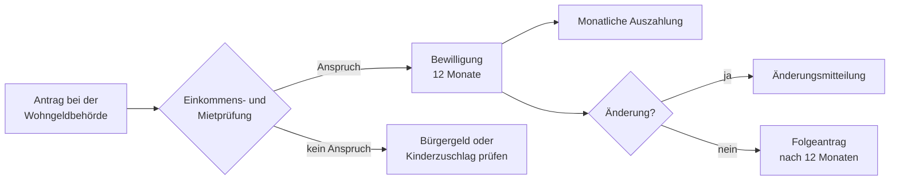

## Geschichte

Das **Wohngeld** gehört zu den ältesten Sozialleistungen der Bundesrepublik: Seit 1965 stützt der Staat einkommensschwache Haushalte bei ihren Wohnkosten — nicht durch Markteingriffe, sondern durch einen direkten Zuschuss. Wichtige Reformschritte:

- **1965** – Einführung durch das erste Wohngeldgesetz (WoGG)
- **2001** – Zusammenführung von Mietzuschuss und Lastenzuschuss; bundeseinheitliche Mietenstufen
- **2016** – Wohngeldreformgesetz mit regelmäßiger Fortschreibung der Höchstbeträge
- **2023** – **Wohngeld-Plus-Gesetz**: Die umfassendste Reform seit Jahrzehnten. Leistungsbeträge werden mehr als verdoppelt, eine Wohnkosten- und Heizkostenkomponente wird eingeführt. Die Zahl der Empfängerhaushalte steigt von ca. 600.000 auf über 1,8 Millionen.

## Wer hat Anspruch?

Wohngeld ist **keine Leistung nur für Erwerbstätige** — es steht grundsätzlich allen Haushalten mit niedrigem Einkommen offen, unabhängig davon, wie dieses Einkommen erzielt wird:

| Personengruppe | Anspruch? |
|---|:---:|
| Arbeitnehmerinnen und Arbeitnehmer mit niedrigem Lohn | ✓ |
| Rentnerinnen und Rentner | ✓ |
| Selbstständige mit geringen Einkünften | ✓ |
| Personen ohne Erwerbstätigkeit (z. B. pflegende Angehörige) | ✓ |
| Studierende (teilweise) | ✓/✗ |
| Bürgergeld-Beziehende | ✗ |
| Grundsicherungs-Beziehende (SGB XII) | ✗ |

Das Gesetz knüpft den Anspruch nicht an Erwerbsarbeit, sondern an zwei Voraussetzungen: **Einkommensarmut** (Haushaltseinkommen unterhalb der gesetzlichen Grenzwerte) und **Eigenverantwortung für Wohnkosten** (also Miete zahlen oder eigene Immobilienlasten tragen). Wer hingegen bereits eine Grundsicherungsleistung bezieht, die Unterkunftskosten einschließt (SGB II oder SGB XII), ist vom Wohngeld ausgeschlossen — Doppelleistungen sind nicht möglich.

Bei **Studierenden** gilt: Haushalte, die *ausschließlich* aus BAföG-Geförderten bestehen, erhalten kein Wohngeld (§ 20 WoGG). Wohnt ein Student jedoch mit einem Elternteil oder Partner zusammen, der keine BAföG-Leistungen erhält, kann der Haushalt als Ganzes anspruchsberechtigt sein.

## Berechnung

Die Wohngeldhöhe folgt einer gesetzlichen Formel (§ 19 WoGG) mit drei Variablen: **Haushaltsgröße**, **bereinigtes Gesamteinkommen** und **berücksichtigungsfähige Miete** (gedeckelt durch Miethöchstbeträge nach Mietenstufe). Vereinfacht gilt:

```
W = M − (a + b × M + c × Y)
```

Ein höheres Einkommen oder eine niedrigere Miete senken den Zuschuss; eine größere Haushaltsgröße erhöht ihn. Entscheidend: Das anrechenbare Einkommen *Y* ist **nicht der Bruttolohn**, sondern wird in mehreren Schritten gemindert — zunächst durch Pauschalabzüge (je 10 % für Steuern, Kranken-/Pflegeversicherung und Rentenversicherung, § 16), dann durch **Freibeträge** nach § 17 und schließlich durch Abzüge für **Unterhaltsleistungen** nach § 18.

| Freibetrag (§ 17) | Betrag/Jahr |
|---|---:|
| Schwerbehinderung (GdB 100 oder mit Pflegebedarf) | 1.800 € |
| Alleinerziehende mit kindergeldberechtigtem Kind | 1.320 € |
| Kind unter 25 mit eigenem Erwerbseinkommen | bis 1.200 € |

Wer laufend Kindes- oder Trennungsunterhalt zahlt, kann diesen nach § 18 zusätzlich vom anrechenbaren Einkommen abziehen — das Wohngeldrecht nimmt damit zur Kenntnis, dass dieses Geld real nicht zur Verfügung steht.

## Mietenstufen

Deutschland ist in **sieben Mietenstufen (I–VII)** eingeteilt. Die Stufe bestimmt, welche Miete maximal berücksichtigt wird:

| Mietenstufe | Beispiele | Höchstbetrag (1 Person, 2025) |
|---:|---|---:|
| I | ländliche Kreise | 404 € |
| III | Mittelstädte | 468 € |
| V | Frankfurt, Stuttgart | 570 € |
| VII | München Innenstadt | 697 € |

## Antragsweg



Wohngeld wirkt **nicht rückwirkend** — gezahlt wird frühestens ab dem Monat des Antragseingangs. Nach Ablauf des Bewilligungszeitraums (12 Monate) muss ein Folgeantrag gestellt werden. Bei langen Bearbeitungszeiten kann die Behörde nach § 26a **vorläufig zahlen**, sofern ein Anspruch dem Grunde nach wahrscheinlich ist. Eine spätere Nachzahlung oder Rückforderung ist dann möglich.

## Verhältnis zu anderen Leistungen

- **Bürgergeld (SGB II)**: Bürgergeld-Beziehende erhalten grundsätzlich *kein* Wohngeld — Unterkunftskosten werden über SGB II gedeckt. Umgekehrt prüft das Jobcenter, ob Wohngeld + Kinderzuschlag den Bedarf abdecken können.
- **Kinderzuschlag**: Seit 2019 ausdrücklich kombinierbar. Für erwerbstätige Familien oft günstiger als Bürgergeld, weil Freibeträge erhalten bleiben.
- **Grundsicherung im Alter (SGB XII)**: Kein Wohngeld für Grundsicherungsbeziehende; Haushalte knapp oberhalb der Grundsicherungsgrenze können jedoch anspruchsberechtigt sein.
- **BAföG-Haushalte**: Ausschließlich aus BAföG-Geförderten bestehende Haushalte sind ausgeschlossen (§ 20 WoGG).

## Inanspruchnahme

Trotz der starken Ausweitung durch das Wohngeld-Plus-Gesetz beantragen Schätzungen zufolge nur **50–60 %** der anspruchsberechtigten Haushalte tatsächlich Wohngeld. Ursachen: Unkenntnis (Wohngeld wird auch bei Erwerbsarbeit oder Rente gewährt), Scheu vor Bürokratie (Mietvertrag, Einkommensnachweise aller Haushaltsmitglieder) und soziales Stigma. Gerade nach dem Wohngeld-Plus-Gesetz lohnt eine Antragstellung auch dann, wenn das Einkommen auf den ersten Blick zu hoch erscheint — die mehrstufigen Abzüge senken das anrechenbare Einkommen oft erheblich.
