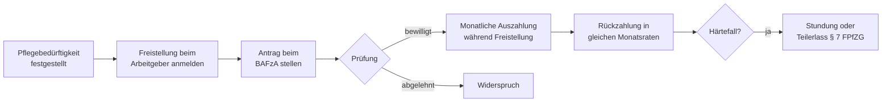

## Hintergrund

Das **zinslose Darlehen während der Familienpflegezeit** ist ein staatliches Instrument, das den Einkommensverlust von Beschäftigten abfedern soll, die ihre Arbeitszeit reduzieren oder ganz unterbrechen, um einen nahen Angehörigen zu pflegen. Rechtsgrundlage ist § 3 des **Familienpflegezeitgesetzes (FPfZG)**; das Darlehen gilt für alle drei pflegebedingten Freistellungsformen.

- **2012** – Erstes FPfZG: Darlehen als freiwilliges betriebliches Instrument, kein Rechtsanspruch; kaum genutzt.
- **2015** – Reform durch das *Gesetz zur besseren Vereinbarkeit von Familie, Pflege und Beruf*: **Rechtsanspruch** auf Familienpflegezeit, Darlehen auf alle Freistellungsarten ausgeweitet.

## Wer hat Anspruch?

Das Darlehen können Beschäftigte beantragen, die eine der folgenden Freistellungen in Anspruch nehmen — vorausgesetzt, der pflegebedürftige Angehörige hat **Pflegegrad 1–5** (SGB XI) oder ist schwer erkrankt und wird **zu Hause** gepflegt:

| Freistellungsart | Rechtsgrundlage | Max. Dauer |
| --- | --- | ---: |
| Kurzzeitige Arbeitsverhinderung | § 2 PflegeZG | 10 Arbeitstage |
| Pflegezeit (vollständige Freistellung) | § 3 PflegeZG | 6 Monate |
| Familienpflegezeit (min. 15 h/Woche) | § 2 FPfZG | 24 Monate |

Beide Gesetze können hintereinander kombiniert werden: bis zu 6 Monate Pflegezeit + bis zu 24 Monate Familienpflegezeit = **maximal 30 Monate** pflegebedingte Freistellung mit Darlehensanspruch.

**Kein Anspruch** besteht für Beamtinnen und Beamte sowie Selbstständige.

## Berechnung der Darlehenshöhe

Das Darlehen beträgt die **Hälfte der Einkommensdifferenz**, berechnet auf Basis eines pauschalierten Nettoentgelts (einheitliche Steuer- und Sozialversicherungsabzüge, unabhängig von individueller Steuerklasse):

```
Darlehen = ½ × (pauschaliertes Netto vor Freistellung − pauschaliertes Netto während Freistellung)
```

**Beispiel bei 50 % Arbeitszeitreduzierung:**

| Position | Betrag |
| --- | ---: |
| Bruttolohn vorher | 3.500 €/Monat |
| Pauschaliertes Netto vorher | ca. 2.300 € |
| Bruttolohn während Freistellung | 1.750 €/Monat |
| Pauschaliertes Netto während Freistellung | ca. 1.300 € |
| Differenz | 1.000 € |
| **Monatliches Darlehen (50 %)** | **500 €** |

Das Darlehen deckt damit nur einen Teil des Ausfalls — kein vollständiger Einkommensersatz.

## Rückzahlung

Nach Ende der Freistellungsphase beginnt die Rückzahlung in **gleichmäßigen Monatsraten** über denselben Zeitraum. Das Darlehen ist **zinslos** — es entstehen keine Zinskosten. Vorzeitige Rückzahlung ist jederzeit ohne Vorfälligkeitsentschädigung möglich.

In Härtefällen gibt es zwei Erleichterungen (§ 7 FPfZG):

- **Stundung** – wenn die wirtschaftliche Lage nach der Pflegephase eine Rückzahlung vorübergehend nicht erlaubt.
- **Teilerlass** – bei besonderer Härte, etwa wenn die Pflegebedürftigkeit fortbesteht und eine weitere Freistellung nötig wird.

## Antragsweg



Zuständig ist das **Bundesamt für Familie und zivilgesellschaftliche Aufgaben (BAFzA)** in Köln, das Antragsformulare und einen Online-Berechnungsrechner bereitstellt. Erforderliche Unterlagen: Pflegegrad-Bescheid, Arbeitgeberbestätigung über die Freistellung, aktuelle Entgeltbescheinigung.

## Verhältnis zu anderen Leistungen

- **Pflegegeld (SGB XI):** Kann parallel bezogen werden — es fließt an den Pflegebedürftigen, das Darlehen an die pflegende Person.
- **Bürgergeld:** Das Darlehen gilt während der Auszahlungsphase als Einkommen und wird voll angerechnet — für Bürgergeld-Beziehende entsteht kein wesentlicher Vorteil.
- **Steuer:** Das Darlehen ist keine steuerpflichtige Einnahme, da es zurückzuzahlen ist.

## Warum wird das Darlehen kaum genutzt?

Trotz des seit 2015 bestehenden Rechtsanspruchs ist die Inanspruchnahme bundesweit sehr gering. Wesentliche Gründe:

- **Rückzahlungspflicht** beginnt unmittelbar nach der Pflegephase — einem Zeitraum, in dem die finanzielle Belastung häufig noch anhält.
- **Kein vollständiger Einkommensersatz** — nur 50 % der Differenz werden ausgeglichen.
- **Geringe Bekanntheit** bei Beschäftigten und Arbeitgebern.
- **Verfahrenskomplexität** wirkt in einer ohnehin belastenden Pflegesituation abschreckend.
