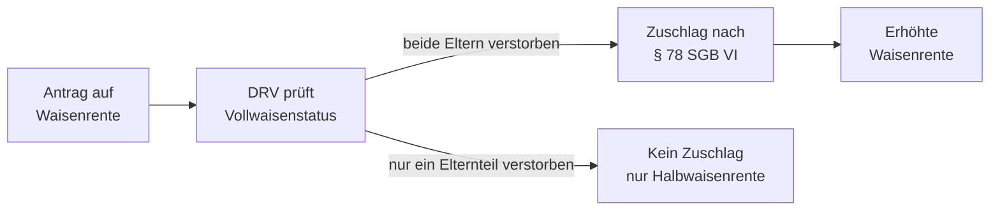

## Hintergrund

Der **Zuschlag bei Waisenrenten** nach § 78 SGB VI ergänzt die reguläre Waisenrente um einen zusätzlichen Betrag, um Vollwaisen besser abzusichern. Die Logik dahinter: Stirbt ein Elternteil, erhält der überlebende Elternteil in der Regel eine Witwen- oder Witwerrente. Sind jedoch *beide* Elternteile verstorben, verfällt dieser Anspruch — der Zuschlag nach § 78 leitet einen Teil dieser sonst ungenutzten Rentenansprüche an das Kind weiter.

## Anspruchsvoraussetzungen

Der Zuschlag gilt ausschließlich für **Vollwaisen** — Kinder, bei denen beide Elternteile verstorben sind. Halbwaisen haben keinen Anspruch, da noch ein Elternteil lebt, der selbst Rentenansprüche erwirbt.

Zusätzlich darf das Kind keinen Anspruch auf einen **Kinderzuschlag** im Rahmen einer anderen Rente haben. Der Zuschlag schließt somit eine Lücke, die entsteht, wenn die übrigen Sicherungsmechanismen des Rentenrechts ins Leere laufen.

## Berechnung

Der Zuschlag bemisst sich am **höheren der beiden Rentenansprüche** der verstorbenen Elternteile. Er entspricht jenem Betrag, der andernfalls als Witwen- oder Witwerrente an einen überlebenden Partner ausgezahlt worden wäre — da kein solcher Partner vorhanden ist, geht dieser Betrag stattdessen in den Waisenrentenzuschlag ein.

Das führt in der Praxis dazu, dass die Vollwaisenrente spürbar höher ausfällt als eine einfache Halbwaisenrente, weil sie beide Rentenbiografien der Eltern berücksichtigt.

## Antragstellung

Der Zuschlag wird **auf Antrag** bei der **Deutschen Rentenversicherung** gewährt, üblicherweise zusammen mit dem Antrag auf Waisenrente. Die DRV prüft automatisch, ob die Voraussetzungen vorliegen — ein gesonderter Antrag ist in der Regel nicht notwendig.

## Praktischer Hinweis

Da der Zuschlag an die Rentenbiografie beider Elternteile anknüpft, lohnt es sich, bei der Antragstellung alle verfügbaren Unterlagen zu den Versicherungsverläufen der Eltern bereitzuhalten (Renteninformationen, Versicherungsnummern). Sind diese nicht greifbar, kann die DRV die Daten in der Regel selbst ermitteln. Bei Unsicherheiten helfen die Beratungsstellen der Deutschen Rentenversicherung kostenlos weiter.
